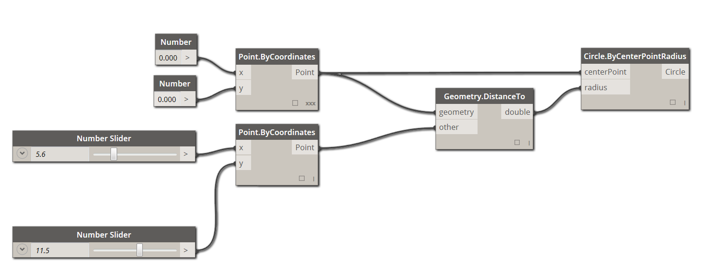
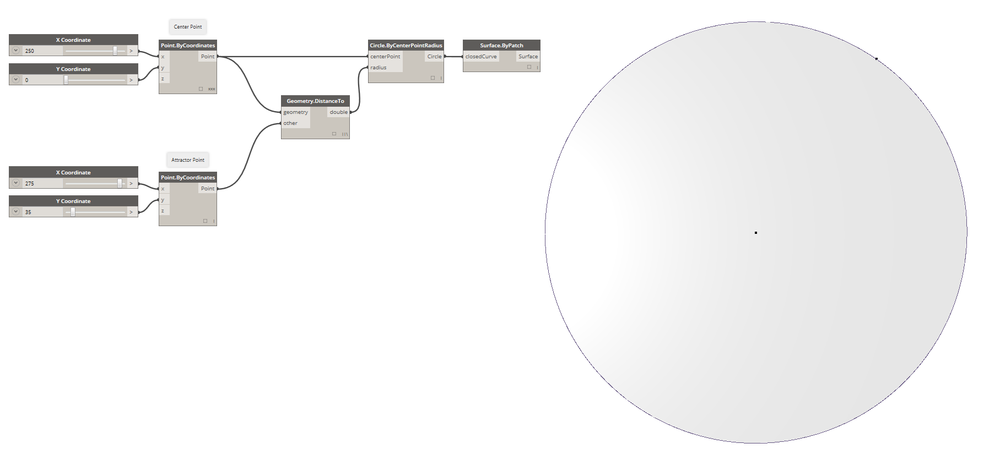

###What is Visual Programming?

Designing frequently involves establishing visual, systemic, or geometric relationships between the parts of a design. More times than not, these relationships are developed by workflows that gets us from concept to result by way of rules. Perhaps without knowing it, we are working algorithmically - defining a step-by-step set of actions that follow a basic logic of input, processing, and output. Programming allows us to continue to work this way but by formalizing our algorithms.

###Algorithms in Hand
While offering some powerful opportunities, the term **Algorithm** can carry some misconceptions with it. Algorithms can generate unexpected, wild, or cool things, but they are not magic. In fact, they are pretty plain, in and of themselves. Let's use a tangible example like an origami crane. We start with a square piece of paper (input), follow a series of folding steps (processing actions), and result in a crane (output).


So where is the Algorithm? It is the abstract set of steps, which we can represent in a couple of ways - either textually or graphically.

**Textual Instructions:**
1. Start with a square piece of
paper, coloured side up. Fold in half and open. Then fold in half the other way.
2. Turn the paper over to the white side. Fold the paper in half, crease well and open, and then fold again in the other direction.
3. Using the creases you have made, Bring the top 3 corners of the model down to the bottom corner. Flatten model.
4. Fold top triangular flaps into the center and unfold.
5. Fold top of model downwards, crease well and unfold.
6. Open the uppermost flap of the model, bringing it upwards and pressing the sides of the model inwards at the same time. Flatten down, creasing well.
7. Turn model over and repeat Steps 4-6 on the other side.
8. Fold top flaps into the center.
9. Repeat on other side.
10. Fold both ‘legs’ of model up, crease very well, then unfold.
11. Inside Reverse Fold the “legs” along the creases you just made.
12. Inside Reverse Fold one side to make a head, then fold down the wings.
13. You now have a crane.

**Graphical Instructions:**


###Programming Defined
Using either of these sets of instructions should result in a crane, and if you followed along yourself, you've applied an algorithm. The only difference is the way in which we read the formalization of that set of instructions and that leads us to **Programming**. Programming, frequently shortened from *Computer Programming*, is the act of formalizing the processing of a series of actions into an executable program. If we turned the above instructions for a creating crane into a format our computer can read and execute, we are Programming.

The key to and first hurdle we will find in Programming, is that we have to rely on some form of abstraction to communicate effectively with our computer. That takes the form of any number of Programming Languages, such as Javascript, Python, or C. If we can write out a repeatable set of instructions, like for the origami crane, we only need to translate it for the computer. We are on our way to having the computer be able to make a crane or even a multitude of different cranes where each one varies slightly. This is the power of Programming - the computer will repeatedly execute whatever task, or set of tasks, we assign to it, without delay and without human error.

####Visual Programming Defined
>Download the example file that accompanies this exercise (Right click and "Save Link As..."): [Visual Programming - Circle Through Point.dyn](datasets/1-1/Visual Programming - Circle Through Point.dyn). A full list of example files can be found in the Appendix.

If you were tasked with writing instructions for folding an origami crane, how would you go about it? Would you make them with graphics, text, or some combination of the two?

If your answer contained graphics, then **Visual Programming** is definitely for you. The process is essentially the same for both Programming and Visual Programming. They utilize the same framework of formalization; however, we define the instructions and relationships of our program through a graphical (or "Visual") user interface. Instead of typing text bound by syntax, we connect pre-packaged nodes together. Here's a comparison of the same algorithm - "draw a circle through a point" - programmed with nodes versus code:

**Visual Program:**



**Textual Program:**
```
myPoint = Point.ByCoordinates(0.0,0.0,0.0);
x = 5.6;
y = 11.5;
attractorPoint = Point.ByCoordinates(x,y,0.0);
dist = myPoint.DistanceTo(attractorPoint);
myCircle = Circle.ByCenterPointRadius(myPoint,dist);
```
The results of our algorithm:



The visual characteristic to programming in such a way lowers the barrier to entry and frequently speaks to designers. Dynamo falls in the Visual Programming paradigm, but as we will see later, we can still use textual programming in the application as well.

