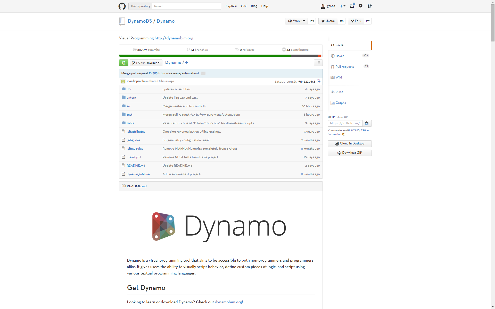

## 1.2. What is Dynamo?
Dynamo is, quite literally, what you make it. Working with Dynamo may include using the application, either in connection with other Autodesk software or not, engaging a Visual Programming process, or participating in a broad community of users and contributers.


###1.2.1. The Application
Dynamo, the application, is a software that can be downloaded and run in either stand-alone "Sandbox" mode or as a plug-in for other software like Revit or Maya. It is described as:
> A visual programming tool that aims to be accessible to both non-programmers and programmers alike. It gives users the ability to visually script behavior, define custom pieces of logic, and script using various textual programming languages.


> 1. See Dynamo in action with Revit
2. Download the installer

###1.2.2. The Process
Once we've installed the application, Dynamo will enable us to work within a Visual Programming process wherein we connect elements together to define the relationships and the sequences of actions that compose custom algorithms. We can use our algorithms for a wide array of applications - from processing data to generating geometry - all without writing a lick of ```code```.


> Add elements, connect, and we off and running with creating Visual Programs.

###1.2.3. The Community
Dynamo wouldn't be what it is without a strong group of avid users and active contributers. Engage the community by following the Blog, adding your work to the Gallery, or discuss Dynamo the Forum.


###1.2.4. The Platform
Dynamo is envisioned as a tool for tool-makers to make tools and use any Autodesk product that has an API. The source code for the project is open-source, enabling us to extend its functionality to our hearts content. Check out the project on Github and browse the Works in Progress of users customizing Dynamo.


> Browse, Fork, and start extending Dynamo for your needs
