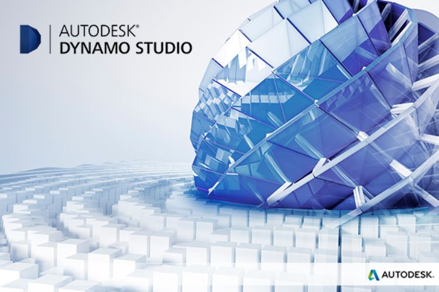
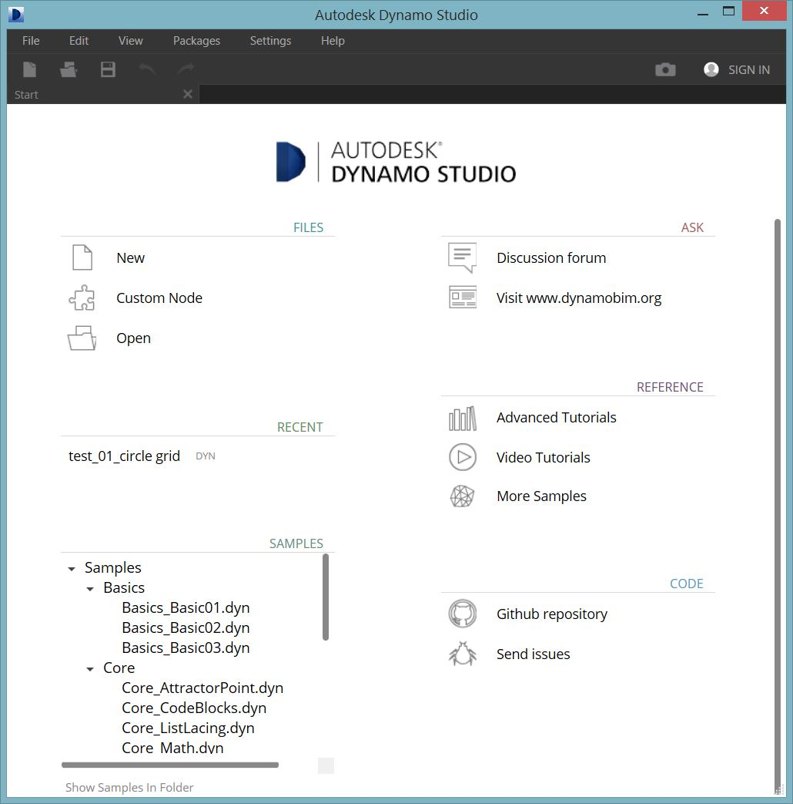
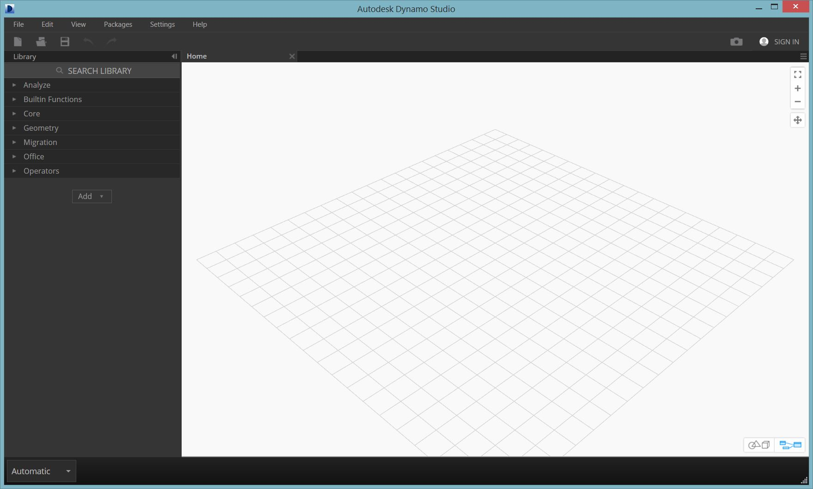

## 2.1 Installing and Launching Dynamo

Dynamo is an active open-source development project with downloadable installers for both official and pre-release ie. "daily build" versions. Download the official release to get started or contribute to what Dynamo becomes through the daily builds or github project.

###2.1.1. Downloading
To download the official released version of Dynamo, visit the [Dynamo website](http://dynamobim.com/). Start the download of Version 0.8.0 immediately by clicking from the homepage or browse to the dedicated download page. 

Here you can download the "bleeding edge" development versions or go to the [Dynamo Github](https://github.com/DynamoDS/Dynamo) project.

###2.1.2. Installing
Browse to the directory of the downloaded installer and run the executable file. During the installation process, the setup allows you to customize the components that will be installed. 

Here we need to decide if we want to include the components that connect Dynamo to other installed applications such as Revit. For more information on the Dynamo Platform, see **Chapter 1.2.2**.

###2.1.3. Launching
To launch Dynamo ... (text)

