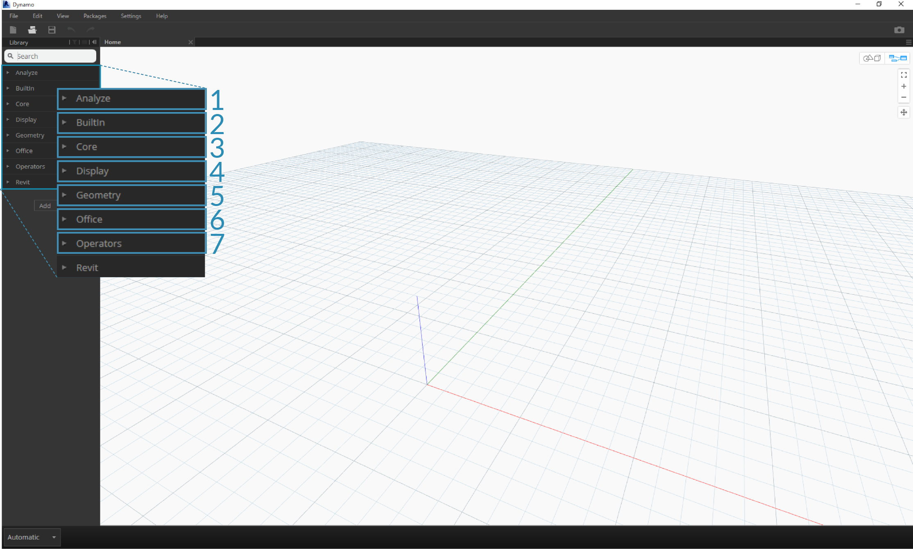
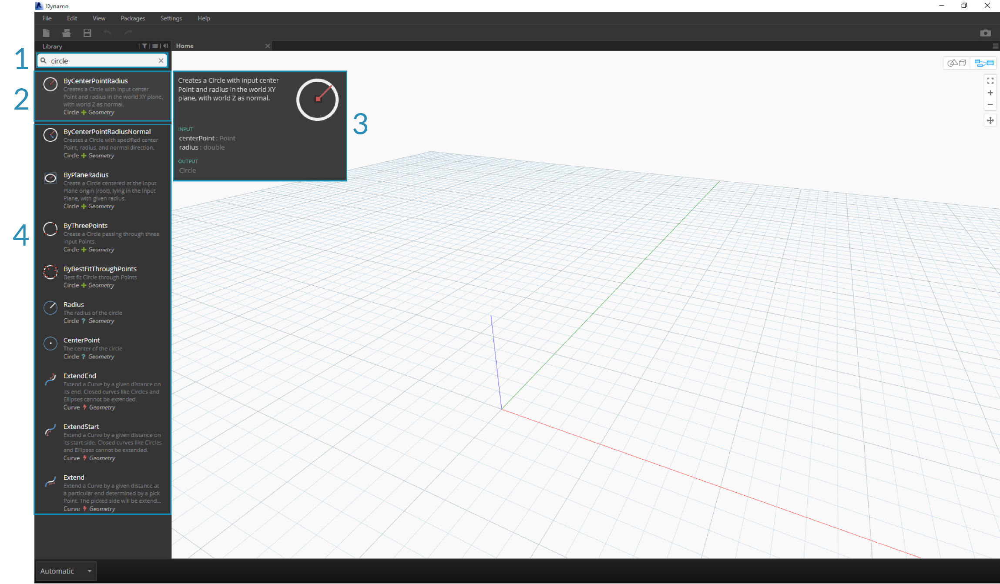
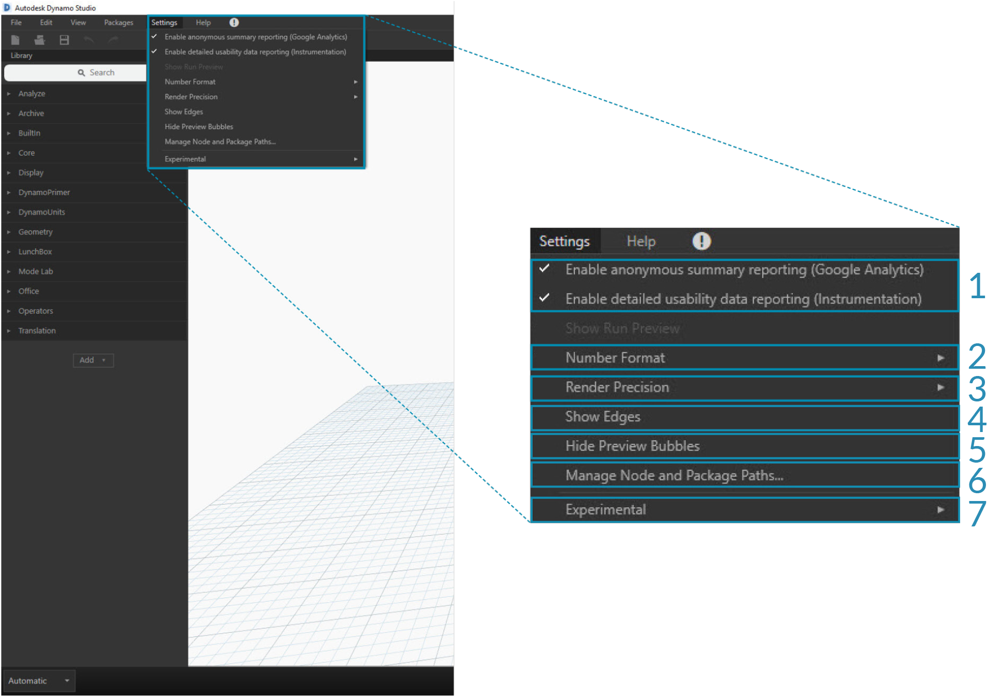
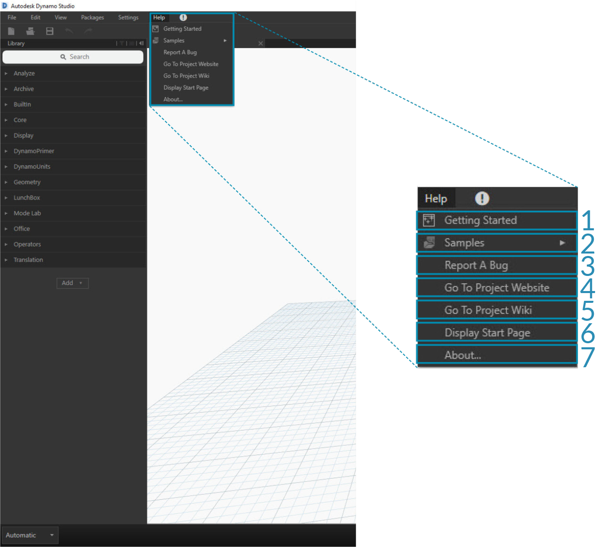

##The Dynamo User Interface

The User Interface (UI) for Dynamo is organized into five main regions, the largest of which is the workspace where we compose our visual programs.

>1. Menus
2. Toolbar
3. Library
4. Workspace
5. Execution Bar

Let's dive deeper into the UI and explore the functionality of each region.

####Menus

The Dropdown Menus are a great place to find some of the basic functionality of the Dynamo application. Like most Windows software, actions related to managing files and operations for selection and content editing are found in the first two menus. The remaining menus are more specific to Dynamo.

> 1. File
2. Edit
3. View
4. Packages
5. Settings
6. Help

####Toolbar

Dynamo's Toolbar contains a series of buttons for quick access to working with files as well as Undo [Ctrl + Z] and Redo [Ctrl + Y] commands. On the far right is another button that will export a snapshot of the workspace, which is extremely useful for documentation and sharing.

> 1. New - Create a new .dyn file
2. Open - Open an existing .dyn (workspace) or .dyf (custom node) file
3. Save/Save As - Save your active .dyn or .dyf file
4. Undo - Undo your last action
5. Redo - Redo your the next action
6. Export Workspace as Image - Export the visible workspace as a PNG file

####Library
The Library contains all of the loaded Nodes, including the default Nodes that come with the installation as well as any additionally loaded Custom Nodes or Packages. The Nodes in the Libary are organized hierarchically within libraries, categories, and, where appropriate, sub-categories based on whether the Nodes **Create** data, execute an **Action**, or **Query** data.

#####Browsing
By default, the **Library** will contain eight categories of Nodes. **Core** and **Geometry** are great menus to begin exploring as they contain the largest quantity of Nodes.  Browsing through these categories is the fastest way to understand the hierarchy of what we can add to our Workspace and the best way to discover new Nodes you haven't used before.

> We will focus on the default collection of Nodes now, but note that we will extend this Library with Custom Nodes, additional libraries, and the Package Manager later.

>1. Analyze
2. Builtin Functions
3. Core
4. Geometry
5. Migration
6. Office
7. Operators

Browse the Library by clicking through the menus. Click the Geometry > Circle. Note the new portion of the menu that is revealed and specifically the **Create** and **Query** Labels.

>1. Library
2. Category
3. Subcategory: Create/Actions/Query
4. Node
5. Node Description and properties - this appears when hovering over the node icon.

From the same Circle menu, hover your mouse over **ByCenterPointRadius**. The window reveals more detailed information about the Node beyond its name and icon. This offers us a quick way to understand what the Node does, what it will require for inputs, and what it will give as an output.

>1. Description - plain language description of the Node
2. Icon - larger version of the icon in the Library Menu
3. Input(s) - name,  data type, and data structure
4. Output(s) - data type and structure

#####Searching
If you know with relative specificity which Node you want to add to your Workspace, the **Search** field is your best friend. When you are not editing settings or specifying values in the Workspace, the cursor is always present in this field. If you start typing, the Dynamo Library will reveal a selected best fit match (with breadcrumbs for where it can be found in the Node categories) and a list of alternate matches to the search. When you hit Enter, or click on the item in the truncated browser, the highlighted Node is added to the center of the Workspace.

>1. Search Field
2. Best Fit Result / Selected
3. Alternate Matches

###Settings
From geometric to user settings, these options can be found in the **Settings** menu. Here you can opt in or out for sharing your user data to improve Dynamo as well as define the application's decimal point precision and geometry render quality.

> Note: Remember that Dynamo's units are generic.

>1. Enabling Reporting
2. Number Format
3. Render Quality

###Help
If you're stuck, check out the **Help** Menu. Here you can find the sample files that come with your installation as well as access one of the Dynamo reference websites through your internet browser. If you need to, check the version of Dynamo installed and whether it is up to date through the **About** option.

>1. Samples
2. Report A Bug
3. Go To Project Website
4. Go To Project Wiki
5. Display Start Page
6. About

