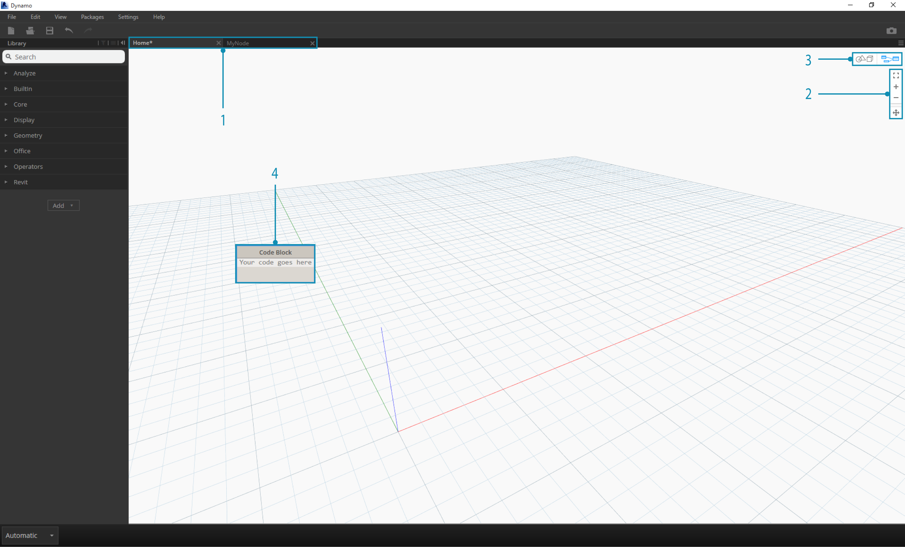
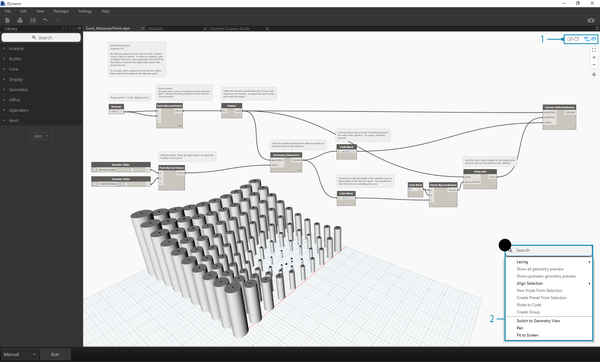
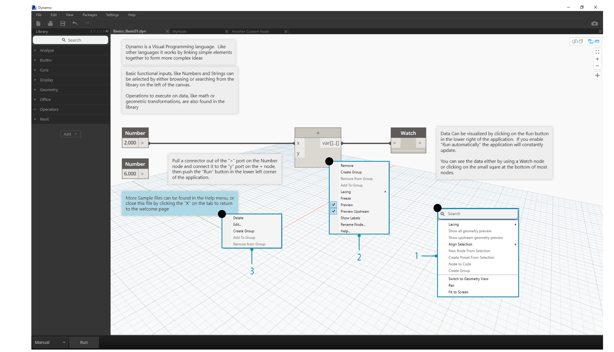

##The Workspace

The Dynamo **Workspace** is where we develop our visual programs, but it's also where we preview any resulting geometry. Whether we are working in a Home Workspace or a Custom Node, we can navigate with our mouse or the buttons at top right. Toggling between modes at bottom right switches which preview we navigate.

> Note: Nodes and geometry have a draw order so you may have objects rendered on top of each other. This can be confusing when adding multiple nodes in sequence as they may be rendered in the same position in the Workspace.

>1. Tabs
2. Zoom/Pan Buttons
3. Preview Mode
4. Double Clicking on the Workspace

###Tabs
The active Workspace tab allows you to navigate and edit your program. When you open a new file, by default you are opening a new **Home** Workspace. You may also open a new **Custom Node** Workspace from the File Menu or by the *New Node by Selection* right click option when Nodes are selected (more eon this functionality later).

> Note: You may have only one Home Workspace open at a time; however, you may have multiple Custom Node Workspaces open in additional tabs.

###Graph versus 3D Preview Navigation
In Dynamo, the Graph and the 3D results of the Graph (if we are creating geometry) are both rendered in the Workspace. By default the Graph is the active preview, so using the Navigation buttons or middle mouse button to pan and zoom will move us through the Graph. Toggling between active previews can be achieved three ways:

> 1. Preview Toggle Buttons in the Workspace
2. Right clicking in the Workspace and selecting *Switch to ... View*
3. Keyboard shortcut (Ctrl + B)

###Hello Mouse!

Based on which Preview mode is active, your mouse buttons will act differently. In general, the left mouse click selects and specifies inputs, the right mouse click gives access to options, and the middle mouse click allows you to navigate the Workspace. The right mouse click will present us with options based on the context of where we are clicking.

>1. Right Click on the Workspace
2. Right Click on a Node
3. Right Click on a Note

Here's a table of mouse interactions per Preview:

**Mouse Action** | **Graph Preview** | **3D Preview**
--- | --- | ---
Left Click | Select | N/A
Right Click | Context Menu | Zoom Options
Middle Click | Pan | Pan
Scroll | Zoom In/Out | Zoom In/Out
Double Click | Create Code Block | N/A

###In-Canvas Search

Using the "In-Canvas Search" will add some serious speed to your Dynamo work-flow by providing you access to node descriptions and tool-tips without taking you away from your place on the graph! By just right-clicking, you can access all the useful functionality of the "Library Search" from wherever you happen to be working on the canvas.

>1. Right click anywhere on the canvas to bring up the search feature. While the search bar is empty, the drop-down will be a preview menu.
2. As you type into the search bar, the drop-down menu will continuously update to show the most relevant search results.
3. Hover over the search results to bring up their corresponding descriptions and tool-tips.

