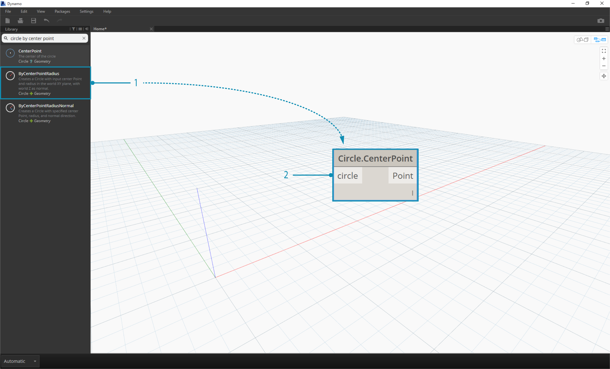
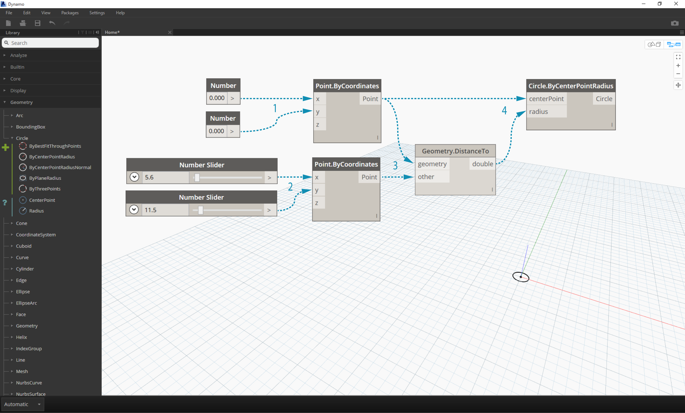
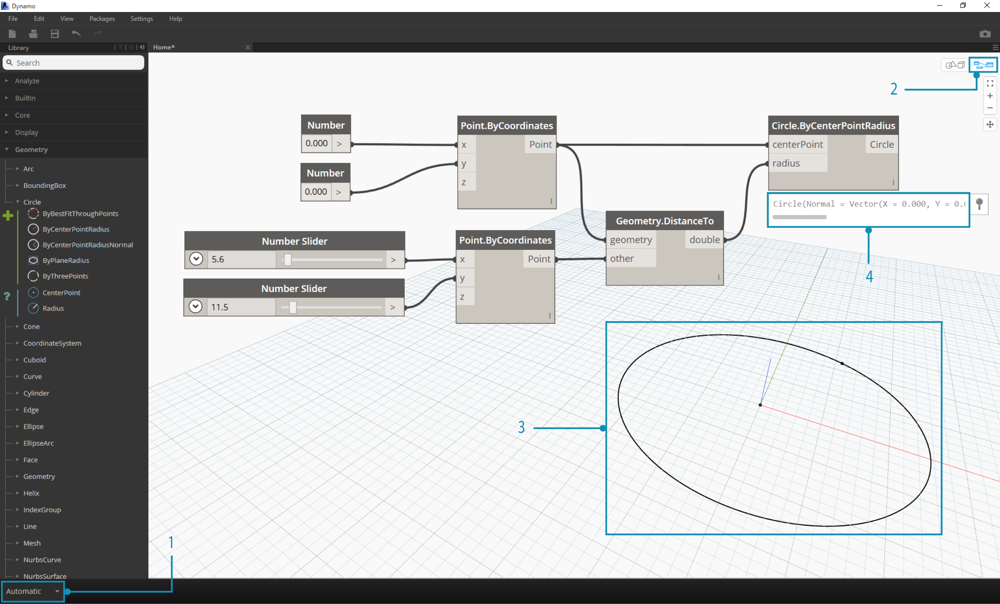

##GETTING STARTED

Now that we have familiarized ourselves with the interface layout and navigating the Workspace, our next step is to understand the typical workflow for developing a graph in Dynamo. Let's get started by creating a dynamically sized circle and then create an array of circles with varying radii.

###Defining Objectives and Relationships
Before we add anything to the Dynamo Workspace, it is key that we have a solid understanding of what we are trying to achieve and what the significant relationships will be. Remember that anytime we are connecting two Nodes, we are creating an explicit link between them - we may change the flow of data later, but once connected we've commited to that relationship. In this exercise we want to create a circle (*Objective*) where the radius input is defined by a distance to a nearby point (*Relationship*).


> A point that defines a distance-based relationship is commonly referred to as an "Attractor." Here the distance to our Attractor Point will be used to specify how big our circle should be.

###Adding Nodes to the Workspace
Now that we have our Objectives and Relationships sketched we can begin creating our graph. We need the Nodes that will represent the sequence of actions Dynamo will execute. Since we know we are trying to create a circle, let's start by locating a Node that does so. Using the Search field or browing through the Library, we will find that there is more than one way to create a circle.


> 1. Browse to Geometry > Circle > **Circle.ByPointRadius**
2. Search > "Circle by Point..."

Let's add the **Circle.ByPointRadius** Node to the Workspace by clicking on it in the Library - this should add the Node to the center of the Workspace.



> 1. The Circle.ByPointandRadius Node in the Library
2. Clicking the Node in the Library adds it to the Workspace

We also will need **Point.ByCoordinates**, **Number Input**, and **Number Slider** Nodes.


> 1. Geometry > Point > **Point.ByCoordinates**
2. Geometry > Geometry > **DistanceTo**
2. Core > Input > **Number**
3. Core > Input > **Number Slider**

###Connecting Nodes with Wires
Now that we have a few Nodes, we need to connect the Ports of the Nodes with Wires. These connections will define the flow of data.


> 1. **Number** to **Point.ByCoordinates**
2. **Number Sliders** to **Point.ByCoordinates**
3. **Point.ByCoordinates** (2) to **DistanceTo**
4. **Point.ByCoordinates** and **DistanceTo** to **Circle.ByCenterPointRadius**

###Executing the Program
With our Program Flow defined, all we need to do is tell Dynamo to execute it. Once our program is executed (either Automatically or when we click Run in Manual Mode), data will pass through the Wires, and we should see the results in the 3d Preview.


> 1. (Click Run) - If the Execution Bar is in Manual Mode, we need to Click Run to execute the graph
2. Node Preview - Hovering your mouse over the box on the lower right corner of a Node will give you a pop-up of the results
3. 3D Preview - If any of our Nodes create geometry, we will see it in the 3D Preview.

###Adding Detail
If our program is working, we should see a circle in the 3D Preview that is passing through our Attractor Point. This is great, but we may want to add more detail or more controls. Let's adjust the input to the circle Node so that we can calibrate the influence on the radius. Add another **Number Slider** to the Workspace, then double click on a blank area of the Workspace to add a **Code Block** Node. Edit the field in the Code Block, specifying ```X/Y```.


>1. **Code Block**
2. **DistanceTo** and **Number Slider** to **Code Block**
3. **Code Block** to **Circle.ByCenterPointRadius**

###Adding complexity
Starting simple and building complexity is an effective way to incrementally develop our program. Once it is working for one circle, let's apply the power of the program to more than one circle. Instead of one center point, if we use a grid of points and accomodate the change in the resulting data structure, our program will now create many circles - each with a unique radius value defined by the calibrated distance to the Attractor Point.


>1. Add a **Number Sequence** Node and replace the inputs of **Point.ByCoordinates** - Right Click Point.ByCoordinates and select Lacing > Cross Reference
2. Add a **Flatten** Node after  Point.ByCoordinates
3. The 3D Preview will update with a grid of circles


