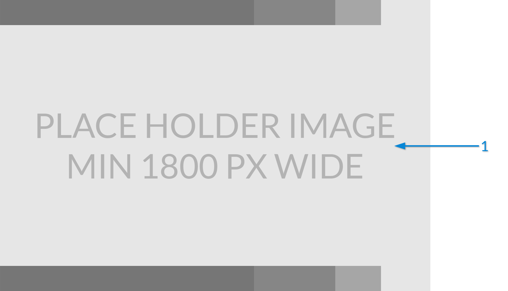

## 3.1 NODES 

In Dynamo, Nodes are the objects you add to the Workspace and connect to form a Visual Program. Each Node performs an operation - sometimes as simple as storing a number to more complex actions such as creating or querying geometry. 

###3.1.1 Anatomy of a Node
(Text)

>1. Name
2. Ports
3. Ports
4. 

###3.1.2 Ports
* Label
* Tool Tip
* * Data Type
* * Description

###3.1.3 States
(Text)

>1. Inactive - Nodes with a light grey Name background are inactive or waiting for data
2. Active - Nodes with a dark grey Name background are active
3. Warning - Nodes that are unsuccesfully executing are Yellow 
4. Selected - Nodes with an Aqua border are currently selected

If your Visual Program contains warning or errors, Dynamo will provide additional information about the problem. Any Node that is Yellow will also have a tooltip above the Name. Hover your mouse over the tooltip to expand it. 

> Tip: With this tooltip information in hand, examine the upstream Nodes to see if the data type or data structure required is in error.