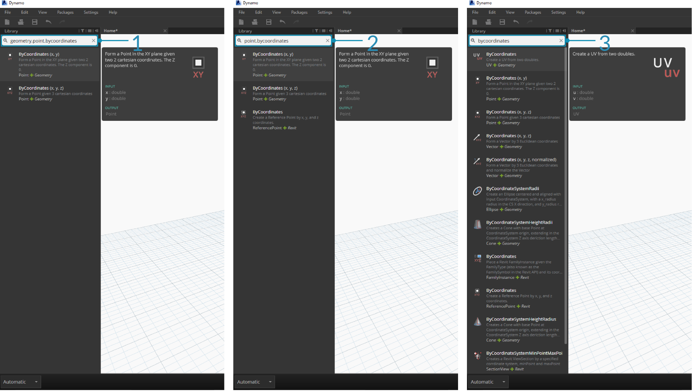
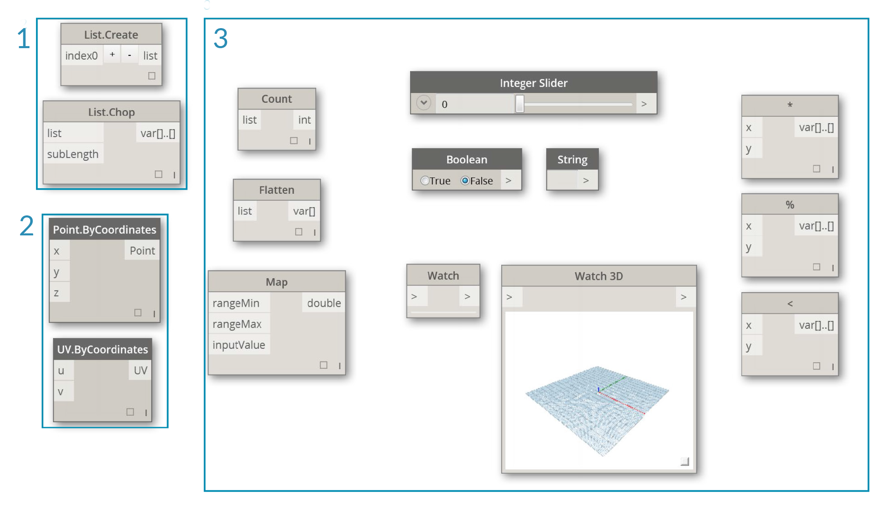
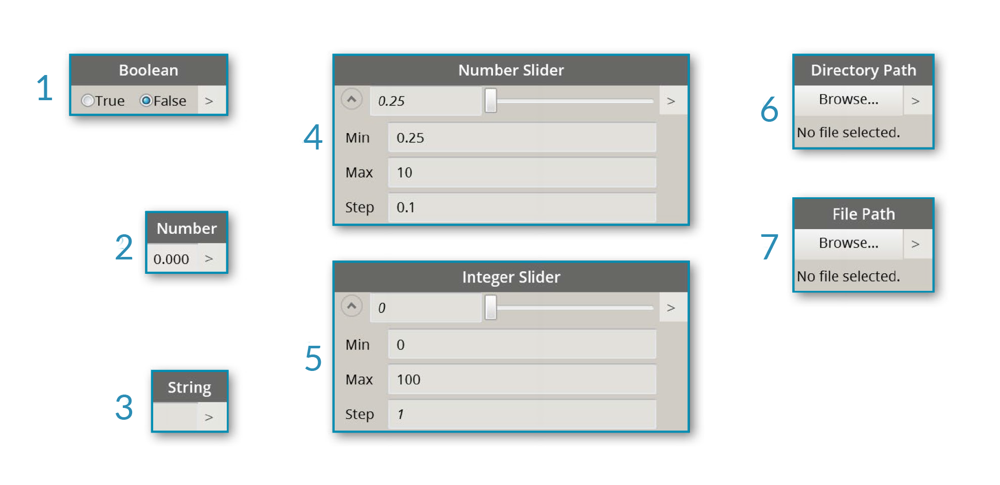

##Dynamo Library

The **Dynamo Library** contains the Nodes we add to the Workspace to define Visual Programs for execution. In the Library, we can search for or browse to Nodes. The Nodes contained here - the basic Nodes installed, Custom Nodes we define, and Nodes from the Package Manager that we add to Dynamo - are organizaed hierachically by category. Let's review this organization and explore the key Nodes we will use frequently.

###Library of Libraries
The Dynamo **Library** that we interface with in the application is actually a collection of functional libraries, each containing Nodes grouped by Category. While this may seem obtuse at first, it is a flexible framework for organizing the Nodes that come with the default installation of Dynamo - and it's even better down the road when we start extending this base functionality with Custom Nodes and additional Packages.

####The Organizational Scheme
The **Library** section of the Dynamo UI is composed of hierachically organized libraries. As we drill down into the Library, we are sequentially browsing a library, the library's categories, and the category's sub-categories to find the Node.


> 1. The Library - The region of the Dynamo Interface
2. A Library - A collection of related Categories, such as **Geometry**
3. A Category - A collection of related Nodes such as everything related to **Circles**
4. A Subcategory - Breakdown of the Nodes within the Category, typically by **Create**, **Action**, or **Query**
5. A Node - The objects that are added to the Workspace to perform an action

####Naming Conventions
The hierarchy of each library is reflected in the Name of Nodes added to the Workspace, which we can also use in the Search Field or with Code Blocks (which use the *Dynamo textual language*). Beyond using key words to try to find Nodes, we can type the heirarchy separated with a period.

Typing in different portions of the Node's place in the Library hierarchy in the ```library.category.nodeName``` format returns different results:



> 1. ```library.category.nodeName```
2. ```category.nodeName```
3. ```nodeName``` or ```keyword```

Typically the Name of the Node in the Workspace will be rendered in the ```category.nodeName``` format, with some notable exceptions particularly in the Input and View Categories. Beware of similarly named Nodes and note the category difference:



> 1. ```Point.ByCoordinates``` and ```UV.ByCoordinates``` have the same Name but come from different categories
2. Nodes from most libraries will include the category format
3. Notable exceptions include Builtin Functions, Core.Input, Core.View, and Operators

###Frequently Used Nodes
With hundreds of Nodes included in the basic installation of Dynamo, which ones are essential for developing our Visual Programs? Let's focus on those that let us define our program's parameters (**Input**), see the results of a Node's action (**Watch**), and define inputs or functionality by way of a shortcut (**Code Block**).

####Input
Input Nodes are the primary means for the User of our Visual Program - be that yourself or someone else - to interface with the key parameters. Here are the Nodes available in the Input Category of the Core Library:


> 1. Boolean
2. Number
3. String
4. Number Slider
5. Integer Slider
6. Directory Path
7. File Path

####Watch
The Watch Nodes are essential to managing the data that is flowing through your Visual Program. While you can view the result of a Node through the Node data preview, you may want to keep it revealed in a **Watch** Node or see the geometry results through a **Watch3D** Node. Both of these are found in the View Category in the Core Library.

> Tip: Occasionally the 3D Preview can be distracting when your Visual Program contains a lot of Nodes. Consider unchecking the Showing Background Preview option in the Settings Menu and using a Watch3D Node to preview your geometry.


> 1. Watch - Note that when you select an item in the Watch Node it will be tagged in the Watch3D and 3D Previews
2. Watch3D - Grab the bottom right grip to resize and navigate with you mouse the same way you would in the 3D Preview

####Code Block
**Code Block** Nodes can be used to define a block of code with lines separated by semi-colons. This can be as simple as ```X/Y```. We can also use Code Blocks as a short cut to defining a Number Input or call to another Node's functionality. The syntax to do so follows the Naming Convention of the Dynamo textual language in Section 3.2.3. Let's try to make a Circle with this shortcut:


>1. Double Click to create a **Code Block** Node
2. Type ```Circle.ByCenterPointRadius(x,y);```
3. Clicking on the Workspace to clear the selection should add ```x``` and ```y``` inputs automatically
4. Create a **Point.ByCoordinates** Node and a **Number Slider** then connect them to the inputs of the Code Block
5. The result of executing the Visual Program should be a circle in the 3D Preview


