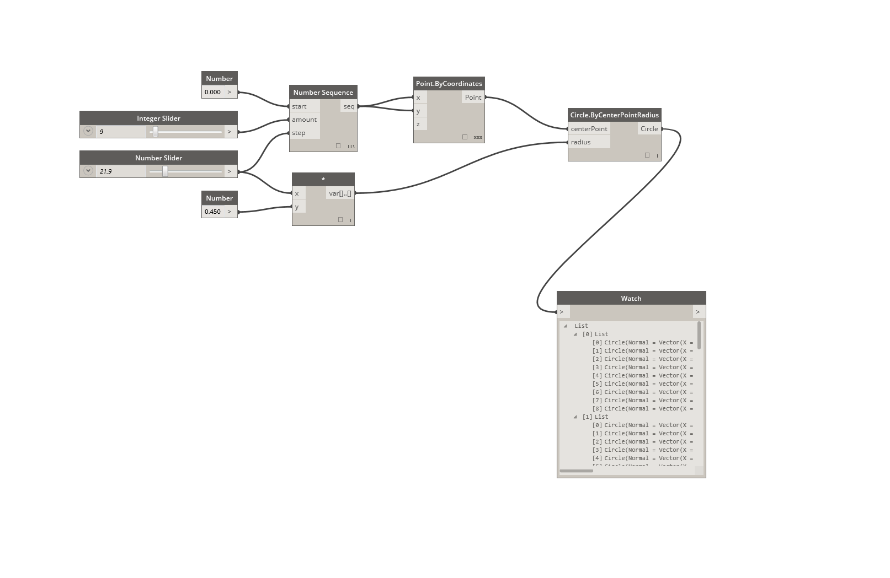
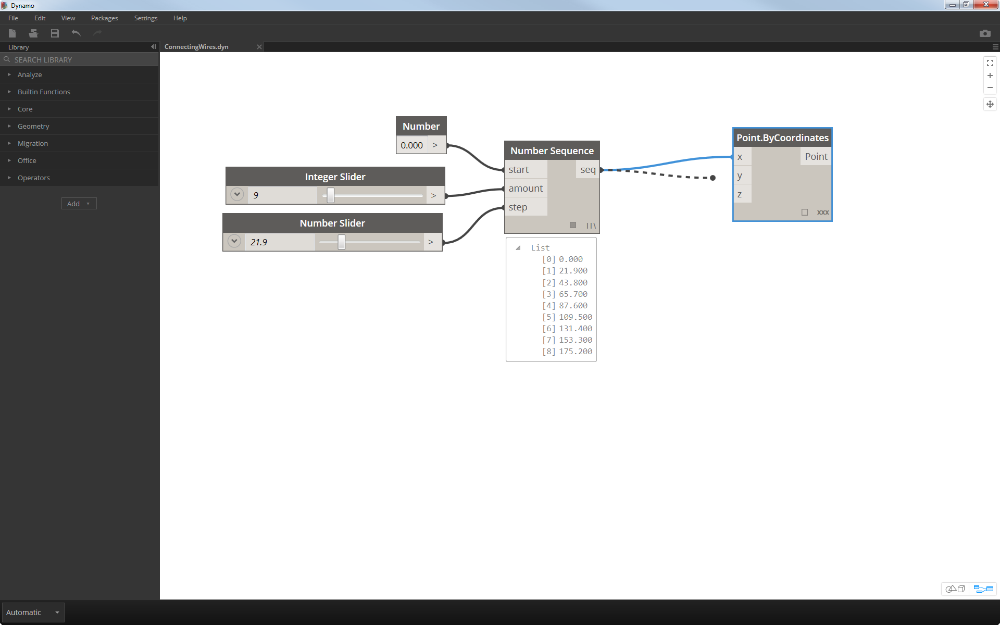
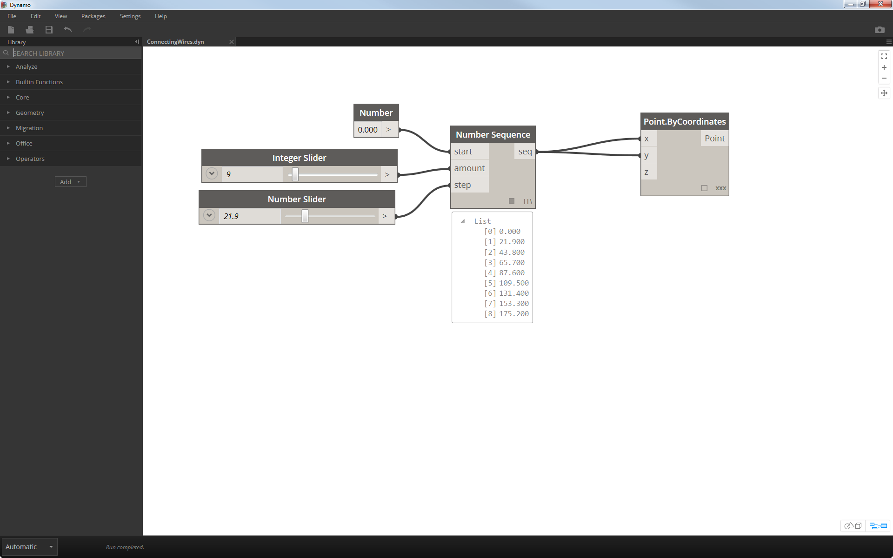
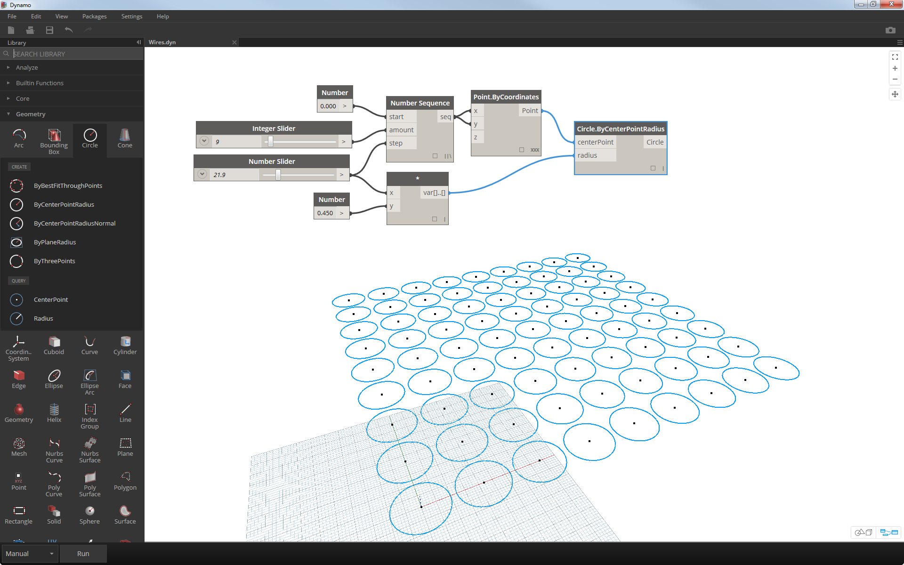
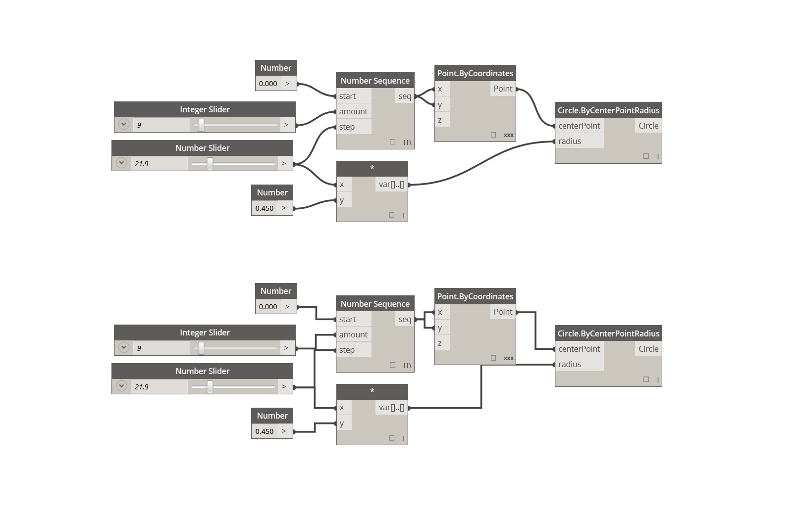

##Wires

Wires connect between Nodes to create relationships and establish the Flow of our Visual Program. We can think of them literally as electrical wires that carry pulses of data from one object to the next.


###Program Flow
Wires connect the output Port from one Node to the input Port of another Node. This directionality establishes the **Flow of Data** in the Visual Program. Although we can arrange our Nodes however we desire in the Workspace, because the output Ports are located on the right side of Nodes and the input Ports are on the left side, we can generally say that the Program Flow moves from left to right.



###Creating Wires
We create a Wire by left clicking our mouse on a Port and then left clicking on the port of another Node to create a connection. While we are in the process of making a connection, the Wire will appear dashed and will snap to become solid lines when successfully connected. The data will always flow through this Wire from output to input; however, we may create the wire in either direction in terms of the sequence of clicking on the connected Ports.

> Tip: Before completing the connection with your second click, allow the Wire snap to a Port and hover your mouse there to see the Port tooltip.


>1. Click on the ```seq``` output Port of the Number Sequence Node
2. As you are moving your mouse towards another Port, the Wire is dashed
3. Click on the ```y``` input Port of the Point.ByCoordiantes to complete the connection

###Editing Wires
Frequently we will want to adjust the Program Flow in our Visual Program by editing the connections represented by the Wires. To edit a Wire, left click on the input Port of the Node that is already connected. You now have two options:



> 1. Existing Wire
2. To change the connection to an input Port, left click on another input Port
3. To remove the Wire, pull the Wire away and left click on the Workspace


###Wire Previews
By default, our Wires will be previewed with a gray stroke. When a Node is selected, it will render any connecting Wire with the same aqua highlight as the Node.


> 1. Default Wire
2. Highlighted Wire

Dynamo also allows us to customize how our Wires look in the Workspace through the View > Connectors Menu. Here we can toggle between Curve or Polyline Wires or turn them off all together.



> 1. Connector Type: Curves
2. Connector Type: Polylines

