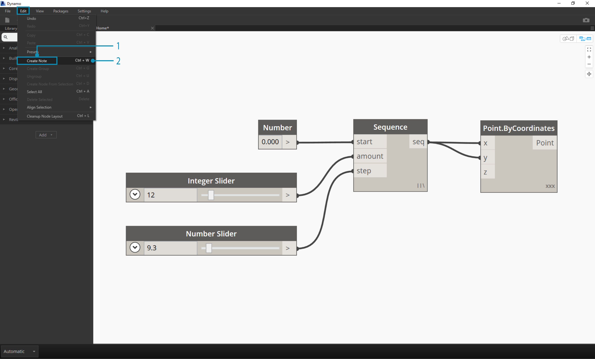
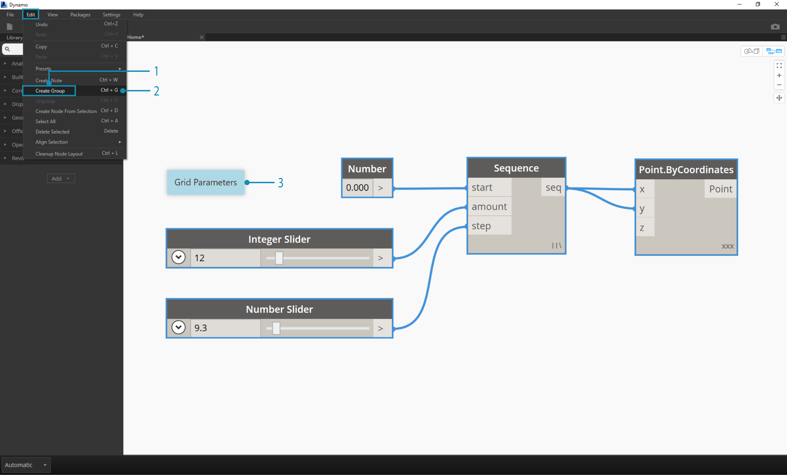
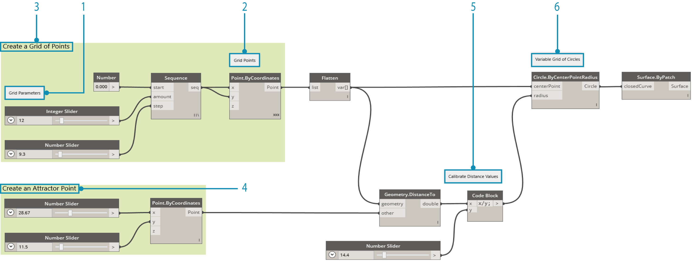

##Managing Your Program

Working within a Visual Programming process can be a powerful creative activity, but very quickly the Program Flow and key user inputs can be obscured by complexity and/or layout of the Workspace. Let's review some best practices for managing your program.

###Alignment
Once we have added more than a few Nodes to the Workspace, we may want to re-organize the layout of the Nodes for clarity's sake. By selecting more than one Node and right-clicking on the Workspace, the pop up window includes an **Align Selection** menu with justification and distribition options in X and Y.

> 1. Select more than one Node
2. Right-click on the Workspace
3. Use the **Align Selection** options

###Notes
With some experience, we may be able to "read" the Visual Program by reviewing the Node Names and following the Program Flow. For users of all experience levels, it is also good practice to include plain language labels and descriptions. Dynamo has a **Notes** Node with an editable text field to do so. We can add Notes to the Workspace in two ways:

> 1. Browse to the menu File > Create Note
2. Use the keyboard shortcut Ctrl+W

Once the Note is added to the Workspace a text field will pop up allowing us to edit the text in the Note. After they are created, we can edit the Note by double-clicking or right-clicking the Note Node.

###Grouping
When our Visual Program gets big, it is helpful to identify the larger steps that will be executed. We can highlight larger collections of Nodes with a **Group** to label them with a colored rectangle in the background and a title. There are three ways to make a Group with more than one Node selected:

> 1. Browse to the menu File > Create Group
2. Use the keyboard shortcut Ctrl+G
3. Right-click on the Workspace and select "Create Group"

Once a Group is created we can edit its settings, such as the title and color.

> Tip: Using both Notes and Groups is an effective way to annotate your file and increase readability.

Here's our program from Section 2.4 with Notes and Groups added:

> 1. Note: "Grid Parameters"
2. Note: "Grid Points"
3. Group: "Create a Grid of Points"
4. Group: "Create an Attractor Point"
5. Note: "Calibrate Distance Values"
6. Note: "Variable Grid of Circles"
