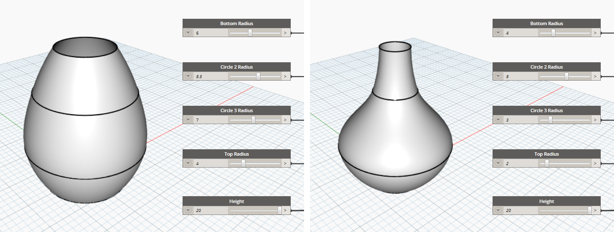
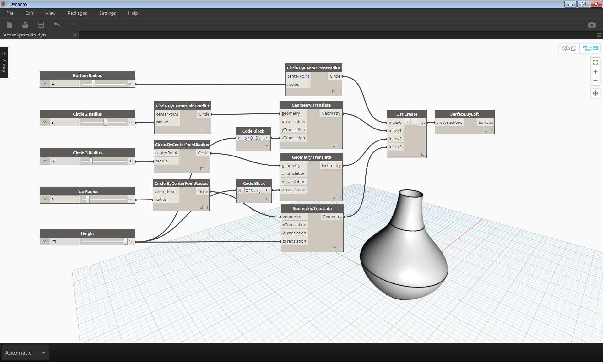
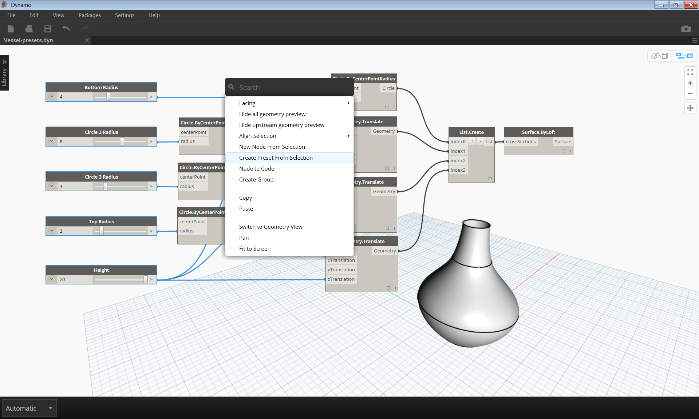
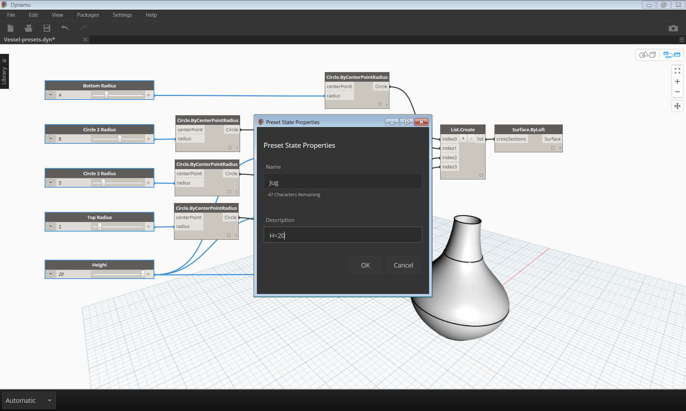
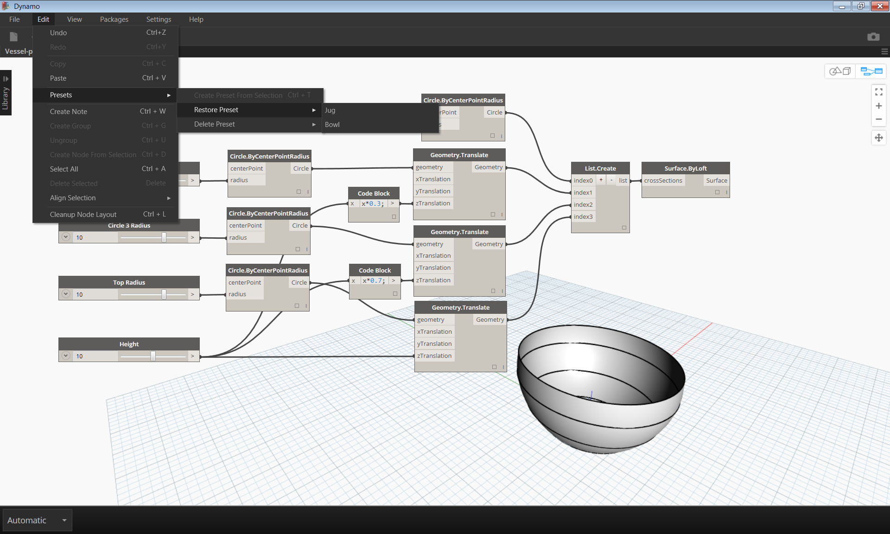
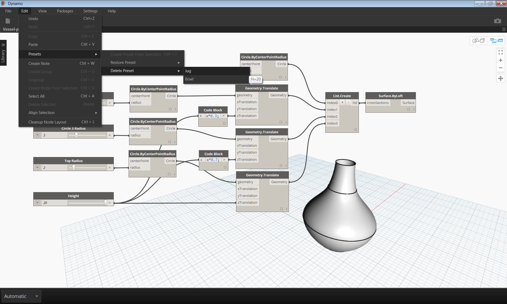

## MANAGING YOUR DATA

In the previous section we looked at managing programs by aligning, grouping, and annotating nodes to organize the Workspace. These best practices help to reduce some of the complexity of your graph. However, key user inputs may still be unclear to someone unfamiliar with your graph, or unfamiliar with visual programming at all. Inputs such as numbers, strings, code blocks, selection nodes, and sliders may be scattered throughout the Workspace and difficult for another user to find and interact with. One way to manage multiple inputs is by saving Presets.

###Presets

Presets are a way to take the current value of a selection of input nodes and save them as a preset state. These states can be restored through the Edit>Presets menu. Presets can be used to create and compare design iterations. Presets are saved with the file, making them a useful tool for sharing or requesting feedback. They also allow another user to interact with the graph without having to search for the relevant inputs, or tune a set of values that work well together from a design perspective.

>1. Preset 1
>2. Preset 2

###Creating Presets
To create a preset, select one or more input nodes. Right-click the canvas and select "Create Preset from Selection", or press Control+T. 
Let's take a look at an example. Below is a simple graph that creates a surface by lofting through a series of circles. 

>1. The inputs of the graph are a series of sliders controlling the height and radii

>Select the input sliders and type Control+T

>Enter a name and description for the saved state in the dialog. Create several states with different input values.

###Restoring Presets
To restore a saved preset, navigate to Edit>Presets>Restore Preset. This will set all the nodes in that state to the saved values. If a node in the state is no longer present in the graph (ie. if it has been deleted), all other nodes in the state will be set.

###Deleting Presets
To delete a preset, navigate to Edit>Presets>Delete Preset. This will remove a state from the list of saved states.

