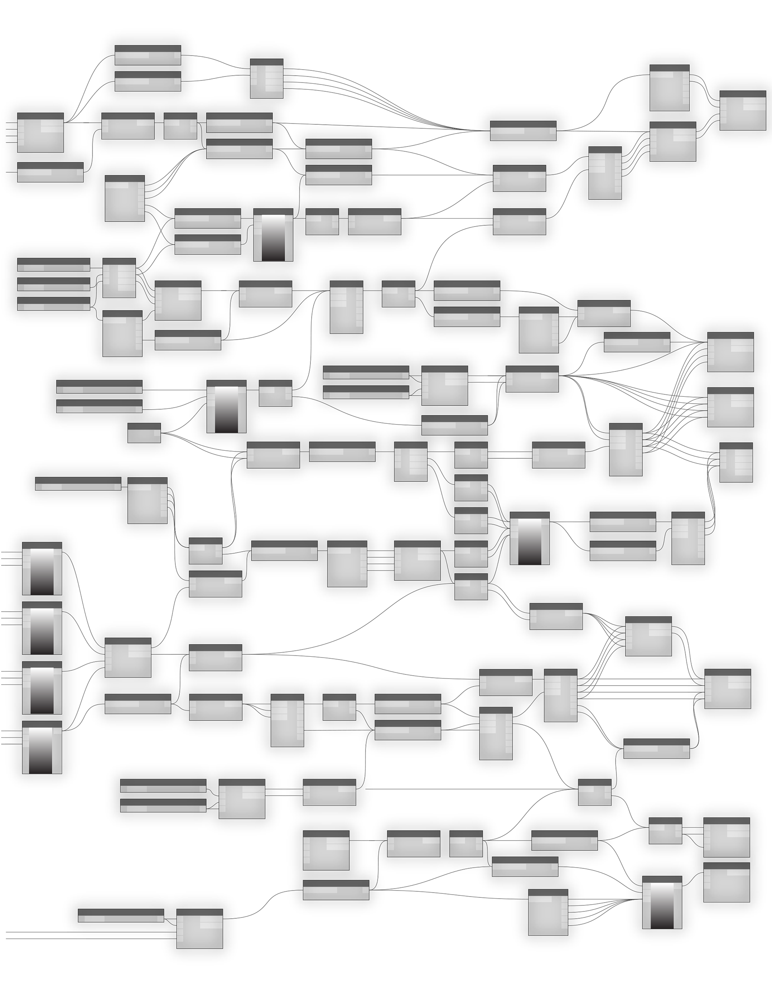

#ANATOMY OF A VISUAL PROGRAM

Dynamo enables us to create Visual Programs in a Workspace by connecting Nodes with Wires to specify the logical flow of the resulting Visual Program. This chapter introduces the elements of Visual Programs, the organization of the Nodes available in Dynamo's Libraries, the parts and states of Nodes, and best practices for your Workspaces.

