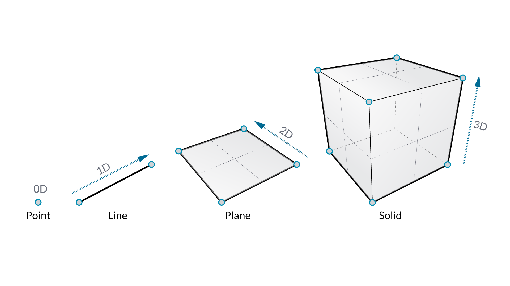
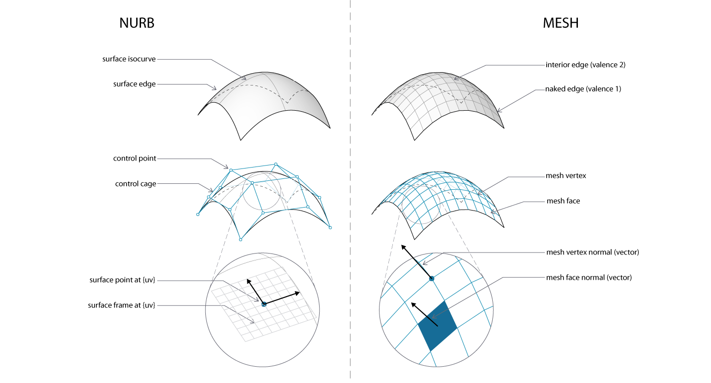

## 4.1 Data

### 4.1.1 Types
#### Numbers

#### Booleans

#### Strings

## Geometry

#####Points

A point is a location in space. For this primer, our coordinate system is X,Y, and Z. A point has a value for X, a value for Y, and a value for Z.

#####Vectors

A vector is a geometric quantity describing Direction and Magnitude. Vectors are abstract; ie. they represent a quantity, not a geometrical element.

#####Planes

Planes are “Flat” and extend infinitely in two directions, defining a local coordinate system.

#####Nurbs
 

NURBS (non-uniform rational B-splines) are mathematical representations that can accurately model any shape from a simple 2D line, circle, arc, or box to the most complex 3D free-form organic surface or solid.  They are created with rational algorithms and are infinitely differentiable.

#####Meshes

A mesh is a collection of vertices, edges and faces which define a polyhedral object.  Meshes are often used for rendering and animation, and are generally 'lighter weight' than nurbs (meaning, they have smaller file sizes and render more quickly).  The tradeoff is that meshes are limited in their resolution.

#####Meshes vs. Nurbs
Generally, we can say that Nurbs are to Meshes as Vectors are to Pixels.  They are significantly different geometry types, and using the propery geometry type for surfaces is critical for parametric modeling and file management.

#####Solids

##### "Null"

### 4.1.2 Hierarchy

#### Item(s)

An item represents one single value, whether by itself or as part of a list.  This can be any data type.
#### List(s)

A list represents a collection of items.

**With respect to data structure, lists are regarded as items in Dynamo.**  In other words, Dynamo functions with a top-down hierarchy for data structure. What does this mean?  Let's walk-through it with an example:

### 4.2.2 Exercise

