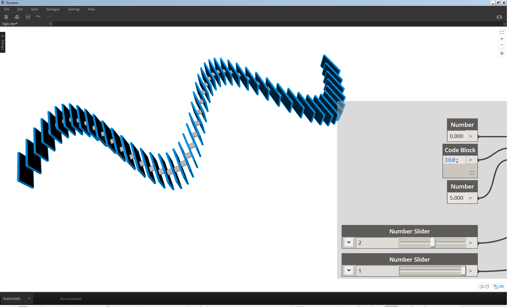
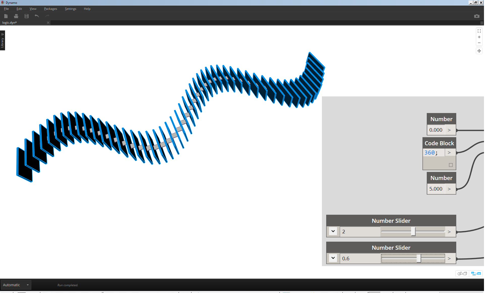
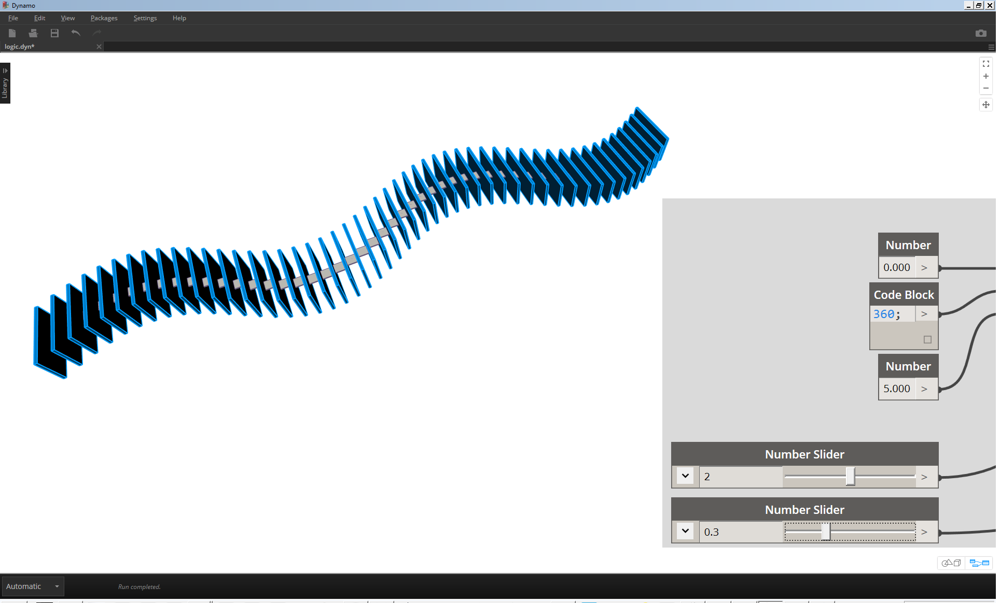

## 4.1 Data

### 4.1.1 Types
#### Numbers
| Icon | Name | Inputs | Outputs |
| -- | -- | -- | -- | -- | -- |-- |
|  | Number | Number Box | double |
#### Booleans
| Icon | Name | Inputs | Outputs |
| -- | -- | -- | -- | -- | -- |-- |
|   | Boolean | True/False | boolean |

#### Strings
| Icon | Name | Inputs | Outputs |
| -- | -- | -- | -- | -- | -- |-- |
|  | String | Text Box | string |

## Geometry

#####Points

| Icon | Name/Syntax | Inputs | Outputs |
| -- | -- | -- | -- | -- | -- |
|  | Point.ByCoordinates | x,y,z | Point |
|  | Point.ByCylindricalCoordinates | cs,angle,elevation,radius | Point |
|  | Point.BySphericalCoordinates | cs,phi,theta,radius | Point |

A point is a location in space. For this primer, our coordinate system is X,Y, and Z. A point has a value for X, a value for Y, and a value for Z.

#####Vectors
| Icon | Name/Syntax | Inputs | Outputs |
| -- | -- | -- | -- | -- | -- |
|  | Vector.ByCoordinates | x,y,z | Vector |
|  | Vector.ByTwoPoints| start,end | Vector |
|  | Vector.XAxis | none | Vector |
|  | Vector.YAxis | none | Vector |
|  | Vector.ZAxis | none | Vector |

A vector is a geometric quantity describing Direction and Magnitude. Vectors are abstract; ie. they represent a quantity, not a geometrical element.

#####Planes
| Icon | Name/Syntax | Inputs | Outputs |
| -- | -- | -- | -- | -- | -- |
|  | Vector.ByCoordinates | p1,p2,p3 | Plane |
|  | Vector.ByTwoPoints| origin,normal | Plane |
|  | Plane.XY  | none | Plane |
|  | Plane.XZ | none | Plane |
|  | Plane.YZ | none | Plane |

Planes are “Flat” and extend infinitely in two directions, defining a local coordinate system.

#####Nurbs
| Icon | Name/Syntax | Inputs | Outputs |
| -- | -- | -- | -- | -- | -- |
|  | NurbsSurface.ByControlPoints | ControlVertices,uDegree,vDegree | NurbsSurface |
|  | NurbsCurve.ByControlPoints | points | NurbsCurve |

NURBS (non-uniform rational B-splines) are mathematical representations that can accurately model any shape from a simple 2D line, circle, arc, or box to the most complex 3D free-form organic surface or solid.  They are created with rational algorithms and are infinitely differentiable.

#####Meshes
| Icon | Name/Syntax | Inputs | Outputs |
| -- | -- | -- | -- | -- | -- |
|  | Mesh.ByPointsFaceIndices | vertexPositions,indices | Mesh |

A mesh is a collection of vertices, edges and faces which define a polyhedral object.  Meshes are often used for rendering and animation, and are generally 'lighter weight' than nurbs (meaning, they have smaller file sizes and render more quickly).  The tradeoff is that meshes are limited in their resolution.

#####Meshes vs. Nurbs
Generally, we can say that Nurbs are to Meshes as Vectors are to Pixels.  They are significantly different geometry types, and using the propery geometry type for surfaces is critical for parametric modeling and file management.

#####Surfaces
| Icon | Name/Syntax | Inputs | Outputs |
| -- | -- | -- | -- | -- | -- |
|  | Surface.ByLoft | crossSections | Surface |
|  | Surface.ByPatch| closedCurve | Surface |
|  | Surface.ByPerimeterPoints  | points | Surface |
|  | Surface.BySweep| profile,path | Surface |
|  | Surface.ByRevolve | profile,axisOrigin,axisDirection,startAngle,sweepAngle | Surface |

#####Solids
| Icon | Name/Syntax | Inputs | Outputs |
| -- | -- | -- | -- | -- | -- |
|  | Solid.ByUnion | solids | Solid |
|  | Solid.ByJoinedSurfaces| facesOfSolid | Solid |
|  | Solid.ByLoft  | crossSections | Solid |
|  | Solid.BySweep| profile,path | Solid |
|  | Solid.ByRevolve | profile,axisOrigin,axisDirection,startAngle,sweepAngle | Solid |

##### "Null"
| Icon | Name/Syntax | Inputs | Outputs |
| -- | -- | -- | -- | -- | -- |
|  | Object.IsNull | obj | bool |
### 4.1.2 Hierarchy

#### List(s)
| Icon | Name/Syntax | Inputs | Outputs |
| -- | -- | -- | -- | -- | -- |
|  | List.Create | index0, index1... | list |

A list represents a collection of items.

**With respect to data structure, lists are regarded as items in Dynamo.**  In other words, Dynamo functions with a top-down hierarchy for data structure. What does this mean?  Let's walk-through it with an example:

#### Item(s)
| Icon | Name/Syntax | Inputs | Outputs |
| -- | -- | -- | -- | -- | -- |
|  | List.GetItemAtIndex | list,index | var[]...[] |

An item represents one single value, whether by itself or as part of a list.  This can be any data type.

### 4.2.2 Exercise
In this first example, we assemble a shelled cylinder which walks through the geometry hierarchy discussed in this section.

> 1. **Point.ByCoordinates -** after adding the battery to canvas, we see a point at the origin of the Dynamo preview grid.  The default values of the *x,y*, and *z* inputs are *0.0*, giving us a point at this location.

> 1. **Plane.ByOriginNormal -** The next step in the geometry hierarchy is a plane.  There are several ways to construct a plane, and we are using an origin and normal for the input.  The origin is the point battery created in the previous step.
2. **Vector.ZAxis -** this is a unitized vector in the z direction.  Notice there are not inputs, only a vector of [0,0,1] value.  We use this as the *normal* input for the *Plane.ByOriginNormal* battery.  This gives us a rectangular plane in the Dynamo preview.

> 1. **Circle.ByPlaneRadius -** Stepping up the hierarchy, we now create a curve from the plane in our previous step.  After plugging into the battery, we get a circle at the origin.  The default radius on the battery is value of *1*.

> 1. **Curve.Extrude -** Now we make this thing pop by giving it some depth and going in the third dimension.  This battery creates a surface from a curve by extruding it.  The default distance on the battery is *1*, and we should see a cylinder in the viewport.

> 1. **Surface.Thicken -** This battery gives us a closed solid by offsetting the surface a given distance and closing the form.  The default thickness value is *1*, and we see a shelled cylinder in the viewport in line with these values.

> 1. **Number Slider -** Rather than using the default values for all of these inputs, let's add some parametric control to the model.
2. **Domain Edit - **after adding the number slider to the canvas, click the caret in the top left to reveal the domain options.
3. **Min/Max/Step -** change the *min*, *max*, and *step* values to *0*,*2*, and *0.01* respectively. We are doing this to control the size of the overall geometry.

> 1. **Number Sliders -** In all of the default inputs, let's copy and paste this number slider (select the slider, hit Ctrl+C, then Ctrl+V) several times, until all of the inputs with defaults have a slider instead.  Some of the slider values will have to be larger than zero to get the definition to work (ie: you need an extrusion depth in order to have a surface to thicken).

We've now created a parametric shelled cylinder with these sliders.  Try to flex some of these parameters and see the geometry update dynamically in the Dynamo viewport.

> 1. **Number Sliders -** taking this a step further, we've added a lot of sliders to the canvas, and need to clean up the interface of the tool we just created.  Right click on one slider, select "Rename..." and change each slider to the appropriate name for its parameter.  You can reference the image above for names.

At this point, we've created an awesome thickening cylinder thing.  This is one object currently, let's look at how to create an array of cylinders that remains dynamically linked.  To do this, we're going to create a list of cylinders, rather than working with a single item.

> 1. **Addition (+) -** Our goal is to add a row of cylinder next to the cylinder we've created.  If we want to add one cylinder adjacent to the current one, we need to consider both radius of the cylinder and the thickness of its shell.  We get this number by adding the two values of the sliders.

> This step is more involved so let's walk through it slowly: the end goal is to create a list of numbers which define the locations of each cylinder in a row.
1. **Multiplication -** First, we want to multiply the value from the previous step by 2. The value from the previous step represents a radius, and we want move the cylinder the full diameter.
2. **Number Sequence -** we create an array of numbers with this battery.  The first input is the *multiplication* battery from the previous step into the *step* value.  The *start* value can be set to *0.0* using a *number* battery.
3.  **Integer Slider - ** For the *amount* value, we connect an integer slider. This will define how many cylinders are created.
4. **Output - ** This list shows us the distance moved for each cylinder in the array, and is parametrically driven by the original sliders.

> 1. This step is simple enough - plug the sequence defined in the previous step into the *x* input of the original *Point.ByCoordinates*.  This will replace the slider *pointX* which we can delete. We now see an array of cylinders in the viewport (make sure the integer slider is larger than 0).

> The chain of cylinders is still dynamically linked to all of the sliders.  Flex each slider to watch the definition update!

