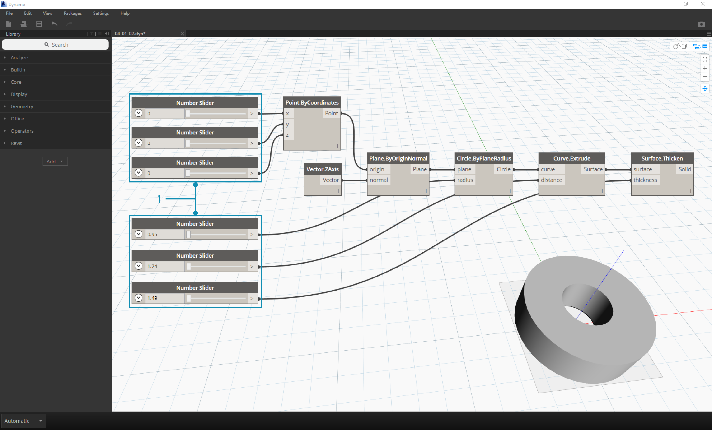
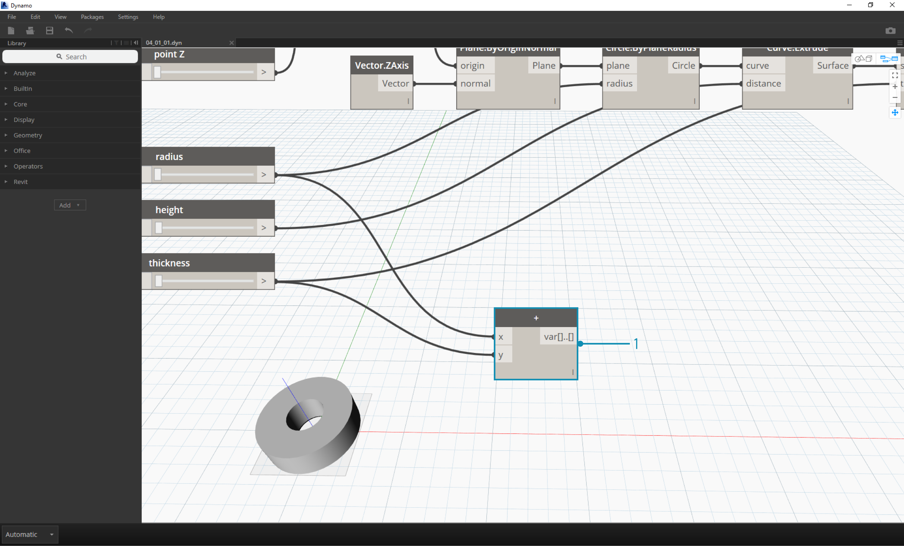
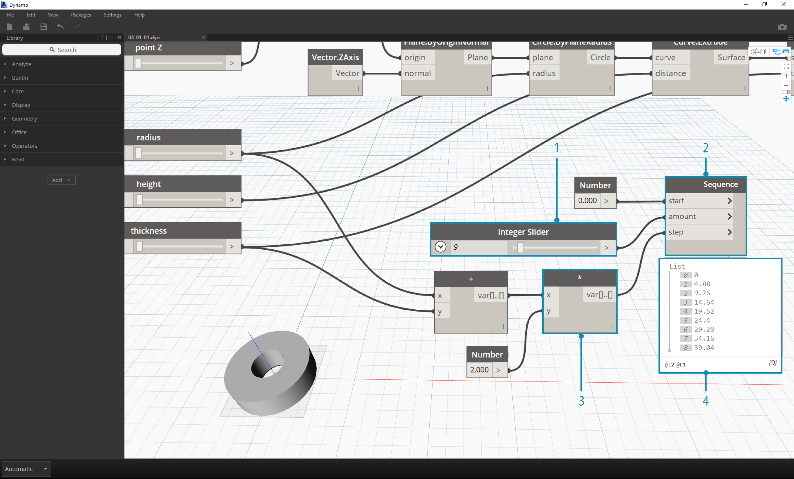

##Data
Data is the stuff of our programs. It travels through Wires, supplying inputs for Nodes where it gets processed into a new form of output data. Let's review the definition of data, how it's structured, and begin using it in Dynamo.

###What is Data?
Data is a set of values of qualitative or quantitative variables. The simplest form of data is numbers such as ```0```, ```3.14```, or ```17```. But data can also be of a number of different types: a variable representing changing numbers (```height```); characters (```myName```); geometry (```Circle```); or a list of data items (```1,2,3,5,8,13,...```). We need data to add to the input Ports of Dynamo's Nodes - we can have data without actions but we need data to process the actions that our Nodes represent. When we've added a Node to the Workspace, if it doesn't have any inputs supplied, the result will be a function, not the result of the action itself.


> 1. Simple Data
2. Data and Action (A Node) successfully executes
3. Action (A Node) without Data Inputs returns a generic function

###Beware of Nulls
The ```'null'``` type represents the absence of data. While this is an abstract concept, you will likely come across this while working with Visual Programming. If an action doesn't create a valid result, the Node will return a null. Testing for nulls and removing nulls from data structure is a crucial part to creating robust programs.

| Icon | Name/Syntax | Inputs | Outputs |
| -- | -- | -- | -- | -- | -- |
|  | Object.IsNull | obj | bool |

###Data Structures
When we are Visual Programming, we can very quickly generate a lot of data and require a means of managing its hierarchy. This is the role of Data Structures, the organizational schemes in which we store data. The specifics of Data Structures and how to use them vary from programming language to programming language. In Dynamo, we add hierarchy to our data through Lists. We will explore this in depth in later chapters, but let's start simply:

A list represents a collection of items placed into one structure of data:
* I have five fingers (*items*) on my hand (*list*).
* There are ten houses (*items*) on my street (*list*).


> 1. A **Number Sequence** node defines a list of numbers by using a *start*, *amount*, and *step* input. With these nodes, we've created two separate lists of ten numbers, one which ranges from *100-109* and another which ranges from *0-9*.
2. The **List.GetItemAtIndex** node selects an item in a list at a specific index.  When choosing *0*, we get the first item in the list (*100* in this case).
3. Applying the same process to the second list, we get a value of *0*, the first item in the list.
4. Now we merge the two lists into one by using the **List.Create** node.  Notice that the node creates a *list of lists.* This changes the structure of the data.
5. When using **List.GetItemAtIndex** again, with index set to *0*, we get the first list in the list of lists.  This is what it means to treat a list as an item, which is somewhat different from other scripting languages. We will get more advanced with list manipulation and data structure in later chapters.

The key concept to understand about data hierachy in Dynamo: **with respect to data structure, lists are regarded as items.**  In other words, Dynamo functions with a top-down process for understanding data structures. What does this mean? Let's walk through it with an example.

### Using Data to Make a Chain of Cylinders
>Download the example file that accompanies this exercise (Right click and "Save Link As..."): [Building Blocks of Programs - Data.dyn](datasets/4-1/Building Blocks of Programs - Data.dyn). A full list of example files can be found in the Appendix.

In this first example, we assemble a shelled cylinder which walks through the geometry hierarchy discussed in this section.

> 1. **Point.ByCoordinates -** after adding the node to canvas, we see a point at the origin of the Dynamo preview grid.  The default values of the *x,y*, and *z* inputs are *0.0*, giving us a point at this location.


> 1. **Plane.ByOriginNormal -** The next step in the geometry hierarchy is a plane.  There are several ways to construct a plane, and we are using an origin and normal for the input.  The origin is the point node created in the previous step.
2. **Vector.ZAxis -** this is a unitized vector in the z direction.  Notice there are not inputs, only a vector of [0,0,1] value.  We use this as the *normal* input for the *Plane.ByOriginNormal* node.  This gives us a rectangular plane in the Dynamo preview.


> 1. **Circle.ByPlaneRadius -** Stepping up the hierarchy, we now create a curve from the plane in our previous step.  After plugging into the node, we get a circle at the origin.  The default radius on the node is value of *1*.


> 1. **Curve.Extrude -** Now we make this thing pop by giving it some depth and going in the third dimension.  This node creates a surface from a curve by extruding it.  The default distance on the node is *1*, and we should see a cylinder in the viewport.


> 1. **Surface.Thicken -** This node gives us a closed solid by offsetting the surface a given distance and closing the form.  The default thickness value is *1*, and we see a shelled cylinder in the viewport in line with these values.


> 1. **Number Slider -** Rather than using the default values for all of these inputs, let's add some parametric control to the model.
2. **Domain Edit - **after adding the number slider to the canvas, click the caret in the top left to reveal the domain options.
3. **Min/Max/Step -** change the *min*, *max*, and *step* values to *0*,*2*, and *0.01* respectively. We are doing this to control the size of the overall geometry.


> 1. **Number Sliders -** In all of the default inputs, let's copy and paste this number slider (select the slider, hit Ctrl+C, then Ctrl+V) several times, until all of the inputs with defaults have a slider instead.  Some of the slider values will have to be larger than zero to get the definition to work (ie: you need an extrusion depth in order to have a surface to thicken).

We've now created a parametric shelled cylinder with these sliders.  Try to flex some of these parameters and see the geometry update dynamically in the Dynamo viewport.


> 1. **Number Sliders -** taking this a step further, we've added a lot of sliders to the canvas, and need to clean up the interface of the tool we just created.  Right click on one slider, select "Rename..." and change each slider to the appropriate name for its parameter.  You can reference the image above for names.

At this point, we've created an awesome thickening cylinder thing.  This is one object currently, let's look at how to create an array of cylinders that remains dynamically linked.  To do this, we're going to create a list of cylinders, rather than working with a single item.


> 1. **Addition (+) -** Our goal is to add a row of cylinders next to the cylinder we've created.  If we want to add one cylinder adjacent to the current one, we need to consider both radius of the cylinder and the thickness of its shell.  We get this number by adding the two values of the sliders.


> This step is more involved so let's walk through it slowly: the end goal is to create a list of numbers which define the locations of each cylinder in a row.
1. **Multiplication -** First, we want to multiply the value from the previous step by 2. The value from the previous step represents a radius, and we want to move the cylinder the full diameter.
2. **Number Sequence -** we create an array of numbers with this node.  The first input is the *multiplication* node from the previous step into the *step* value.  The *start* value can be set to *0.0* using a *number* node.
3.  **Integer Slider - ** For the *amount* value, we connect an integer slider. This will define how many cylinders are created.
4. **Output - ** This list shows us the distance moved for each cylinder in the array, and is parametrically driven by the original sliders.


> 1. This step is simple enough - plug the sequence defined in the previous step into the *x* input of the original *Point.ByCoordinates*.  This will replace the slider *pointX* which we can delete. We now see an array of cylinders in the viewport (make sure the integer slider is larger than 0).


> The chain of cylinders is still dynamically linked to all of the sliders.  Flex each slider to watch the definition update!

