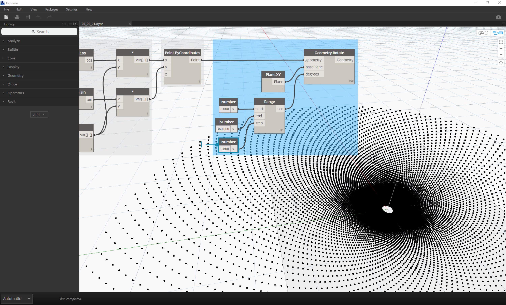

##Math Exercise - Fibonacci Spiral

>In the first step, we define a number sequence based on three inputs: start, amount and step.  This sequence represents the 't' in the parametric equation, so we want to use a list that's large enough to define a spiral.

> 1. **Polycurve.ByPoints:** Point.ByCoordinates into *points*.  We can leave *connectLastToFirst* without an input because we aren't making a closed curve.  This creates a spiral which passes through each point defined in the previous step.

We've now completed the Fibonacci Spiral!  We'll now branch into two separate exercises from here, which we'll call the Nautilus and the Sunflower.  These are abstractions of natural systems, but the two different applications of the Fibonacci spiral will make sense visually.
###Nautilus

###Sunflower

