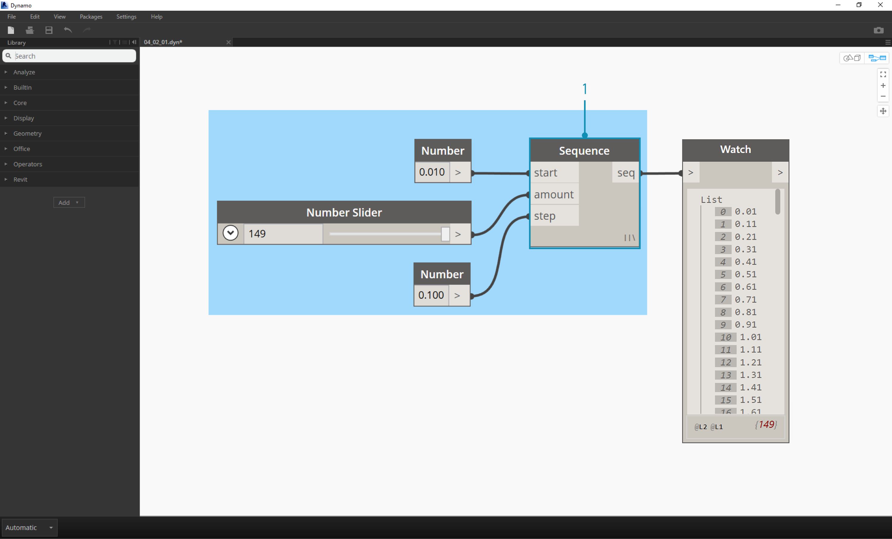
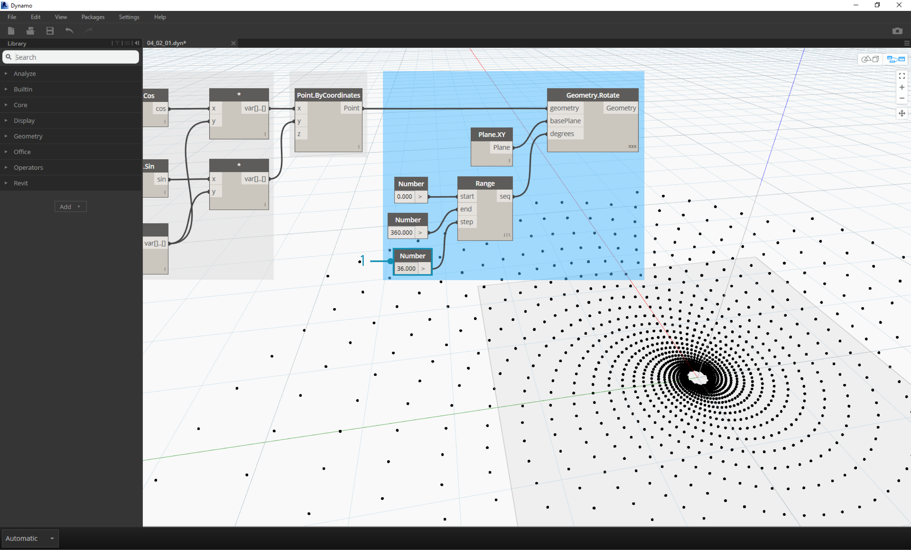

###Fibonacci Spiral

>In the first step, we define a number sequence based on three inputs: start, amount and step.  This sequence represents the 't' in the parametric equation, so we want to use a list that's large enough to define a spiral.

>1. Curve.ParameterAtPoint: The input for the curve is the Polycurve.ByPoints battery and the input for the point list is Point.ByCoordinates.  With this battery, we get a normalized parameter along the curve, which is a setup for the step to follow.
2. Curve.PlaneAtParameter: The curve input is Polycurve.ByPoints and the param input is the battery from the previous step.  This gives us a perpendicular frame to the curve at each point.
3.  Add a Circle.ByPlaneRadius battery to the canvas.
