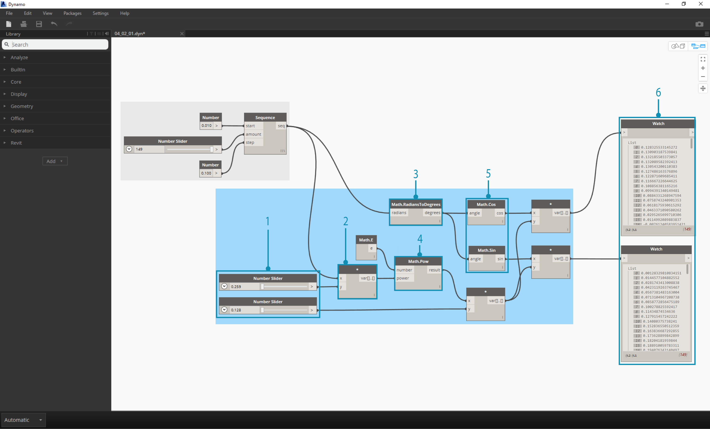
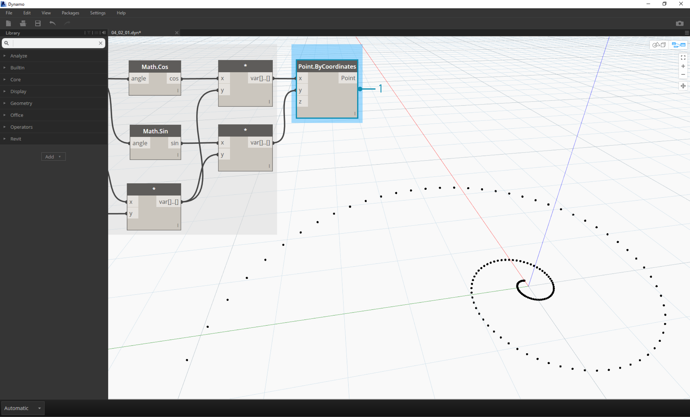
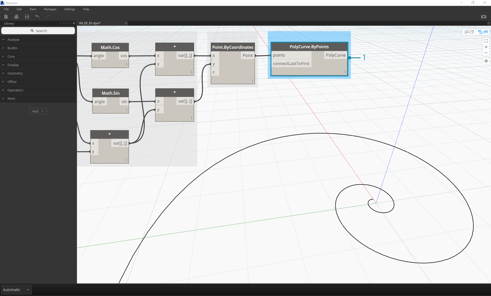
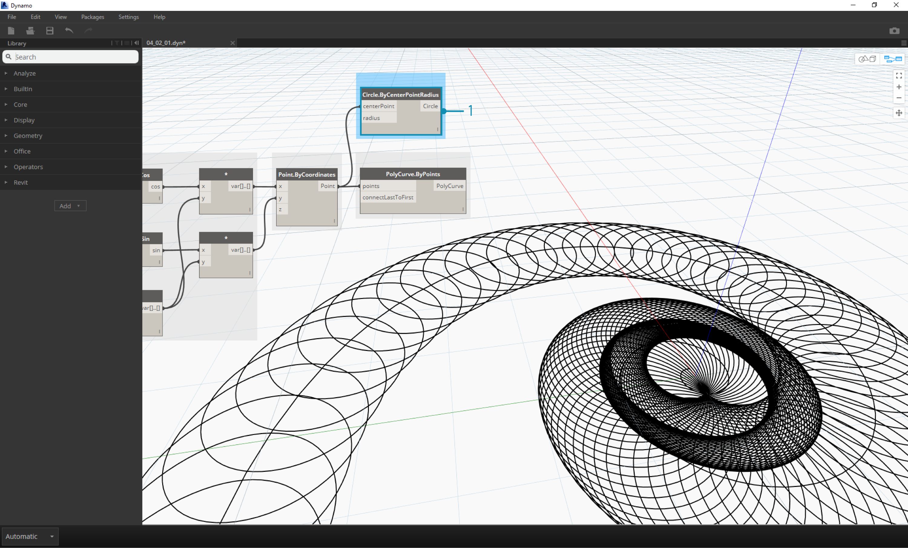
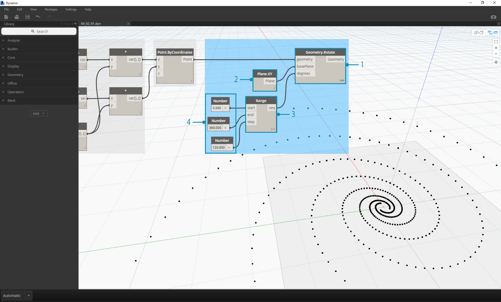

## 4.2 Math

## 4.2.1 Constants

| Icon | Name | Syntax| Inputs | Outputs |
| -- | -- | -- | -- | -- | -- |-- |
|  | Pi | Math.PI | none | double |

**Pi -** is a mathematical constant which represents the ratio of circle's circumference to its diameter.  The value is commonly used in trigonmetric functions and is one of the more prevalent constants used in parametric modeling.

| Icon | Name | Syntax| Inputs | Outputs |
| -- | -- | -- | -- | -- | -- |-- |
|  | e | Math.E | none | double |

**e -** The number *e* is a mathematical constant which is based on the natural logarithm.  Like *pi*, *e* is an irrational number which is commonly used in mathematics. The number is fundamental to growth prediction, and shows itself often in the fields of biology and economics.

| Icon | Name | Syntax| Inputs | Outputs |
| -- | -- | -- | -- | -- | -- |-- |
|  | phi | Math.GoldenRatio | none | double |


**φ: The Golden Ratio - **Another irrational constant, the golden ratio defines that two quantities are in the golden ratio if their ratio is the same as the ratio of their sum to the larger of the two quantities.  This ratio appears often in geometry and biological systems, and is considered for a wide-range of applications ranging from the practical to the aesthetic.

## 4.2.2 Arithmetic Operators
Operators are a set of components that use
algebraic functions with two numeric input values, which result in one output
value (addition, subtraction, multiplication, division, etc.).

You use the Math Operators to perform arithmetical
actions on a set of numbers. These can be found under Operators>Actions.

####Addition, Subtraction, Multiplication, Division


These four operators are commonplace.  Let's look at a few other operators which dive deeper:

####Exponent


Exponentiation, or the power operator, involves two numbers: the base number (x) and the power (y). The power of x to the y is defined as x repeatedly multiplied by itself for a total of y times.  For example:
```
2 ^ 3 = 2 x 2 x 2 = 8.```

####Square Root


The square root of x referes to the number z such that z^2=x.  This operator is commonplace in a wide-range of geometric applications, most notably the [Pythagorean Theorem](http://en.wikipedia.org/wiki/Pythagorean_theorem).  For example:
```
Sqrt(4) = 2```


####Absolute Value


The absolute value of a number refers to its non-negative value.  In other words
```
|-10| = 10 and |10| = 10```

This operator comes in handy when parametrically, especially when a calculation concerns itself with scalar values rather than vectors (ie speed vs. velocity).
####Modulo


The modulo operation refers to the remainder after a division. For example,
```
11 % 6 = 5 (6 goes into 11 once, and has a remainder, or modulo, of 5)```

While this may not seem like much, the modulo is a great tool for creating patterns.  The image below demonstrates how quickly one can parse out even and odd numbers with pure operations:

####Ceiling, Floor, Round
 


The ceiling, floor, and round operation refer to methods for reducing a decimal (or float) number to an integer.  In division, for example:
```
11/6 = 1.833```

The floor represents the lower bound of the integer within the decimal range.
```
Floor(11/6) = Floor(1.833) = 1```

The ceiling represents the upper bound.
```
Ceil(11/6) = Ceil(1.833) = 2```

The round operations will 'round' to the closest number in the range.
```
Round(11/6) = Round(1.833) = 2```

## 4.2.3 Functions
#### Remap Range


This is one of the most important functions in parametric modeling.  The component maps a set of values in one domain into another domain, while maintaining the same distribution ratio.
#### Average


Determines the average (mean) of a list of numbers.
#### Sum


Determines the sum of a list of numbers.
#### Random/RandomList
 

Create a random number or a random list of numbers.
#### Trigonometric Functions
In summary, trigonometric functions are functions of an angle, relating the angles of a triangle to the lengths of its sides.  The input in Dynamo is degrees.

| Icon | Name| Syntax| Ratio | Formula |
| -- | -- | -- | -- | -- |
|  | sine| Math.Sin | opposite/hypotenuse |   |
|  | cosine | Math.Cos | adjacent/hypotenuse |  |
|  | tangent | Math.Tan | opposite/adjacent |  |


#### Inverse Trigonometric Functions

Inverse trigonometric functions use a ratio as an input, with the resultant output being an angle.  The output in Dynamo is degrees.  These are less commonly used in modeling.

| Icon | Name| Syntax| Formula |
| -- | -- | -- | -- |
|  | arcsine| Math.Asin |  |
|  | arccosine | Math.Acos |  |
|  | arctangent | Math.Atan |  |

#### Hyperbolic Functions
Even less common in trigonometry are the hyperbolic functions, which are analogs to the trigonometric functions.  These functions have applications in physics, fluid dynamics, and complex analysis, but are outside of the scope of this primer.

| Icon | Name| Syntax| Formula |
| -- | -- | -- | -- |
|  | sinh | Math.Sinh |  |
|  | cosh | Math.Cosh |  |
|  | tanh | Math.Tanh |  |

#### Math.RadiansToDegrees/Math.DegreesToRadians
 

Convert Radians to Degrees.  This is a handy battery for quickly converting angle units.  Dynamo works in degrees by default for inputs and outputs.


### 4.2.4 Formulas

##Math Exercise - Fibonacci Spiral
###Parametric Formula

>1. **Number Sequence:** define a number sequence based on three inputs: *start, amount* and *step*.  This sequence represents the 't' in the parametric equation, so we want to use a list that's large enough to define a spiral.

The step above has created a list of numbers to define the parametric domain.  The golden spiral is defined as the equation:  = and
=. The group of batteries below represent this equation in visual programming form.


> When stepping through the group of batteries, try to pay attention the parallel between the visual program and written equation.
1. **Number Slider:** Add two number sliders to the canvas.  These sliders will represent the *a* and the *b* variables of the parametric equation.  These represent a constant which is flexible, or parameters which we can adjust towards a desired outcome.
2. ** * :** The multiplication battery is represented by an aseterisk.  We'll use this repeatedly to connect multiplying variables
3. **Math.RadiansToDegrees:** The '*t*' values need to be translate to degrees for their evaluation in the trigonometric functions.  Remember, Dynamo defaults to degrees for evaluating these functions.
4. **Math.Pow:** as a function of the '*t*' and the number '*e*' this creates the Fibonacci sequence.
5. **Math.Cos and Math.Sin:**  These two trigonmetric function will differentiating the x-coordinate and the y-coordinate, respectively, of each parametric point.
6.  **Watch: **We now see that our output is two lists, these will be the *x* and *y* coordinates of the points used to generate the spiral.


###From Formula to Geometry
Now, the bulk of batteries from the previous step will work fine, but it is a lot of work.  To create a more efficient workflow, have a look at **code blocks** (section 3.2.3) to define a string of Dynamo expressions into one node.  In this next series steps, we'll look at using the parametric equation to draw the Fibonacci spiral.

> 1. **Point.ByCoordinates:** Conect the upper multiplication node into the '*x*' input and the lower into the '*y*' input. We now see a parametric spiral of points on the screen.


> 1. **Polycurve.ByPoints:** Conect Point.ByCoordinates from the previous step into *points*.  We can leave *connectLastToFirst* without an input because we aren't making a closed curve.  This creates a spiral which passes through each point defined in the previous step.

We've now completed the Fibonacci Spiral!  Let's take this further into two separate exercises from here, which we'll call the Nautilus and the Sunflower.  These are abstractions of natural systems, but the two different applications of the Fibonacci spiral will be well represented.
###Nautilus

> 1. As a jumping off point, let's start with the same step from the previous exercise: creating a spiral array of points with the **Point.ByCoordinates** battery.


> 1. **Polycurve.ByPoints:** Again, this is the battery from the pervious exercise, which we'll use as a reference.
2. **Circle.ByCenterPointRadius:** We'll use a circle battery here with the same inputs as the previous step.  The radius value defaults to *1.0*, so we see an immediate output of circles. It becomes immediately legible how the points diverge further from the origin.


> 1. **Circle.ByCenterPointRadius:** To create a more dynamic array of circles, we plug the original number sequence (the '*t*' sequence) into the radius value.
2. **Number Sequence:** This is the original array of '*t*'.  By pluggin this into the radius value, the circle centers are still diverging further from the origin, but the radius of the circles are increasing, creating a funky Fibonacci circle graph.

###Sunflower
Now that we've made a circular Nautilus shell, let's jump into parametric grids.  We're going to use a basic rotate on the Fibonacci Spiral to create a Fibonacci grid, and the result is modeled after the [growth of sunflower seeds.](http://ms.unimelb.edu.au/~segerman/papers/sunflower_spiral_fibonacci_metric.pdf)


> 1. Again, as a jumping off point, let's start with the same step from the previous exercise: creating a spiral array of points with the **Point.ByCoordinates** battery.


> 1. **Geometry.Rotate:** There are several Geometry.Rotate options; be certain you've chosen the battery with *geometry*,*basePlane*, and *degrees* as its inputs.  Connect **Point.ByCoordinates** into the geometry input.
2. **Plane.XY:** Connect to the *basePlane* input. We will rotate around the origin, which is the same location as the base of the spiral.
3.**Number Range:** For our degree input, we want to create multiple rotations. We can do this quickly with a Number Range component.  Connect this into the *degrees* input.
4.**Number:** And to define the range of numbers, add three number nodes to the canvas in vertical order. From top to bottom, assign values of *0.0,360.0,* and *120.0* respectively.  These are driving the rotation of the spiral.  Notice the output results from the **Number Range** node after connecting the three number nodes to the battery.

Our output is beginning to resemble a whirlpool.  Let's adjust some of the **Number Range** parameters and see how the results change:

> 1. Change the step size of the **Number Range** node from *120.0* to *36.0*.  Notice that this is creating more rotations and is therefore giving us a denser grid.


> 1. Change the step size of the **Number Range** node from *36.0* to *3.6*.  This now gives us a much denser grid, and the directionality of the spiral is unclear.  Ladies and gentlemen, we've created a sunflower.

