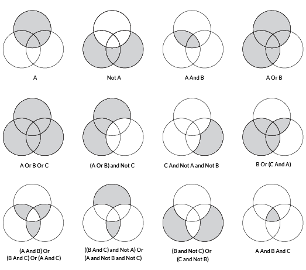
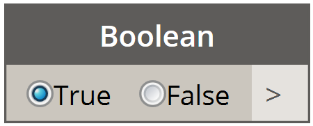

### 4.3.1 Booleans

Numeric variables can store a whole range of different numbers. Boolean
variables can only store two values referred to as Yes or No, True or False,
1 or 0. Obviously we never use booleans to perform calculations because of their
limited range. We use booleans to evaluate conditions.

> The diagram above represents an array of boolean possiblities.  These are used as logical operators for computational modeling.

At the most basic level, Dynamo has a boolean battery which functions as a light switch for logical operations:

> The boolean battery in Dynamo is a basic radio button, toggling between true and false.

