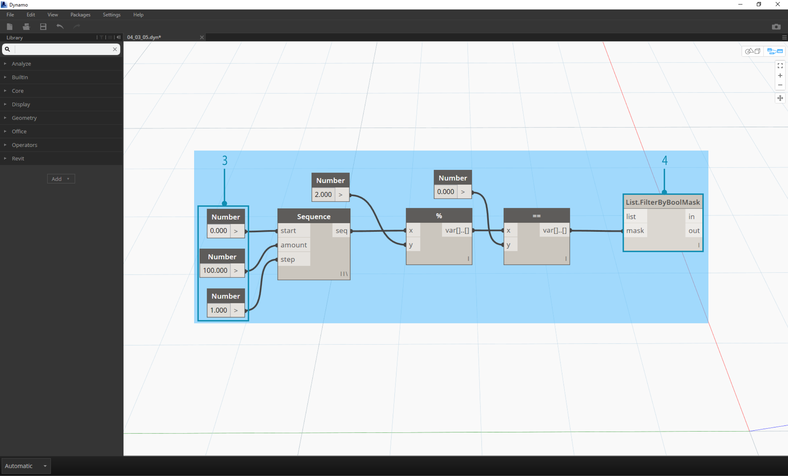
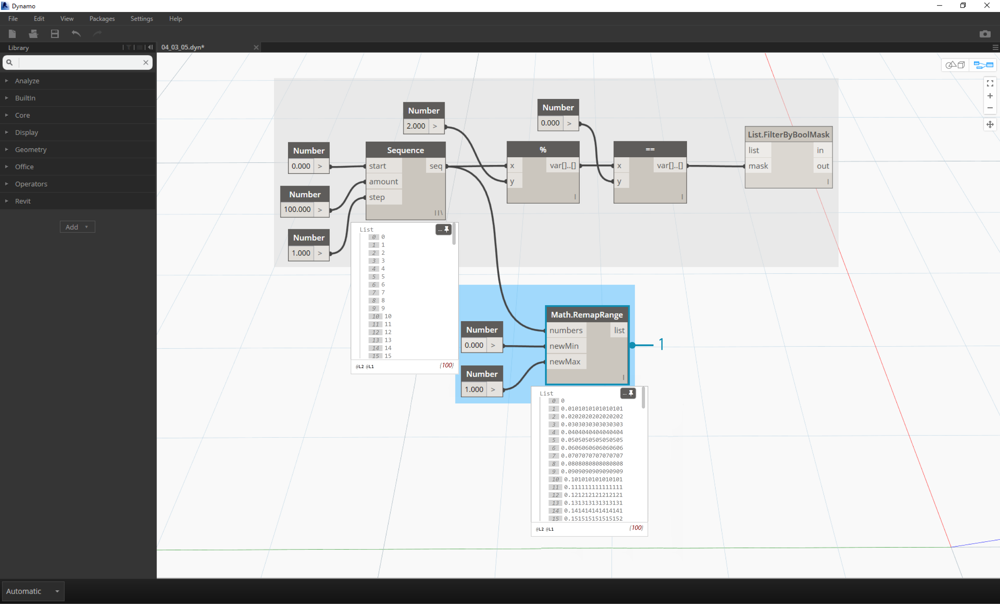

## 4.3 Logic

### 4.3.1 Booleans
Numeric variables can store a whole range of different numbers. Boolean
variables can only store two values referred to as Yes or No, True or False,
1 or 0. Obviously we never use booleans to perform calculations because of their
limited range. We use booleans to evaluate conditions.

| Icon | Name | Syntax| Inputs | Outputs |
| -- | -- | -- | -- | -- | -- |-- |
|  | Boolean | -- | True/False Radio Button | Boolean |
> The boolean battery in Dynamo is a basic radio button, toggling between true and false.

At the most basic level, Dynamo has a boolean battery which functions as a light switch for logical operations.  This is a fundamental element for making conditional evaluation.

### 4.3.2 "If"
The "If" statement is a key concept in programming: "If *this* is true, then *that* happens, otherwise *something else* happens.  The statement's decision is driven by a boolean, and the two results are defined by the user.  There are multiple ways to define an "If" statement in Dynamo:

| Icon | Name | Syntax| Inputs | Outputs |
| -- | -- | -- | -- | -- | -- |-- |
|  | If | If | test, true, false | result|
|  | Formula | IF(x,y,z) | x, y, z | result |
|  | Code Block | (x?y:z)| x, y, z | result|
Let's go over a brief example on each of these three nodes in action using the conditional "If" statement:

> In this image, the *boolean* is set to *true*, which means that the result is a string reading: *"this is the result if true".*  The three batteries creating the *If* statement are working identically here.

> Again, the batteries are working identically.  If the *boolean* is changed to *false*, our result is the number *Pi*, as defined in the original *If* statement.

### 4.3.3 Relational Operators
| Icon | Name | Syntax| Inputs | Outputs |
| -- | -- | -- | -- | -- | -- |-- |
|  | Less Than | < | x,y | boolean(s)|
|  | Less Than or Equal To | <=| x, y | boolean(s) |
|  |Greater Than |>| x, y | boolean(s)|
|  | Greater Than or Equal To | >=| x, y | boolean(s)|
|  | Equal To | ==| x, y | boolean(s)|
|  | Not Equal To | !=| x| boolean(s)|
Relational operators receive one or more inputs, and output a boolean depending on the result of a specific test.  In summary, these are the "*greater than, less than*" tests.  The demo below gives us an example.

> The result of each test is a boolean.  In the *less than* test, *2* is indeed *less than 5*, o the result is *true*. In the *greater than* test, *2* is not *greater than 5*, so the result is *false*.

### 4.3.4 Logic Gates
| Icon | Name | Syntax| Inputs | Outputs |
| -- | -- | -- | -- | -- | -- |-- |
|  | And | && | x, y | boolean(s)|
|  | And | And | bool0,bool1... | boolean(s) |
|  | Or |//| x, y | boolean(s)|
|  | Or| Or| bool0, bool1... | boolean(s)|
|  | Xor |Logic.Xor| a, b | boolean(s)|
|  | Not |Not| x | boolean(s)|
In its simplest form, a logic gate receives two booleans and outputs one boolean.  These are based on fundamental sets, much like a [Venn Diagram](http://en.wikipedia.org/wiki/Venn_diagram).  Dynamo uses the basic gates of *And*, *Or*, and *Xor*.

**And/&& -** In the table above, the two batteries for *And* may be confusing.  Here is how they're different:

> The *&&* battery receives two inputs.  The *And* battery receives two inputs by default (middle icon), but one can click the *+/-* to add or subtract more inputs (right icon with 4 inputs). Other than that, the two are functionally identical. So go with *And* battery.

**Xor -**This battery returns a true value if and only if *one* of the values is *true*.

> This image show the four combinations of two booleans. If both values are *true*, a *false* is returned.  If both values are *false*, a *false* is also returned.  The *true* value is return if and only if *one* of the values is *true*.  This rounds out the three main logic gates for two booleans.

### 4.3.5 Filter

| Icon | Name | Syntax| Inputs | Outputs |
| -- | -- | -- | -- | -- | -- |-- |
|  | Filter By Boolean Mask | List.FilterByBoolMask | list, mask | in, out|

*List.FilterByBoolMask* is a great tool for geometry operations. After conducting a conditional test on an array of elements, one can parse through those elements with this battery.  In the exercise below, we demonstrate this in detail.

### 4.3.6 Exercise
####Even/Odd
This preliminary exercise uses logic to separate a list of numbers into a list of even numbers and a list of odd numbers.

> 1. **Number Range -** add a number range to the canvas.
2. **Numbers -** add three number nodes to the canvas.  The value for each number node should be: *0.0* for *start*, *10.0* for *end*, and *1.0* for *step*.
3. **Output - ** our output is a list of 11 numbers ranging from 0-10.
4. **Modulo (%)-** *Number Range* into *x* and *2.0* into *y*.  This calculates the remainder for each number in the list divided by 2. The output from this list gives us a list of values alternating between 0 and 1.
5. **Equality Test (==) -** add an equality test to the canvas.  Plug *modulo* output into the *x* input and *0.0* into the *y* input.
6. **Watch -** The output of the equality test is a list of values alternating between true and false.  These are the values used to separate the items in the list.  *0* (or *true*) represents even numbers and (*1*, or *false*) represents odd numbers.
6. **List.FilterByBoolMask -** this battery will filter the values into two different lists based on the input boolean.  Plug the original *number range* into the *list* input and the *equality test** output into the *mask* input.  The *in* output represents true values while the *out* output represents false values.
7. **Watch - ** as a result, we now have a list of even numbers and a list of odd numbers. We've used logical operators to separate lists into patterns!

####Zipper
Building off of the logic established in the first exercise, let's apply this setup into a modeling operation.

> 1. We'll jump off from the previous exercise with the same batteries.  The only exceptions:
2. We've changed the format.
3. The input values have changed.
4. We've unplugged the in list input into *List.FilterByBoolMask*. We'll put these batteries aside for now, but they'll come in handy later in the exercise.

> Let's begin by connecting the batteries together as shown in the image above. This group of batteries represents a parametric equation to define a line curve. A few notes:
1. The **first slider** should have a min of 1, a max of 4, and a step of 0.01.
2. The **second slider** should have a min of 0, a max of 1, and a step of 0.01.
3. **PolyCurve.ByPoints -** if the above battery diagram is copied, the result is a sine curve in the Dynamo Preview viewport.

The method here for the inputs: use number nodes for more static properties and number sliders on the more flexible ones.  We want to keep the original number range that we're defining in the beginning of this step.  However, the sine curve that we create here should have some flexibility.  We can move these sliders to watch the curve update its frequency and amplitude.

> We're going to jump around a bit in the definition, so let's look at the end result so that we can reference what we're getting at.  The first two steps are made separately, we now want to connect the two.  We'll use the base sine curve to drive the location of the zipper components, and we'll use the true/false logic to alternate between little boxes and larger boxes.

> 1. **Math.RemapRange - ** Using the number sequence created in step 01, let's create a new series of numbers by remapping the range.  The original numbers from step 01 range from 0-100.  These numbers range from 0 to 1 by by the *newMin* and *newMax* inputs respectively.

> 1. **Curve.PointAtParameter - ** Plug *Polycurve.ByPoints* (from step 2) into *curve* and *Math.RemapRange* into *param*. This step creates points along the curve. We remapped the numbers to 0 to 1 because the input of *param* is looking for values in this range.  A value of *0* represents the start point, a value of *1* represents the end points.  All numbers in between evaluate within the *[0,1]* range.

> 1. **List.FilterByBoolMask - ** Plug *Curve.PointAtParameter* from the previous step into the *list* input.
2. **Watch -** a watch node for *in* and a watch node for *out* shows that we have two lists representing even indices and odd indices.  These points are ordered in the same way on the curve, which we demonstrate in the next step.

> 1. **Cuboid.ByLengths -** recreate the connections seen in the image above to get a zipper along the sine curve. A cuboid is just a box here, and we're defining it's size based on the curve point in the center of hte box.  The logic of the even/odd divide should now be clear in the model.

> 1. **Number Slider -** stepping back to the beginning of the definition, we can flex the number slider and watch the zipper update.  The top row of images represents a range values for the top number slider. This is the frequency of the wave.
2. **Number Slider -** the bottom row of images represents a range of values for the bottom slider.  This is the amplitude of the wave.

