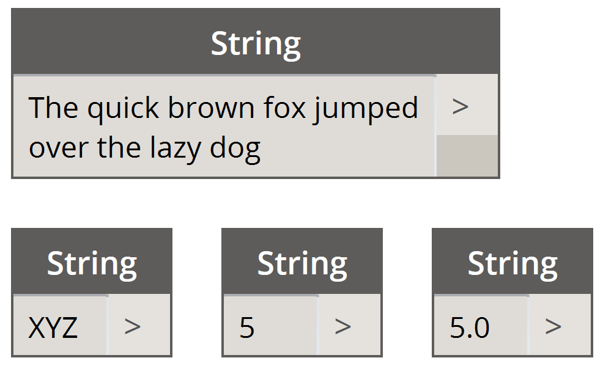

### 4.4.1 Creating Strings
Formally, a string is a sequence of characters representing a literal constant or some type of variable. Informally, a string is programming lingo for text.  We've worked with numbers (integers and decimal ones) to drive parameters, and we can do the same with text.

> The sample batteries above are strings.  A number can be represented as a string, as can a letter, or an entire array of text.

Strings can be used for a wide range of applications, including defining custom parameters, annotating documentation sets, and parsing through text-based data sets. The string battery is located in the Core>Input category of the Dynamo UI.