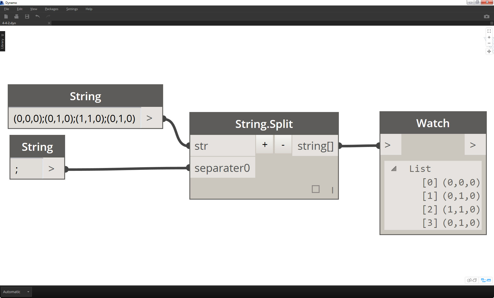

### 4.4.2 Querying Strings

You can parse through large amounts of data quickly by querying strings.  We'll talk about some basic operations which can speed up a workflow and help for software interoperability.
####String.Split
The image below considers a string of data coming from an external spreadsheet.  The string represents the vertices of a rectangle in the XY-Plane.

> 1. The ";" separator splits each vertex of the rectangle.

> 1. The "

####String.IndexOf
Before performing parsing through 

> The image above represents the concatenation of three strings:
1. Add or subtract strings to the concatenation by clicking the +/- buttons int he center of the battery.
2. The output gives one concatenated string, with spaces and punctuation included.