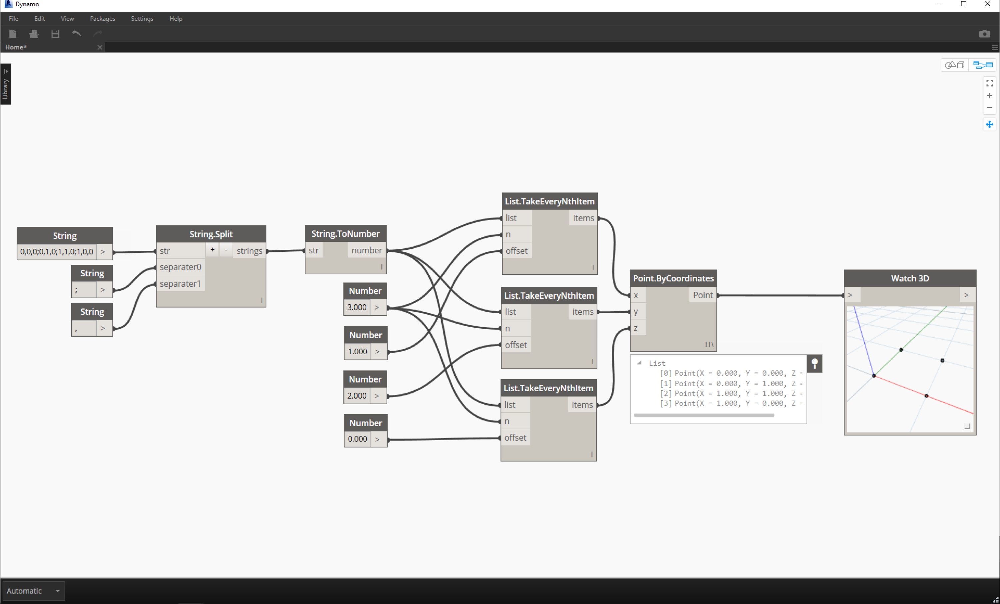

### 4.4.2 Querying Strings

You can parse through large amounts of data quickly by querying strings.  We'll talk about some basic operations which can speed up a workflow and help for software interoperability.
####String.Split
The image below considers a string of data coming from an external spreadsheet.  The string represents the vertices of a rectangle in the XY-Plane.

> 1. The ";" separator splits each vertex of the rectangle.

> 1. The "

> 1. The "

####String.ToNumber
While the list of items above may look like numbers, they are still regarded as individual strings in Dynamo.  In order to create points, their data type needs to be converted from a string to a number.  This is done with the String.ToNumber battery:

> 1. The "
