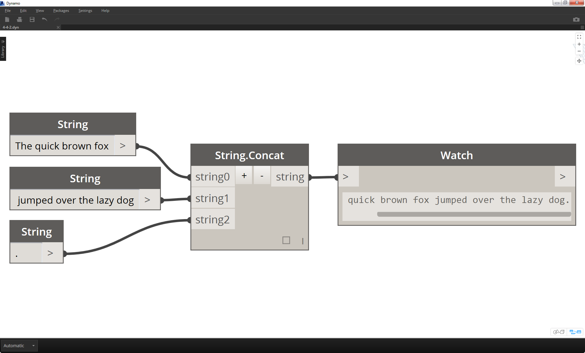
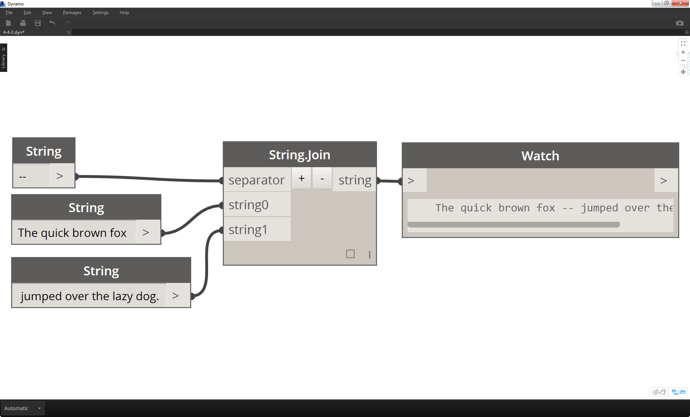

### 4.4.3 Manipulating Strings
Since a string is a generic text object, they host a wide range of applications.  Let's take a look at some of the major actions in the Core>String Category in Dynamo:

####Concatenate
Concatenate is a method of merging two strings together in order. This takes each literal string in a list and creates one merged string.

> The image above represents the concatenation of three strings:
1. Add or subtract strings to the concatenation by clicking the +/- buttons int he center of the battery.
2. The output gives one concatenated string, with spaces and punctuation included.

####Join
The join method is very similar to concatenate, except it has an added layer of punctuation. If you've worked in Excel, you may have come across a CSV file.  This stands for comma-separated values.  One could use a comma (or in this case, two dashes) as the separator with the join battery in order to create a similar data structure:

> The image above represents the joining of two strings:
1. The separator input allows one to create a string which divides the joined strings.