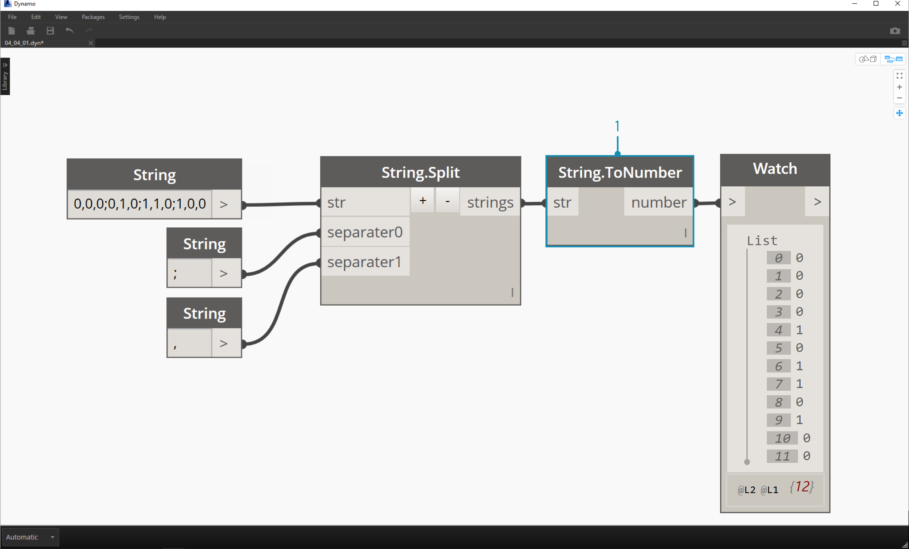
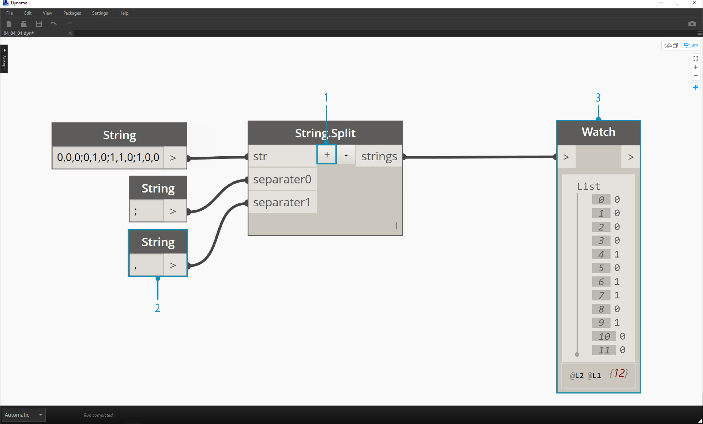
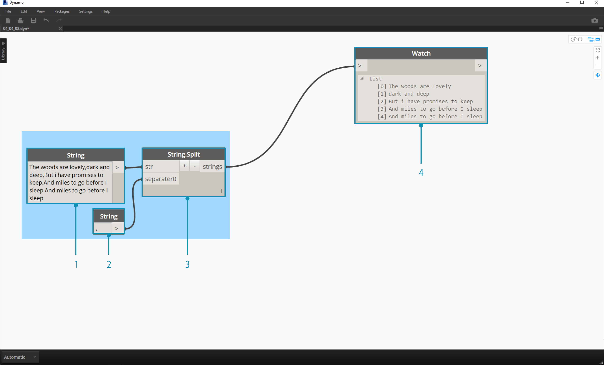
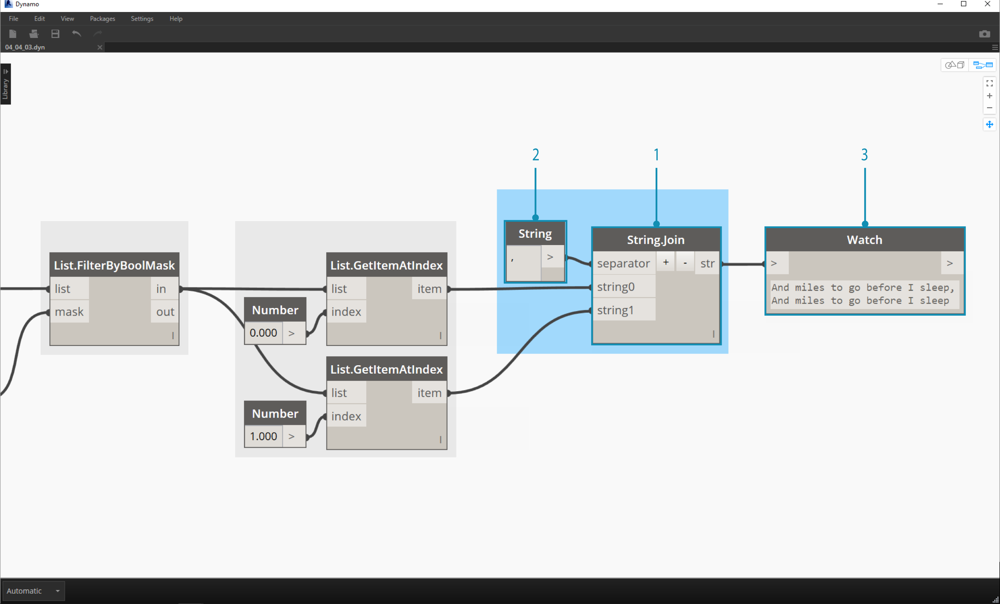

## 4.4 Strings

### 4.4.1 Creating Strings

Formally, a string is a sequence of characters representing a literal constant or some type of variable. Informally, a string is programming lingo for text.  We've worked with numbers (integers and decimal ones) to drive parameters, and we can do the same with text.

> The sample batteries above are strings.  A number can be represented as a string, as can a letter, or an entire array of text.

Strings can be used for a wide range of applications, including defining custom parameters, annotating documentation sets, and parsing through text-based data sets. The string battery is located in the Core>Input category of the Dynamo UI.

### 4.4.2 Querying Strings

You can parse through large amounts of data quickly by querying strings.  We'll talk about some basic operations which can speed up a workflow and help for software interoperability.
####String.Split
The image below considers a string of data coming from an external spreadsheet.  The string represents the vertices of a rectangle in the XY-Plane.

> 1. The ";" separator splits each vertex of the rectangle.

> 1. The "

> 1. The "

####String.ToNumber
While the list of items above may look like numbers, they are still regarded as individual strings in Dynamo.  In order to create points, their data type needs to be converted from a string to a number.  This is done with the String.ToNumber battery:

> 1. The "

### 4.4.3 Manipulating Strings
Since a string is a generic text object, they host a wide range of applications.  Let's take a look at some of the major actions in the Core>String Category in Dynamo:

####Concatenate
Concatenate is a method of merging two strings together in order. This takes each literal string in a list and creates one merged string.

> The image above represents the concatenation of three strings:
1. Add or subtract strings to the concatenation by clicking the +/- buttons int he center of the battery.
2. The output gives one concatenated string, with spaces and punctuation included.

####Join
The join method is very similar to concatenate, except it has an added layer of punctuation. If you've worked in Excel, you may have come across a CSV file.  This stands for comma-separated values.  One could use a comma (or in this case, two dashes) as the separator with the join battery in order to create a similar data structure:

> The image above represents the joining of two strings:
1. The separator input allows one to create a string which divides the joined strings.

### 4.4.4 Strings Exercise
In this exercise, we're going to use methods of querying and manipulating strings to deconstruct the final stanza of Robert Frost's [Stopping By Woods on a Snowy Evening](http://www.poetryfoundation.org/poem/171621).  Not the most practical application, but it will help us to grasp conceptual string actions as we apply them to legible lines of rhythm and rhyme.

> Let's begin with a basic string split of the stanza.  We first notice that the writing is formatted based on commas.  We'll use this format to separate each line into individual items.
1. The base string is pasted into a string node.
2. Another string node is used to denote the separator.  In this case, we're using a comma.
3. A String.Split battery is added to the canvas and connected to the two strings.
4. The output shows that we've now separated the lines into individual elements.

> Now, let's get to the good part of the poem: the last two lines.  The original stanza was one item of data.  We separated this data into individual items in the first step. Now we need to do a search for the text we're looking for. And while we *can* do this by selecting the last two items of the list, if this were an entire book, we wouldn't want to read through everything and manually isolate the elements.
1. Instead of manually searching, we use a String.Contains battery to perform a search for a set of characters.  This is the similar to doing the "Find" command in a word processor.  In this case, we get a return of "true" or "false" if that substring is found within the item.
2. In the "searchFor" input, we define a substring that we're looking for within the stanza. Let's use a string node with the text "And miles".
3. The output gives us a list of falses and trues.  We'll use this boolean logic to filter the elements in the next step.

>1. List.FilterByBoolMask is the battery we want to use to cull out the falses and trues.  The "in" output return the statements with a "mask" input of "true, while the "out" output return those which are "false".
2. Our output from the "in" is as expected, giving us the final two lines of the stanza.

>Now, we want to drive home the repetition of the stanza by merging the two lines together.  When viewing the output of the previous step, we notice that there are two items in the list:
1. Using two List.GetItemAtIndex batteries, we can isolate the items using the values of 0 and 1 as the index input.
2. The output for each battery gives us, in order, the final two lines.

>To merge these two items into one, we use the String.Join battery:
1. After adding the String.Join battery, we notice that we need a separator.
2. To create the separator, we add a string node to the canvas and type in a comma.
3. The final output has merged the last two items into one.

This may seem like a lot of work to isolate the last two lines; and it's true, string operations often require some up front work.  But they are scalable, and they can be applied to large datasets with relative ease.  If you are working parametrically with spreadsheets and interoperability, be sure to keep string operations in mind.

