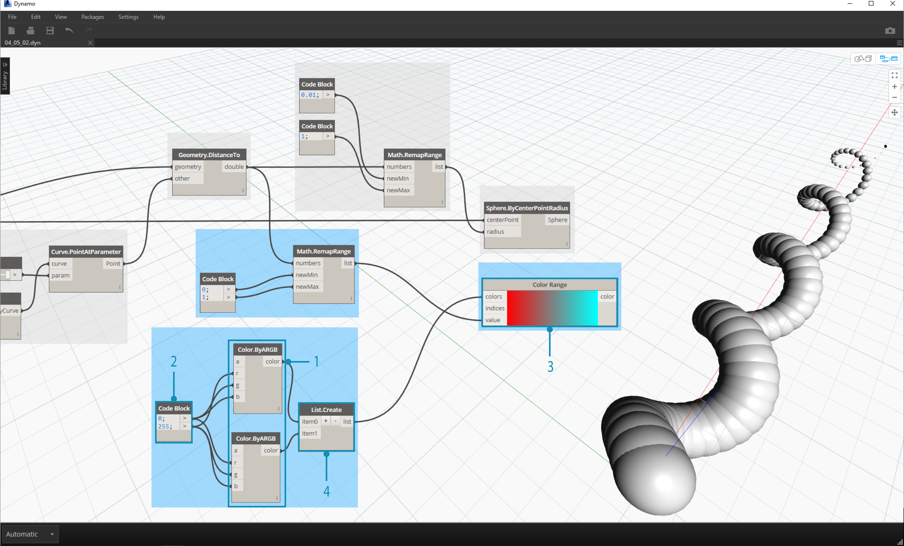
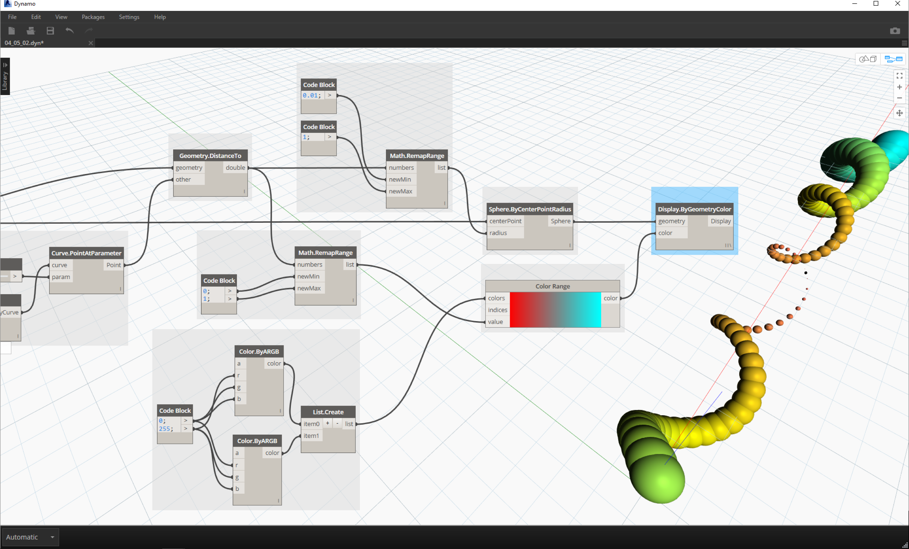

## 4.5 Color

###4.5.1 Creating

###4.5.2 Querying

###4.5.3 Range

###4.5.4 Color Preview

The Display.ByGeometry
###4.5.5 Color Exercise
This exercise focuses on controlling color parametrically in parallel with geometry. The geometry is a basic helix, which we define below using the **code block** (3.2.3). This is a quick and easy way to create a parametric function; and since our focus is on color (rather than geometry), we use the code block to efficiently create the helix without cluttering the canvas.  We will use the code block more frequently as the primer moves to more advanced material.

> 1. **Code Block:** Define the two code blocks with the formulas above.  This is a quick parametric method for creating a spiral.
2. **Point.ByCoordinates:**Plug the three outputs from the code block into the coordinates for the battery.

We now see an array of points creating a helix.  The next step is to create a curve through the poitns so that we can visualize the helix.

> 1. **PolyCurve.ByPoints:** Connect the *Point.ByCoordinates* output into the *points* input for the battery.  We get a helical curve.
2. **Curve.PointAtParameter:** Connect the *PolyCurve.ByPoints* output into the *curve* input. The purpose of this step is to create a parametric attractor point which slides along the curve.  Since the curve is evaluating a point at parameter, we'll need to input a *param* value betwen 0 and 1.
3.  **Number Slider:** After adding to the canvas, change the *min* value to *0.0*, the *max* value to *1.0*, and the *step* value to *.01*.  Plug the slider output into the *param* input for *Curve.PointAtParameter*.  We now see a point along the length of the helix, represented by a percentage of the slider (0 at the start point, 1 at the end point).

With the reference point created, we now compare the distance from the reference point to the original points defining the helix.  This distance value will drive geometry as well as color.

> 1. **Geometry.DistanceTo:** Connect *Curve.PointAtParameter* output into the *input*.  Connect *Point.ByCoordinates* into the *geometry input.
2. **Watch:** The resultant output shows a list of distances from each helical point to the reference point along the curve.

Our next step is drive parameters with the list of distances from the helical points to the reference point.  We use these distance values to define the radii of a series of spheres along the curve. In order to keep the spheres a suitable size, we need to *remap* the values for distance.

> 1. **Math.RemapRange:** Connect *Geometry.DistanceTo* output inot the numbers input.
2. **Code Block:** connect a code block with a value of *0.01* into the *newMin* input and a code block with a value of *1* into the *newMax* input.
3. **Watch:** connect the *Math.RemapRange* output into one battery and the *Geometry.DistanceTo* output into another.  Compare the results.

This step has remapped the list of distance to be a smaller range.  We can edit the *newMin* and *newMax* values however we see fit.  The values will remap and will have the same *distribution ratio* across the domain.

> 1. **Sphere.ByCenterPointRadius:** connect the *Math.RemapRange* output into the *radius* input and the original *Point.ByCoordinates* output into the *centerPoint* input.

> 1. **Number Slider:** change the value of the number slider and watch the size of the spheres update.  We now have a parametric jig.

The size of the spheres demonstrates the parametric array defined by a reference point along the curve.  Let's use the same concept for the sphere radius to drive their color.

>  1. **Color Range:** Add top the canvas.  When hovering over the *value* input, we notice that the numbers requested are between 0 and 1.  We need to remap the numbers from the *Geometry.DistanceTo* output so that they are compatible with this domain.
 2. **Sphere.ByCenterPointRadius:** For the time being, let's disable the preview on this battery (*Right Click > Preview*)

> 1. **Math.RemapRange:** This process should look familiar. Connect the *Geometry.DistanceTo* output into the numnbers input.
2. **Code Block:** Similar to an earlier step, create a value of *0* for the *newMin* input and a value of *1* for the *newMax* input.  Notice that we are able to define two outputs from one code block in this case.
3. **Color Range:** Connect the *Math.RemapRange* output into the *value* input.

> 1. **Color.ByARGB:** This is what we'll do to create two colors.  While this process may look awkward, it's the same as RGB colors in another software, we're just using visual programming to do it.
2. **Code Block:** create two values of *0* and *255*.  Plug the two outputs into the two *Color.ByARGB* inputs in agreement with the image above (or create your favorite two colors).
3. **Color Range:** The *colors* input requests a list of colors.  We need to create this list from the two colors created in the previous step.
4. **List.Create:** merge the two colors into one list.  Plug the output into the *colors* input for *Color Range*.

> 1. **Display.ByGeometryColor:** Connect *Sphere.ByCenterPointRadius* into the *geometry* input and the *Color Range* into the *color* input. We now have a smooth gradient across the domain of the curve.

> If we change the value of the *number slider* from earlier in the definition, the colors and sizes update.  Colors and radius size are directly relate in this case.

