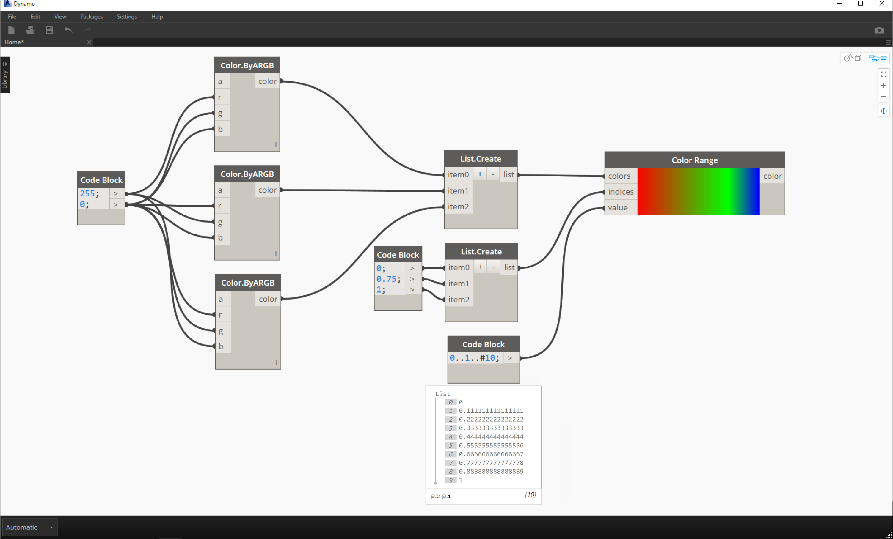
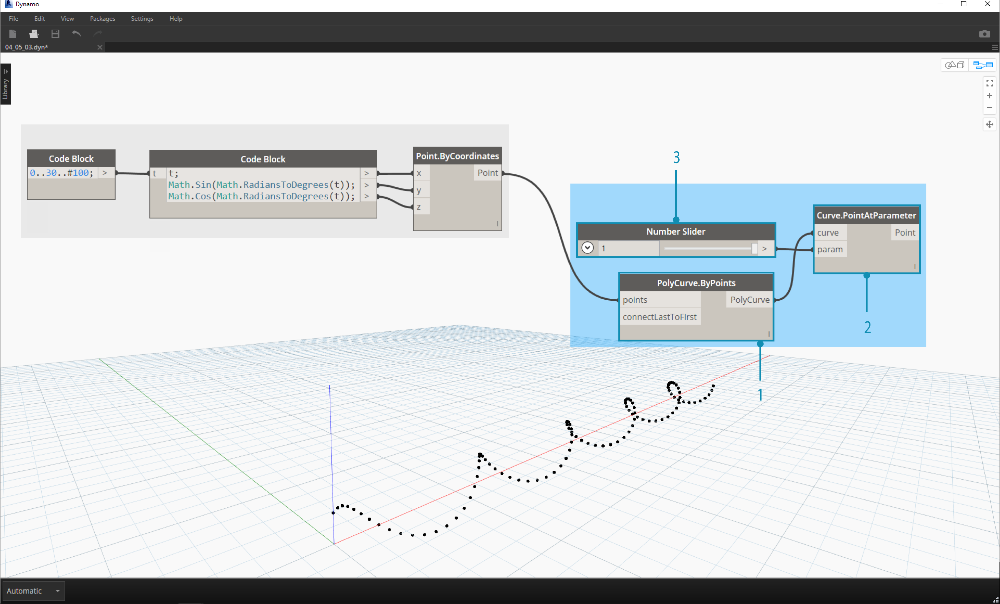
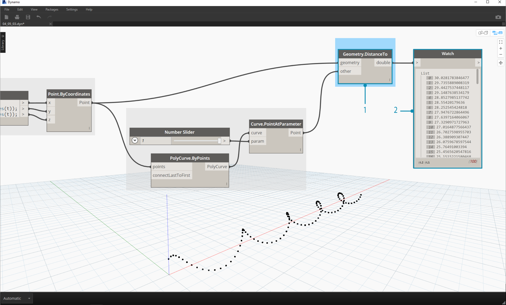
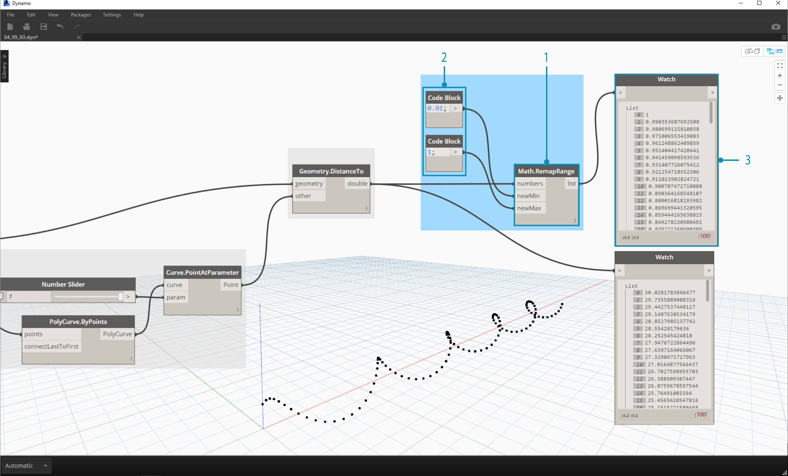
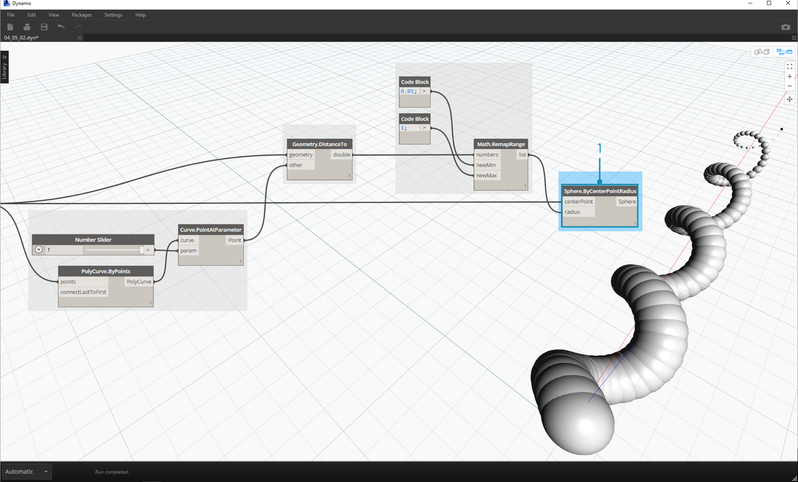
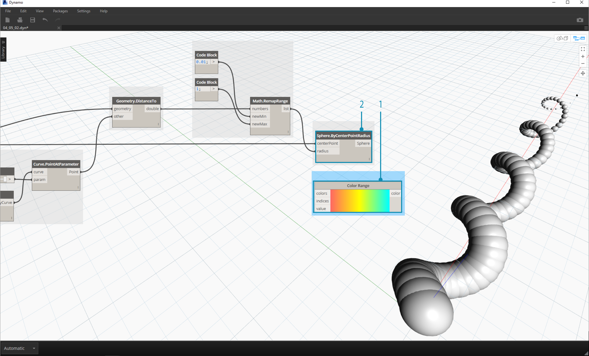
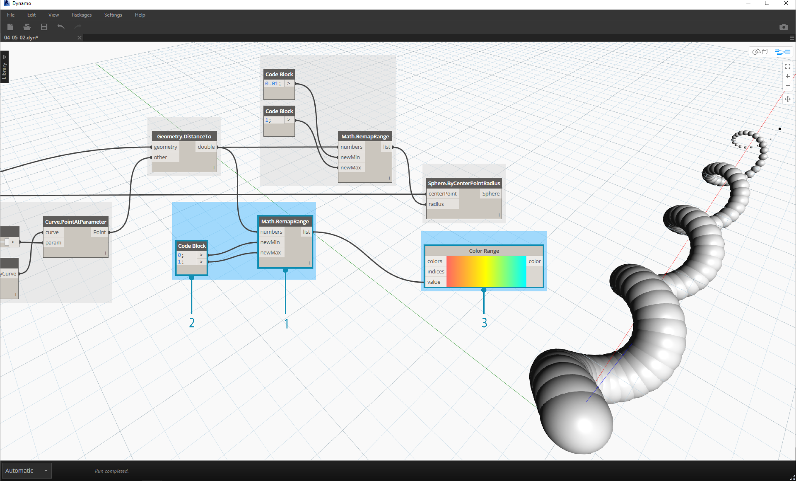
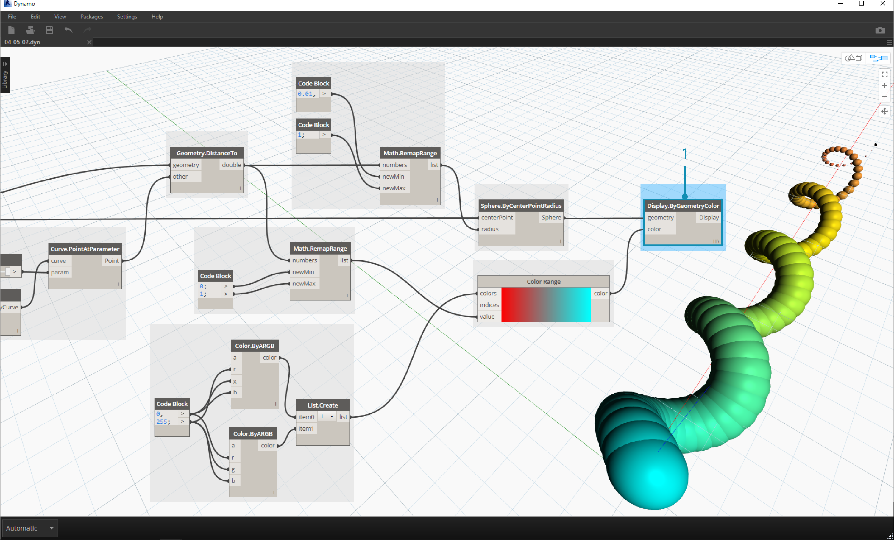
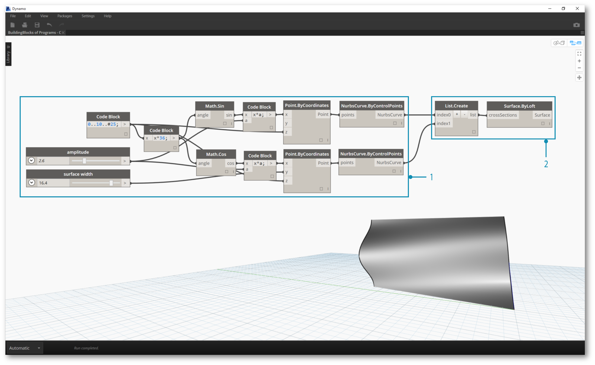

##Color
Color is a great data type for creating compelling visuals as well as for rendering difference in the output from your Visual Program. When working with abstract data and varying numbers, sometimes it's difficult to see what's changing and to what degree. This is a great application for colors.

###Creating Colors
Colors in Dynamo are created using ARGB inputs.This corresponds to the Alpha, Red, Green, and Blue channels. The alpha represents the *transparency* of the color, while the other three are used as primary colors to generate the whole spectrum of color in concert.

| Icon | Name | Syntax| Inputs | Outputs |
| -- | -- | -- | -- | -- | -- |-- |
|  | ARGB Color | Color.ByARGB | A,R,G,B | color |

###Querying Color Values
The colors in the table below query the properties used to define the color: Alpha, Red, Green, and Blue.  Note that the Color.Components Node gives us all four as different outputs, which makes this Node preferable for querying the properties of a color.

| Icon | Name | Syntax| Inputs | Outputs |
| -- | -- | -- | -- | -- | -- | -- |
|  | Alpha | Color.Alpha | color | A |
|  | Red | Color.Red | color | R |
|  | Green | Color.Green | color | G |
|  | Blue | Color.Blue | color | B |
|  | Components | Color.Components | color | A,R,G,B |

The colors in the table below correspond to the **HSB color space**.  Dividing the color into hue, saturation, and brightness is arguably more intuitive for how we  interpret color: What color should it be? How colorful should it be? And how light or dark should the color be?  This is the breakdown of hue, saturation, and brightness respectively.

| Icon | Query Name | Syntax| Inputs | Outputs |
| -- | -- | -- | -- | -- | -- | -- |
|  | Hue | Color.Hue | color | Hue |
|  | Saturation | Color.Saturation | color | Saturation |
|  | Brightness | Color.Brightness | color | Brightness |

###Color Range
The color range is similar to the **Remap Range** Node from section 4.2: it remaps a list of numbers into another domain.  But instead of mapping to a *number* domain, it maps to a *color gradient* based on input numbers ranging from 0 to 1.

The current Node works well, but it can be a little awkward to get everything working the first time around. The best way to become familiar with the color gradient is to test it out interactively. Let's do a quick exercise to review how to setup a gradient with output colors corresponding to numbers.

>1. **Define three colors: ** Using a code block node, define *red, green*, and *blue* by plugging in the appropriate combinations of *0* and *255*.
2. **Create list:** Merge the three colors into one list.
3. **Define Indices: ** Create a list to define the grip positions of each color (ranging from 0 to 1).  Notice the value of 0.75 for green.  This places the green color 3/4 of the way across the horizontal gradient in the color range slider.
4. **Code Block: ** Input values (between 0 and 1) to translate to colors.

### Color Preview
The **Display.ByGeometry** Node gives us the ability to color geometry in the Dynamo viewport.  This is helpful for separating different types of geometry, demonstrating a parametric concept, or defining an analysis legend for simulation.  The inputs are simple: geometry and color. To createa a gradient like the image above, the color input is connected to the **color range** Node.

###Color Exercise
>Download the example file that accompanies this exercise (Right click and "Save Link As..."): [Building Blocks of Programs - Color.dyn](datasets/4-5/Building Blocks of Programs - Color.dyn). A full list of example files can be found in the Appendix.

This exercise focuses on controlling color parametrically in parallel with geometry. The geometry is a basic helix, which we define below using the **Code Block** (3.2.3). This is a quick and easy way to create a parametric function; and since our focus is on color (rather than geometry), we use the code block to efficiently create the helix without cluttering the canvas.  We will use the code block more frequently as the primer moves to more advanced material.

> 1. **Code Block:** Define the two code blocks with the formulas above.  This is a quick parametric method for creating a spiral.
2. **Point.ByCoordinates:**Plug the three outputs from the code block into the coordinates for the Node.

We now see an array of points creating a helix.  The next step is to create a curve through the poitns so that we can visualize the helix.

> 1. **PolyCurve.ByPoints:** Connect the *Point.ByCoordinates* output into the *points* input for the Node.  We get a helical curve.
2. **Curve.PointAtParameter:** Connect the *PolyCurve.ByPoints* output into the *curve* input. The purpose of this step is to create a parametric attractor point which slides along the curve.  Since the curve is evaluating a point at parameter, we'll need to input a *param* value betwen 0 and 1.
3.  **Number Slider:** After adding to the canvas, change the *min* value to *0.0*, the *max* value to *1.0*, and the *step* value to *.01*.  Plug the slider output into the *param* input for *Curve.PointAtParameter*.  We now see a point along the length of the helix, represented by a percentage of the slider (0 at the start point, 1 at the end point).

With the reference point created, we now compare the distance from the reference point to the original points defining the helix.  This distance value will drive geometry as well as color.

> 1. **Geometry.DistanceTo:** Connect *Curve.PointAtParameter* output into the *input*.  Connect *Point.ByCoordinates* into the *geometry input.
2. **Watch:** The resultant output shows a list of distances from each helical point to the reference point along the curve.

Our next step is to drive parameters with the list of distances from the helical points to the reference point.  We use these distance values to define the radii of a series of spheres along the curve. In order to keep the spheres a suitable size, we need to *remap* the values for distance.

> 1. **Math.RemapRange:** Connect *Geometry.DistanceTo* output inot the numbers input.
2. **Code Block:** connect a code block with a value of *0.01* into the *newMin* input and a code block with a value of *1* into the *newMax* input.
3. **Watch:** connect the *Math.RemapRange* output into one Node and the *Geometry.DistanceTo* output into another.  Compare the results.

This step has remapped the list of distance to be a smaller range.  We can edit the *newMin* and *newMax* values however we see fit.  The values will remap and will have the same *distribution ratio* across the domain.

> 1. **Sphere.ByCenterPointRadius:** connect the *Math.RemapRange* output into the *radius* input and the original *Point.ByCoordinates* output into the *centerPoint* input.

> 1. **Number Slider:** change the value of the number slider and watch the size of the spheres update.  We now have a parametric jig.

The size of the spheres demonstrates the parametric array defined by a reference point along the curve.  Let's use the same concept for the sphere radius to drive their color.

>  1. **Color Range:** Add top the canvas.  When hovering over the *value* input, we notice that the numbers requested are between 0 and 1.  We need to remap the numbers from the *Geometry.DistanceTo* output so that they are compatible with this domain.
 2. **Sphere.ByCenterPointRadius:** For the time being, let's disable the preview on this Node (*Right Click > Preview*)

> 1. **Math.RemapRange:** This process should look familiar. Connect the *Geometry.DistanceTo* output into the numnbers input.
2. **Code Block:** Similar to an earlier step, create a value of *0* for the *newMin* input and a value of *1* for the *newMax* input.  Notice that we are able to define two outputs from one code block in this case.
3. **Color Range:** Connect the *Math.RemapRange* output into the *value* input.

> 1. **Color.ByARGB:** This is what we'll do to create two colors.  While this process may look awkward, it's the same as RGB colors in another software, we're just using visual programming to do it.
2. **Code Block:** create two values of *0* and *255*.  Plug the two outputs into the two *Color.ByARGB* inputs in agreement with the image above (or create your favorite two colors).
3. **Color Range:** The *colors* input requests a list of colors.  We need to create this list from the two colors created in the previous step.
4. **List.Create:** merge the two colors into one list.  Plug the output into the *colors* input for *Color Range*.

> 1. **Display.ByGeometryColor:** Connect *Sphere.ByCenterPointRadius* into the *geometry* input and the *Color Range* into the *color* input. We now have a smooth gradient across the domain of the curve.

> If we change the value of the *number slider* from earlier in the definition, the colors and sizes update.  Colors and radius size are directly related in this case: we now have a visual link between two parameters!

### Color On Surfaces
The **Display.BySurfaceColors** node gives us the ability to map data across a surface using color! This functionality introduces some exciting possibilities for visualizing data obtained through discrete analysis like solar, energy, and proximity. Applying color to a surface in Dynamo is similar to applying a texture to a material in other CAD environments. Let's demonstrate how to use this tool in the brief exercise below.

###Color on Surfaces Exercise
>Download the example file that accompanies this exercise (Right click and "Save Link As..."): [Building Blocks of Programs - ColorOnSurface.zip](datasets/4-5/BuildingBlocks of Programs - ColorOnSurface.zip). A full list of example files can be found in the Appendix.

> First, we need to create (or reference) a surface to use as an input for the **Display.BySurfaceColors** node. For this example we are lofting between a sine and cosine curve.
1. This **Group** of nodes is creating points along the Z-axis then displacing them based on sine and cosine functions. The two point lists are then used to generate NURBS curves.
2. **Surface.ByLoft**: generate an interpolated surface between the list of NURBS curves.

>1. **File Path**: select an image file to sample for pixel data downstream
2. use **File.FromPath** to convert the file path to a file then pass into **Image.ReadFromFile** to output an image for sampling
3. **Image.Pixels**: input an image and provide a sample value to use along the x and y dimensions of the image.
4. **Slider**: provide sample values for **Image.Pixels**
5. **Display.BySurfaceColors**: map array of color values across surface along X and Y respectively  

>Close-up preview of the output surface with resolution of 400x300 samples