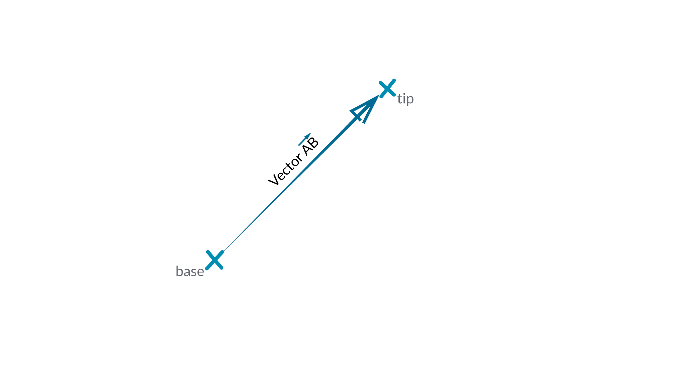
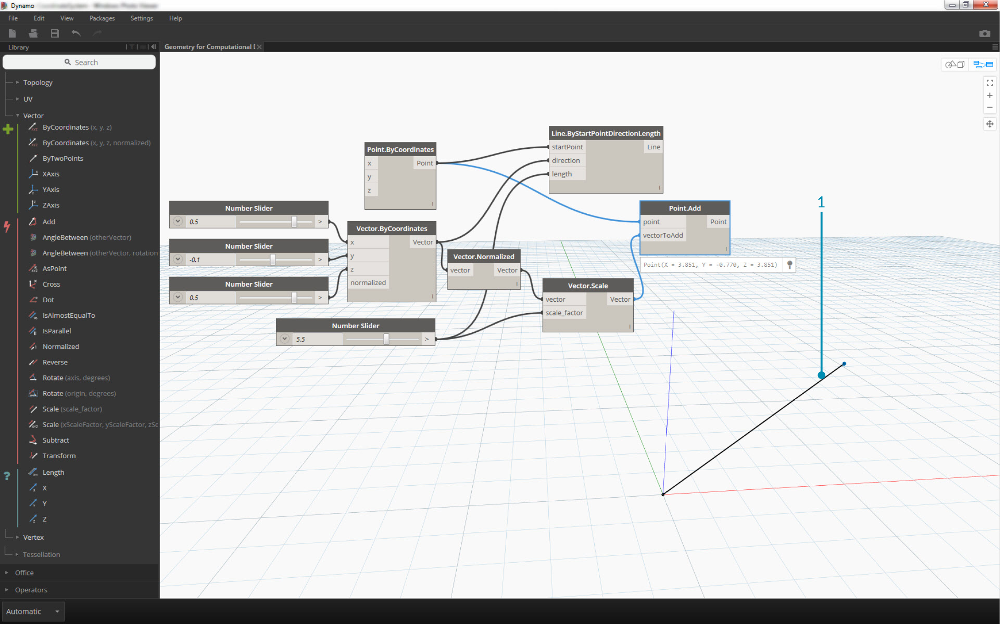
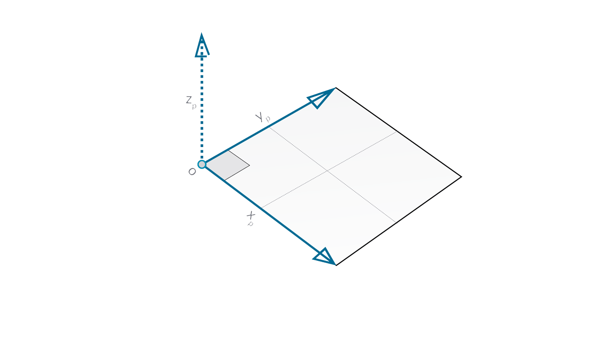
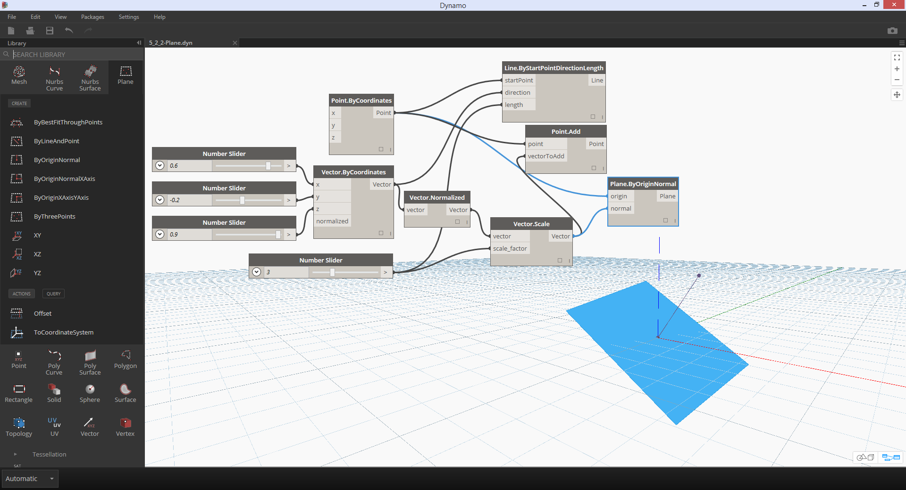
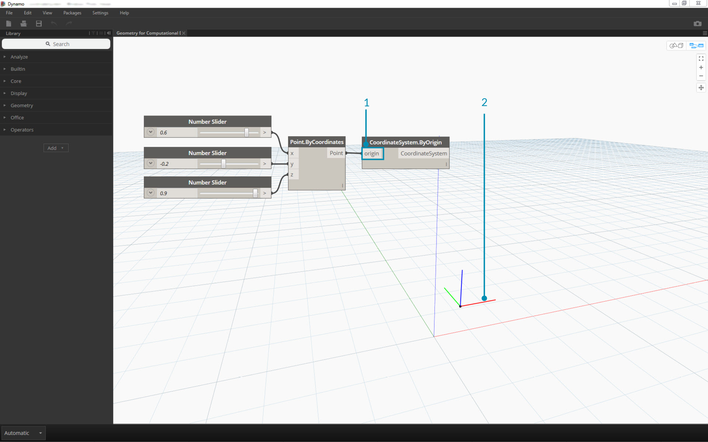

## Vectors, Planes, and Coordinate Systems
Text

> Roger, Roger. What's our vector, Victor?

#### - *Airplane*

### What's a Vector?
Text

### What's a Plane?
Text

### What's a Coordinate System?
Text

> Add alternative coordinate systems - cylindrical, spherical

### Exercise
Text

