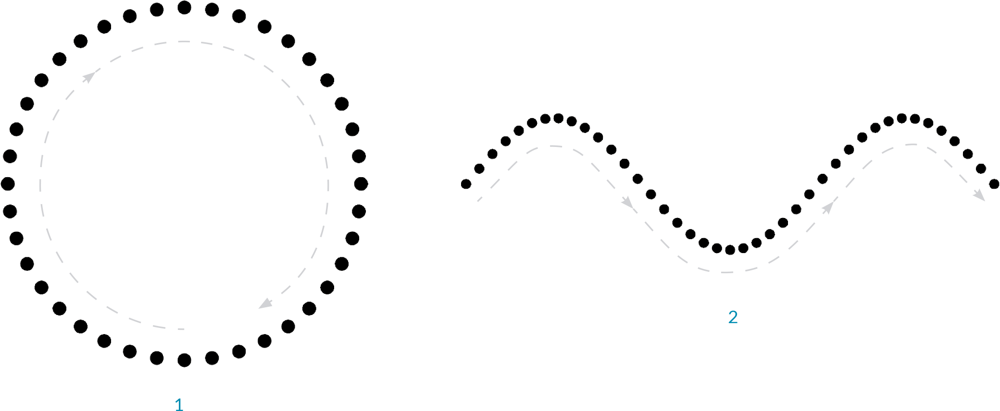

## Points
Points make up everything else
Defined by three values
Relative to the coordinate system they are based within

### What's a Point?
Text

### Point as Coordinates
Text

### Exercise
Text
Get and set coordinates
