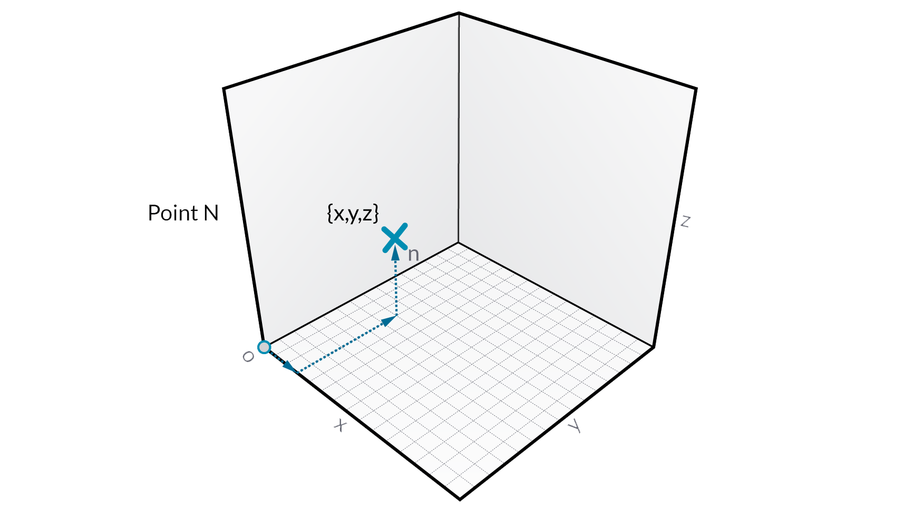
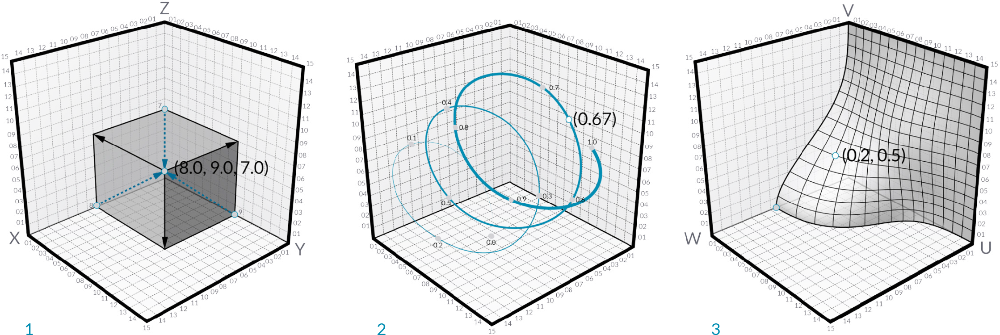

## Points
If Geometry is the language of a model, then Points are the alphabet. Points are the foundation upon which all other geometry is created - we need at least two Points to create a Curve, we need at least three Points to make a Polygon or a Mesh Face, and so on.

### What's a Point?
A Point is defined by nothing more than one or more values called coordinates. How many coordinate values we need to define the Point depends upon the Coordinate System or context in which it resides. The simplest form a of a Point exists in our World Coordinate System and has three coordinates [X,Y,Z].

### Point as Coordinates
Text

