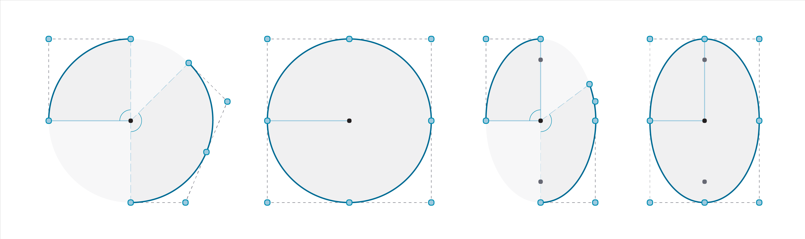

## Curves
Text

### What's a Curve?
Text
parameters
Operations

### Lines
Text

### Arcs, Circles, and Ellipses
Text

### NURBS + Polycurves

What's a NURB?
Points, Weights

Collection of curves joined

### Exercise
