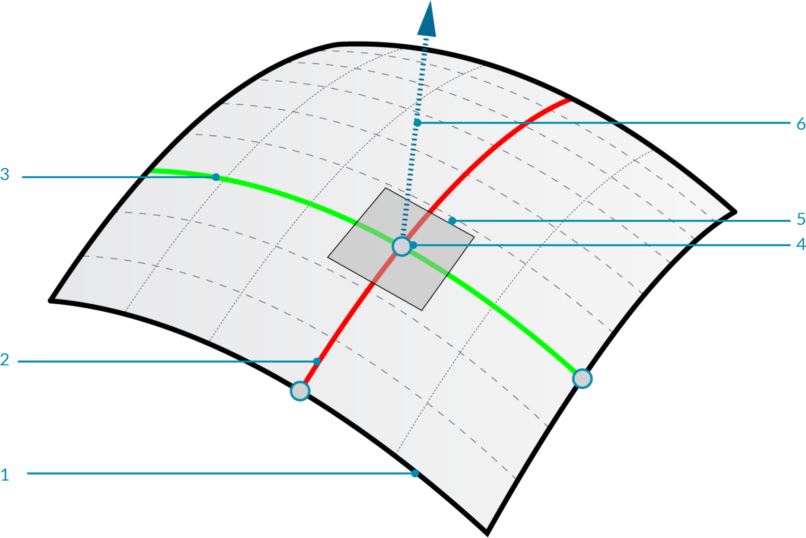
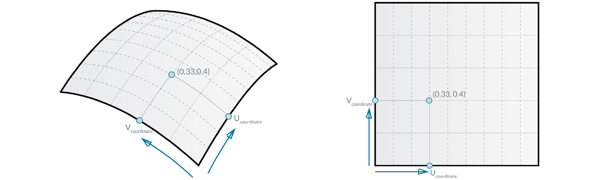
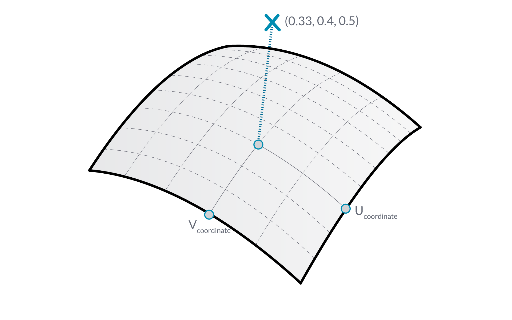
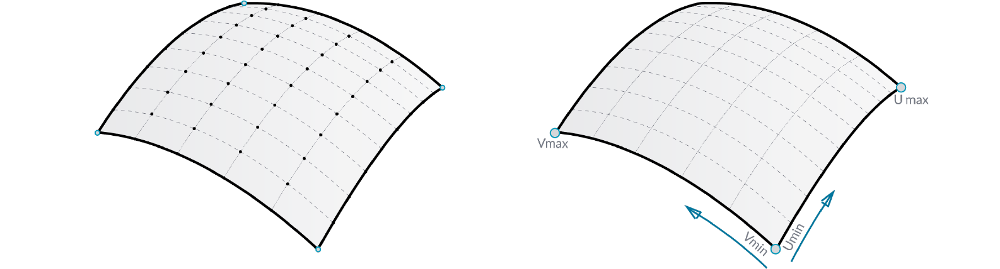
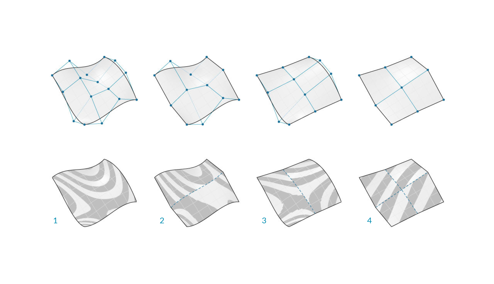
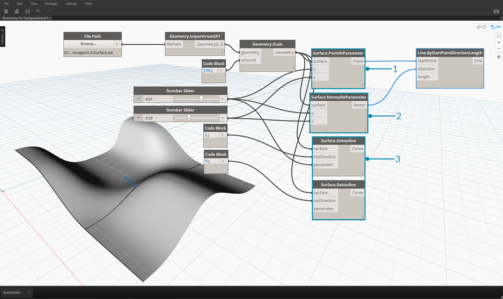

## Surfaces
As we move from using Curves to using Surfaces in a model, we can now begin to represent objects we see in our three dimensional world. While Curves are not always planar ie. three dimensional the space they define is always bound to one dimension. Surfaces give us another dimension a collecton of additional properties we can use within other modeling operations.

### What's a Surface?
A Surface is a mathematical shape defined by two functions that utilize a range of parameter values. Instead of ```t``` for Curves, we use ```U``` and ```V``` to describe the corresponding parameter space. This means we have more data to draw from when working with this type of Geometry. For example, Curves have tangent vectors and normal planes (which can rotate or twist along its length), whereas Surfaces have normal vectors and tangent planes that will be consistent in their orientation.


> 1. Surface
2. U Isocurve
3. V Isocurve
4. UV Coordinate (Point)
5. Perpendicular Frame (Plane)
6. Normal Vector

**Surface Domain**: A surface domain is defined as the range of (U,V) parameters that evaluate into a three dimensional point on that surface. The domain in each dimension (U or V) is usually described as two numbers (U Min to U Max) and (V Min to V Max).



Although the shape of the Surface by not look "rectangular" and it locally may have a tighter or looser set of isocurves, its "space" defined by its domain is always two dimensional. In Dynamo, Surfaces are always understood to have a domain defined by a minimum of 0.0 and maximum of V in both U and V directions.

**Isocurve** (or Isoparametric Curve): A curve defined by a constant U or V value on the surface and a domain of values for the corresponding other U or V direction.

**UV Coordinate**: The Point in UV Parameter Space defined by U, V, and sometimes W.



**Perpendicular Frame**: A Plane that is perpendicular to both U and V Isocurves at a given UV Coordinate.

**Normal Vector**: A Vector defining the direction of "up" relative to the Perpendicular Frame.


### NURBS Surfaces
**NURBS Surfaces** are very similar to NURBS curves. You can think of NURBS Surfaces as a grid of NURBS Curves that go in two directions. The shape of a NURBS Surface is defined by a number of control points and the degree of that surface in the U and V directions. The same algorithms are used to calculate shape, normals, tangents, curvatures and other properties by way of control points, weights and degree.




In the case of NURBS surfaces, there are two directions implied by the geometry, because NURBS surfaces are, regardless of the shape we see, rectangular grids of control points. And even though these directions are often arbitrary relative to the world coordinate system, we will use them frequently to analyze our models or generate other geometry based on the Surface.


> 1. Degree (U,V) = (3,3)
2. Degree (U,V) = (3,1)
3. Degree (U,V) = (1,2)
4. Degree (U,V) = (1,1)

### Polysurfaces
**Polysurfaces** are composed of Surfaces that are joined across an edge. Polysurfaces offer more than two dimensional UV definition in that we can now move through the connected shapes by way of their Topology.

>While "Topology" generally describes a concept around how parts are connected and/or related Topology in Dynamo is also a type of Geometry. Specifically it is a parent category for Surfaces, Polysurfaces, and Solids.


Sometimes called patches, joining Surfaces in this manner allows us to make more complex shapes as well as define detail across the seam. Conveniently we can apply a fillet or chamfer operation to the edges of a Polysurface.

Let's import and evaluate a Surface at a Parameter in Dynamo to see what kind of information we can extract.


> 1. *Surface.PointAtParameter* returns the Point at a given UV Coordinate
2. *Surface.NormalAtParameter* returns the Normal Vector at a given UV Coordinate
3. *Surface.GetIsoline* returns the Isoparametric Curve at a U or V Coordinate - note the isoDirection input.


