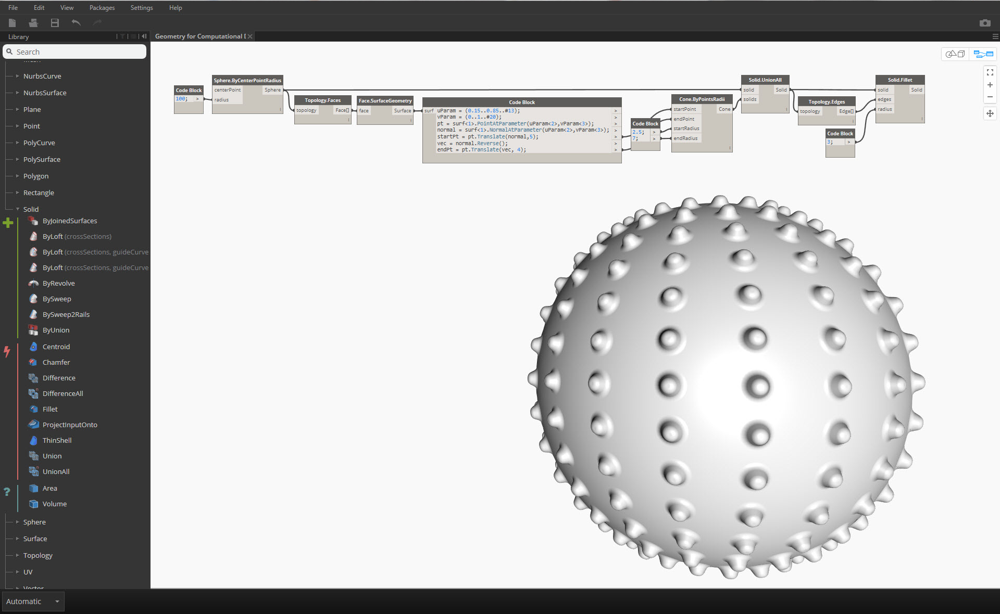

## Solids
Lorem

### What's a Solid?
Solids consist of one or more Surfaces that contain volume by way of a closed boundary that defines "in" or "out." These surfaces must form a "watertight" volume to be considered a solid.

Solids can be created by joining surfaces or polysurfaces together, or using operations such as loft, sweep, and revolve. Sphere, cube, cone and cylinder primitives are also solids.
### Topology
Solids are made up of three types of elements: vertices, edges, and faces. Faces are the surfaces that make up the solid. Edges are the lines between adjacent faces, and vertices are the start and end points of those lines. These elements can be queried using the Topology nodes.

### Operations
Solids can be modified by filleting or chamfering their edges to eliminate sharp corners and angles. The chamfer operation creates a ruled surface between two faces, while a fillet blends between faces to maintain tangency. 

>1. Solid Cube
2. Chamfered Cube
3. Filleted Cube

### Boolean Operations
Solid boolean operations are methods for combining two or more solids. A single boolean is actually performing four operations: 
1. **Intersect** two or more objects
2. **Split** them at the intersections
3. **Delete** unwanted portions of the geometry
4. **Join** everything back together 

This makes solid booleans a powerful time-saving process. There are three solid boolean operations defining which parts of the geometry are kept.

> 1. **Union:** Remove the overlapping portions of the solids and join them into a single solid
2. **Difference:** Subtract one solid from another. The solid to be subtracted is referred to as a tool
3. **Intersection:** Keep only the intersecting volume of the two solids

In addition to these three operations, Dynamo has Solid.DifferenceAll and Solid.UnionAll nodes for performing difference and union operations with multiple solids. 

> 1. **UnionAll:** Union operation with sphere and outward-facing cones
2. **DifferenceAll:** Difference operation with sphere and inward-facing cones

Let's use a few boolean operations to create a spiky ball.

> 1. **Sphere.ByCenterPointRadius**: Create base solid
2. **Topology.Faces**, **Face.SurfaceGeometry**: Query the faces of the solid and convert to surface geometry- in this case, the sphere has only one face
3. **Cone.ByPointsRadii**: Construct cones using points on the surface
4. **Solid.UnionAll**: Union the cones and the sphere
5. **Topology.Edges**: Query the edges of the new solid
6. **Solid.Fillet**: Fillet the edges of the spiky ball

> Download the example files that accompanies this image (Right click and "Save Link As..."). A full list of example files can be found in the Appendix.

> Geometry for Computational Design - Solids.dyn