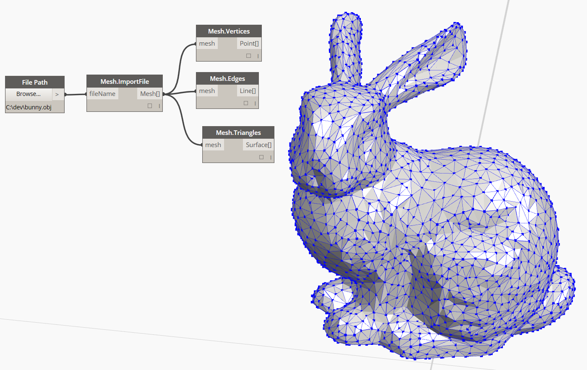

## Meshes
In the field of computational modeling, meshes are one of the most pervasive forms of representing 3D geometry. Mesh geometry can be a light-weight and flexible alternative to working with NURBS, and are used in everything from rendering and visualizations to digital fabrication and 3D printing. This chapter will provide an introduction to how mesh geometry is handled in Dynamo.

### What's a Mesh?
A Mesh is a collection of quadrilaterals and triangles that represents a surface or solid geometry. The structure of a mesh object includes vertices, edges, and faces, as well as additional mesh properties such as normals.

> 1. Mesh vertices
2. Mesh edges
3. Mesh faces

### Mesh Elements
Dynamo defines meshes using a Face-Vertex data structure. At its most basic, this structure is simply a collection of points which are grouped into polygons. The points of a mesh are called vertices, while the polygons are called faces. To create a mesh we need a list of vertices and a system of grouping those vertices into faces called an index group.

> 1. List of vertices
2. List of index groups to define faces

### Meshes versus NURBS Surfaces
Lorem
control points
interpolation

### Mesh Toolkit
Lorem
Extending by way of the Package Manager

https://github.com/DynamoDS/Dynamo/wiki/Dynamo-Mesh-Toolkit

