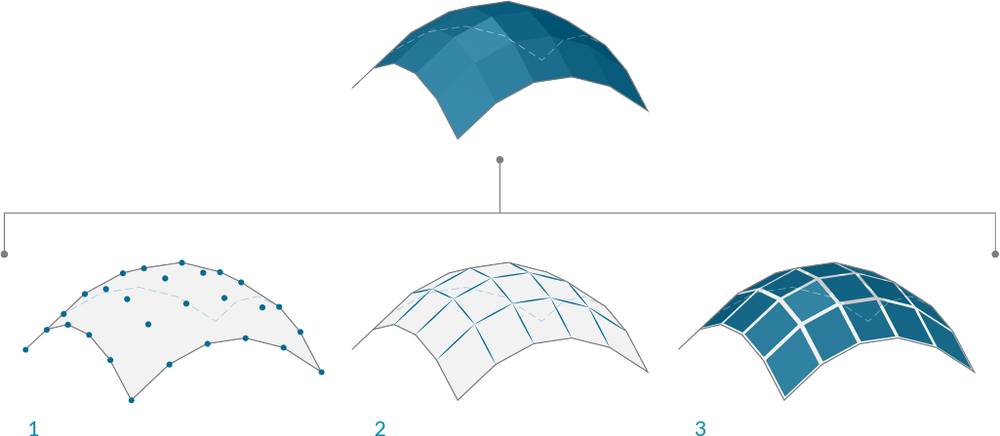

## Meshes
In the field of computational modeling, meshes are one of the most pervasive forms of representing 3D geometry. Mesh geometry can be a light-weight and flexible alternative to working with NURBS, and are used in everything from rendering and visualizations to digital fabrication and 3D printing. This chapter will provide an introduction to how mesh geometry is handled in Dynamo.

### What's a Mesh?
A Mesh is a collection of quadrilaterals and triangles that represents a surface or solid geometry. The structure of a mesh object includes vertices, edges, and faces, as well as additional mesh properties such as normals.

> 1. Mesh vertices
2. Mesh edges
3. Mesh faces

### Mesh Elements
Dynamo defines meshes using a Face-Vertex data structure. At its most basic, this structure is simply a collection of points which are grouped into polygons. The points of a mesh are called vertices, while the polygons are called faces. To create a mesh we need a list of vertices and a system of grouping those vertices into faces called an index group.

> 1. List of vertices
2. List of index groups to define faces

####Vertices
The vertices of a mesh are simply a list of points. The index of the vertices is very important when constructing a mesh, or getting information about the structure of a mesh.

####Faces
A face is an ordered list of three or four vertices. The “surface” representation of a mesh face is therefore implied according to the position of the vertices being indexed. We already have the list of vertices that make up the mesh, so instead of providing individual points to define a face, we instead simply use the index of the vertices. This also allows us to use the same vertex in more than one face.

> 1. A quad face made with indices 0, 1, 2, and 3
2. A triangle face made with indices 1, 4, and 2

####Vertex Normals
lorem

### Meshes versus NURBS Surfaces
How is mesh geometry different from NURBS geometry? When might you want to use one instead of the other?

####Parameterization

In a previous chapter, we saw that NURBS surfaces are defined by a series of NURBS curves going in two directions. These directions are labeled U and V, and allow a NURBs surface to be parameterized according to a two-dimensional surface domain. The curves themselves are stored as equations in the computer, allowing the resulting surfaces to be calculated to an arbitarily small degree of precision. It can be difficult, however, to combine multiple NURBS surfaces together. Joining two NURBS surfaces will result in a polysurface, where different sections of the geometry will have different UV parameters and curve definitions.

Meshes, on the other hand, are comprised of a discrete number of exactly defined vertices and faces. The network of vertices generally cannot be defined by simple UV coordinates, and because the faces are discrete the amount of precision is built into the mesh and can only be changed by refining the mesh and added more faces. The lack of UV coordinates, however, allows meshes the flexibility to handle more complicated geometry with a single mesh, instead of resorting to a polysurface in the case of NURBS.

> lorem

###Local vs Global Influence

Another important difference is the extent to which a local change in mesh or NURBS geometry affects the entire form. Mesh geometry is completely local. Moving one vertex affects only the faces that are adjacent to that vertex. In NURBS surfaces, the extent of the influence is more complicated and depends on the degree of the surface as well as the weights and knots of the control points. In general, however, moving a single control point in a NURBS surface creates a more global change in geometry.

> 1. NURBS Surface - moving a control point has global influence
2. Mesh geometry - moving a vertex has local influence

One analogy that can be helpful is to compare a vector image (composed of lines and curves) with a raster image (composed of individual pixels). If you zoom into a vector image, the curves remain crisp and clear, while zooming into a raster image results in seeing individual pixels. In this analogy, NURBS surfaces can be compared to a vector image, while a mesh behaves similarly to a raster image.

### Mesh Toolkit
Dynamo's mesh capabilities can be extended by installing the [Mesh Toolkit](https://github.com/DynamoDS/Dynamo/wiki/Dynamo-Mesh-Toolkit) package. The Dynamo Mesh Toolkit provides tools to import meshes from external file formats, create a mesh from Dynamo geometry objects, and manually build meshes by their vertices and indices. The library also provides tools to modify meshes, repair meshes, or extract horizontal slices for use in fabrication.

See chapter 10.2 for an example using Mesh Toolkit.

