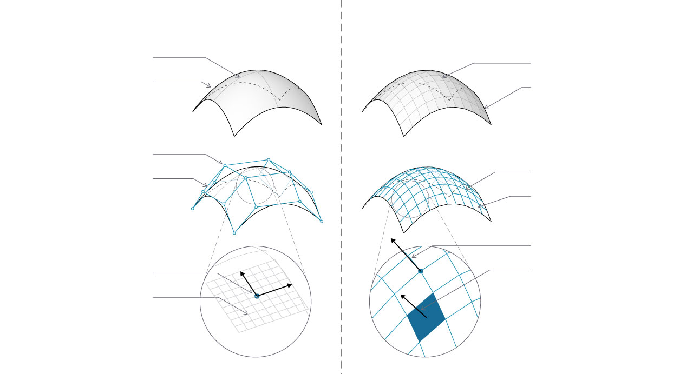

## Importing Geometry

In a previous chapter, we saw that NURBS surfaces are defined by a series of NURBS curves going in two directions. These directions are labeled ``U`` and ``V``, and allow a NURBs surface to be parameterized according to a two-dimensional surface domain. The curves themselves are stored as equations in the computer, allowing the resulting surfaces to be calculated to an arbitrarily small degree of precision. It can be difficult, however, to combine multiple NURBS surfaces together. Joining two NURBS surfaces will result in a polysurface, where different sections of the geometry will have different UV parameters and curve definitions.

> 1. Surface
2. Isoparametric (Isoparm) Curve
3. Surface Control Point
4. Surface Control Polygon
5. Isoparametric Point
6. Surface Frame
7. Mesh
8. Naked Edge
9. Mesh Network
10. Mesh Edges
11. Vertex Normal
12. Mesh Face / Mesh Face Normal
