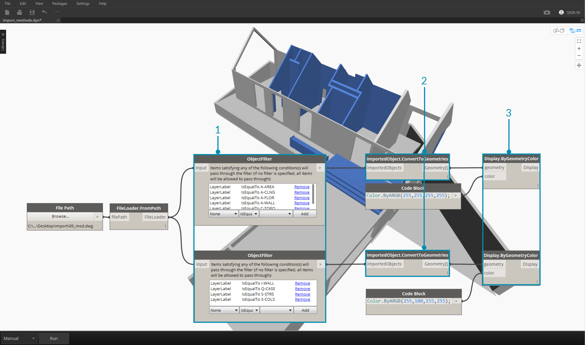
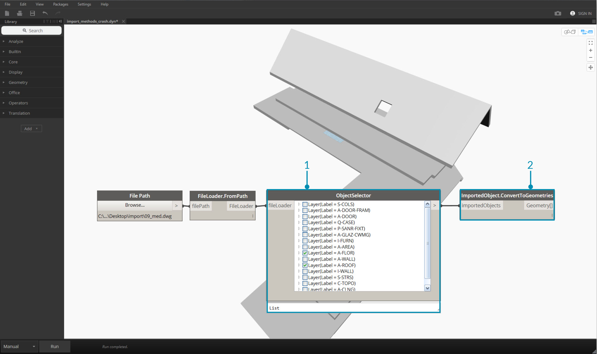

## Importing Geometry
There are several ways to import geometry into Dynamo. We've demonstrated importing meshes using *Mesh Toolkit* in the previous section - we can also import Solid models from .SAT files. With these processes, we can develop geometry in another platform, load it into Dynamo, and apply parametric operations through visual programming. 

Another method for importing geometry uses a process called *ATF Translation*.  In this case, we can import not just geometry, but a file's structure. For example, we can choose which layers of a .DWG to import rather than importing the entire model. We'll demonstrate this below in more detail.

###Importing Geometry from a DWG file

Nodes for importing a DWG into the Dynamo environment are found under the *Translation* tab (Note: the these tools are only available in [Dynamo Studio](http://www.autodesk.com/products/dynamo-studio/overview)).  The following examples show a series of components used to browse for a file, import the file contents, and convert it into usable Dynamo geometry. Dynamo also gives us the ability to filter and select specific objects to import from a DWG file - which we'll demonstrate below.  For more information on Importing Geometry from a DWG File, read Ben Goh's [blog post here](http://dynamobim.org/dwg-import-in-dynamo-studio-0-9-1/).

###Get Imported Objects
The simplest way to import DWG into Dynamo Studio is to import the entire file into the workspace:

>1.	Use the File Path component to browse for the DWG file to be imported into Dynamo.
2.	Connect to **FileLoader.FromPath** to read the file.
3.	Use the **FileLoader.GetImportedObjects** component to parse the geometry into Dynamo Studio.
4.	**ImportedObject.ConvertToGeometries** will convert the objects into usable geometry in the Dyanamo workspace.

As shown in the above image, all types of geometry in the DWG file - surfaces, meshes, curves and lines - are imported into Dynamo.

### Object Filter
To specify which geometries are imported from the DWG file, additional **ObjectFilter** nodes can be added to the definition. The **ObjectFilter** node is compatible with either a **FileLoader** or a list of **ImportedObject**, and outputs an **ImportedObject** list.

The following images show the conditional statements within each **ObjectFilter** node. Any **ImportedObject** that satisfies any of the listed conditions will pass through the filter. Filtering can be based on layer label (i.e. layer name), geometry type, diffuse color, etc., and can be used in conjunction with other filters to refine the selection. 

>1.	Replace **FileLoader.GetImportedObjects** with **ObjectFilter** to search for specific conditions in the DWG file. – in this case only surface geometry will be imported, removing all curve and line geometry visible in the previous image.
2.	Connect Filter to **ImportedObject.ConvertToGeometries** to import the filtered geometry.

By adding two filters with different conditional statements, we can divide the list of geometry into multiple streams:

>1.	Replace **FileLoader.GetImportedObjects** with two **ObjectFilter** modules of different conditional statements. This will separate the geometry from one file into two different streams.
2.	Connect Filter to **ImportedObject.ConvertToGeometries** to import the filtered geometry.
3.	Connect **ImportedObject.ConvertToGeometries** to **Display.ByGeometryColor** to visualize each stream in a different color. 

###Explicit Object Selection

The **ObjectSelector** node gives us an alternative method to importing objects from the DWG file. Instead of using filters, this method will give us the ability to choose specifically which objects and layers will be imported into Dynamo.

>1. Replace **FileLoader.GetImportedObjects** with **ObjectSelector** to call for specific layers and objects within a DWG file.
2. Connect Filter to **ImportedObject.ConvertToGeometries**. 

