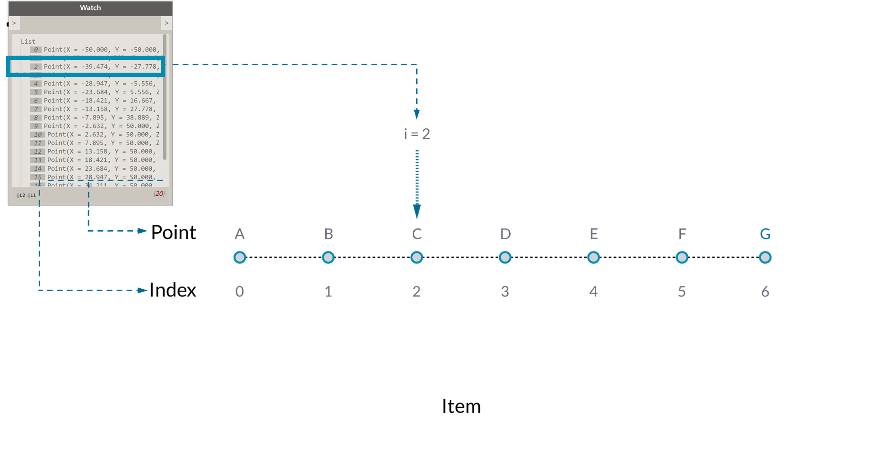

## What's a List?
Text
### Zero-Based Index

One thing that might seem odd at first is that the first index number of a list
is always 0; not 1. So, when we talk about the first item of a list, we actually mean
the item that corresponds to index number 0.

For example, if we were to count the number of fingers we have on our right
hand, chances are that you would have counted from 1 to 5. However,Dynamo would count this list from 0 to 4.

Note that we still have 5 items in the list; it’s just that the list is using a zero-based
counting system. And the items being stored in the list don’t just have to be
numbers. They can be any data type that Dynamo supports, such as points,
curves, surfaces, families, etc.

Often times the easiest way to take a look at the type of data stored in a list
is to connect a watch node to another node's output. By default, the watch node automatically shows all index numbers to the left side of the list and displays the data items on the right.

The index numbers are a crucial element when working with lists.

###Lacing
Data matching is a problem without a clean solution. It occurs when a node has access to differently sized inputs. Changing the data matching algorithm can lead to vastly different results.

Imagine a node which creates line segments between points (Line.ByStartPointEndPoint). It will have two input parameters which both supply point coordinates:

As you can see there are different ways in which we can draw lines between these sets of points. Lacing options are found by right-clicking the center of a node and choosing the "Lacing" menu.

####Shortest List
The simplest way is to connect the inputs one-on-one until one of the streams runs dry. This is called the “Shortest List” algorithm:

####Longest List
The “Longest List” algorithm keeps connecting inputs until all streams run dry. This is the default behavior for components:

####Cross Product
Finally, the “Cross Product” method makes all possible connections:

