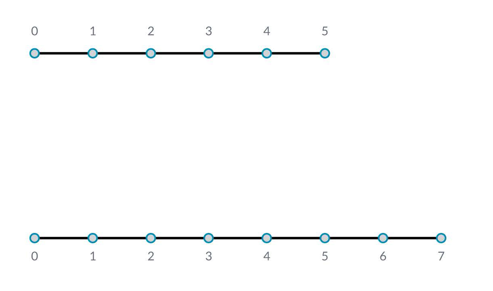
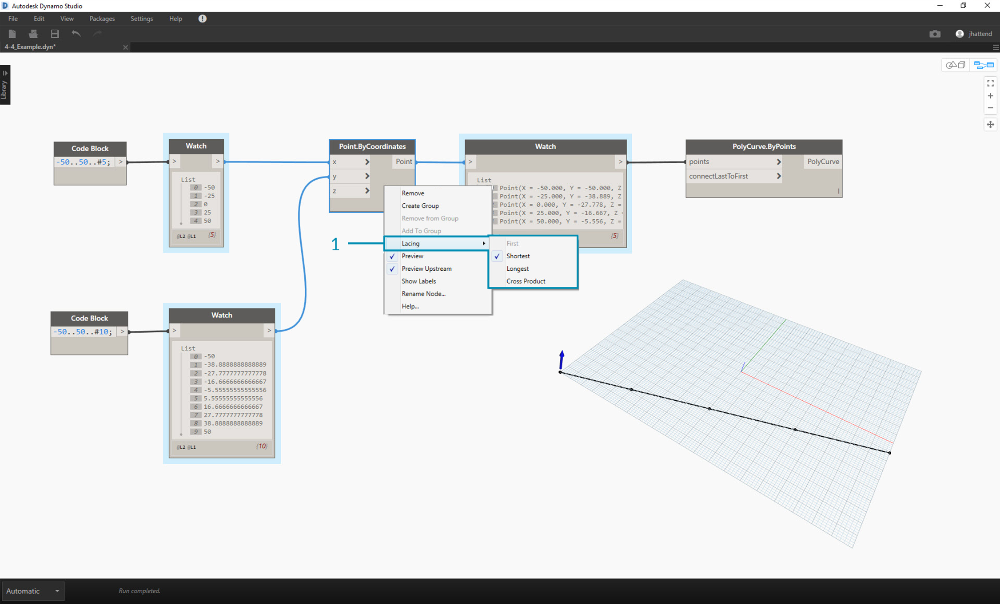
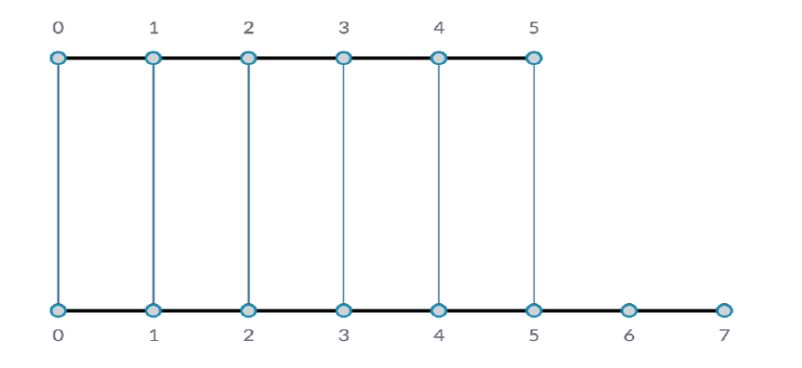
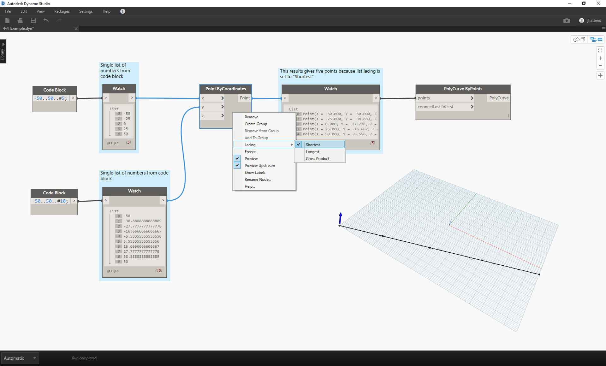
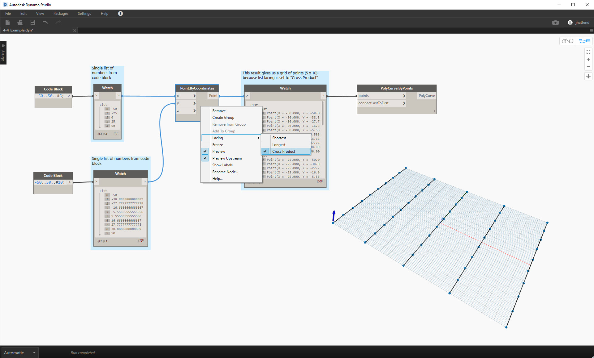

## What's a List?
A list is a collection of elements, or items.  Take a bunch of bananas for example.  Each banana is an item within the list (or bunch). It's easier to pick up a bunch of bananas rather than each banana individually, and the same holds for grouping elements by parametric relationships in a data structure.

When we buy groceries, we put all of the purchased items into a bag.  This bag is also a list.  If we're making banana bread, we need 3 bunches of bananas (we're making a *lot* of banana bread).  The bag represents a list of banana bunches and each bunch represents a list of bananas.  The bag is a list of lists (two-dimensional) and the banana is a list (one-dimensional).

In Dynamo, list data is ordered, and the first item in each list has an index "0".  Below, we'll discuss how lists are defined in Dynamo and how multiple lists relate to one another.

## Zero-Based Index

One thing that might seem odd at first is that the first index number of a list
is always 0; not 1. So, when we talk about the first item of a list, we actually mean
the item that corresponds to index number 0.

For example, if we were to count the number of fingers we have on our right
hand, chances are that you would have counted from 1 to 5. However,Dynamo would count this list from 0 to 4.

Note that we still have 5 items in the list; it’s just that the list is using a zero-based
counting system. And the items being stored in the list don’t just have to be
numbers. They can be any data type that Dynamo supports, such as points,
curves, surfaces, families, etc.

Often times the easiest way to take a look at the type of data stored in a list
is to connect a watch node to another node's output. By default, the watch node automatically shows all index numbers to the left side of the list and displays the data items on the right.

The index numbers are a crucial element when working with lists.

### Inputs and Outputs

> 1. The input data for *PolyCurve.ByPoints* and *Circle.ByCenterPointRadius* are the same, however the Polycurve node gives us one polycurve while the Circle node gives us 5 circles with centers at each point.  Intuitively this makes sense: the polycurve is drawn as a curve connecting the 5 points, while the circles create a differenct circle at each point.  So what's happening with the data?
2. Hovering over the *points* input for *Polycurve.ByPoints*, we see that the input is looking for *"Point[]"*.  This represents a list of points, and to create a polycurve, the input needs to be a list for each polycurve.  This node will therefore condense each list into one polycurve.
3.  On the other hand, the *centerPoint* input for *Circle.ByCenterPointRadius* asks for *"Point"*.  This node looks for one point, as an item, to define the center point of the circle.  This is why we get five circles from the input data.
4.  Recognizing these difference with inputs in Dynamo helps to better understand how the nodes are operating when managing data.

###Lacing
Data matching is a problem without a clean solution. It occurs when a node has access to differently sized inputs. Changing the data matching algorithm can lead to vastly different results.

Imagine a node which creates line segments between points (Line.ByStartPointEndPoint). It will have two input parameters which both supply point coordinates:

As you can see there are different ways in which we can draw lines between these sets of points. Lacing options are found by right-clicking the center of a node and choosing the "Lacing" menu.

###Base File
To demonstrate the lacing operations below, we'll use this base file to define shortest list, longest list, and cross product.

 > 1. We'll change the lacing on *Point.ByCoordinates*, but won't change anything else about the graph above.

####Shortest List
The simplest way is to connect the inputs one-on-one until one of the streams runs dry. This is called the “Shortest List” algorithm:

> By changing the lacing to *shortest list*, we get a basic diagonal line composed of five points. Five points is the length of the lesser list, so the shortest list lacing stops after it reaches the end of one list.

####Longest List
The “Longest List” algorithm keeps connecting inputs until all streams run dry. This is the default behavior for components:

> By changing the lacing to *longest list*, we get a diagonal line which extends vertically.  By the same method as the concept diagram, the last item in the list of 5 items will be repeated to reach the length of the longer list.

####Cross Product
Finally, the “Cross Product” method makes all possible connections:

> By changing the lacing to *Cross Product*, we get every combination between each list, giving us a 5x10 grid of points.  This is an equivalent data structure to the cross product as shown in the concept diagram above, except our data is now a list of lists.  By connecting a polycurve, we can see that each list is defined by its X-Value, giving us a row of vertical lines.

