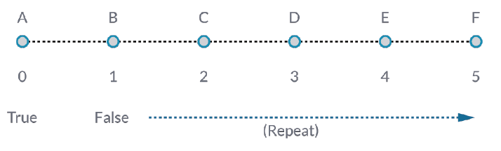
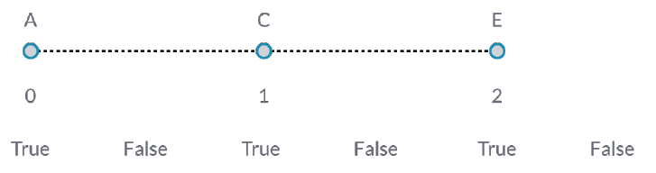
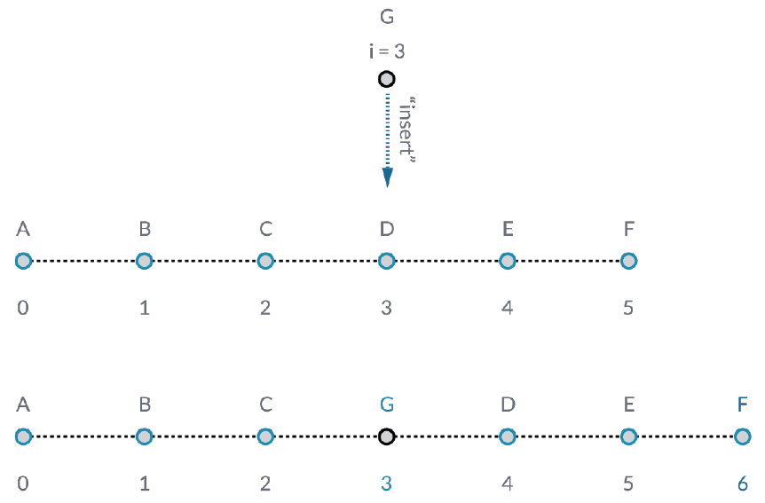

## Working with Lists

### Inputs and Outputs

> 1. The input data for PolyCurve.ByPoints and Circle.ByCenterPointRadius are the same, however the Polycurve battery gives us one polycurve while the Circle.ByCenterPointRadius battery gives us 5 circles with centers at each point.  Intuitively this makes sense: the polycurve is drawn as a curve connecting the 5 points, while the circles create a differenct circle at each point.  So what's happening with the data?
2. However over the "points" input for Polycurve.ByPoints, we see that the input is looking for "Point[]".  This represents a list of points, and to create a polycurve, the input needs to be a list for each polycurve.  This battery will therefore condense each list into one polycurve.
3.  On the other hand, the "centerPoint" input for Cirle.ByCenterPointRadius asks for "Point".  This battery looks for one point, as an item, to define the center point of the circle.  This is why we get five circles from the input data.
4.  Recognizing these difference with inputs in Dynamo helps to better understand how the batteries are operating when managing data.

###List.Count

###List.FilterByBooleanMask

###List.GetItemAtIndex

###Insert

###List.Reverse

###List.ShiftIndices

