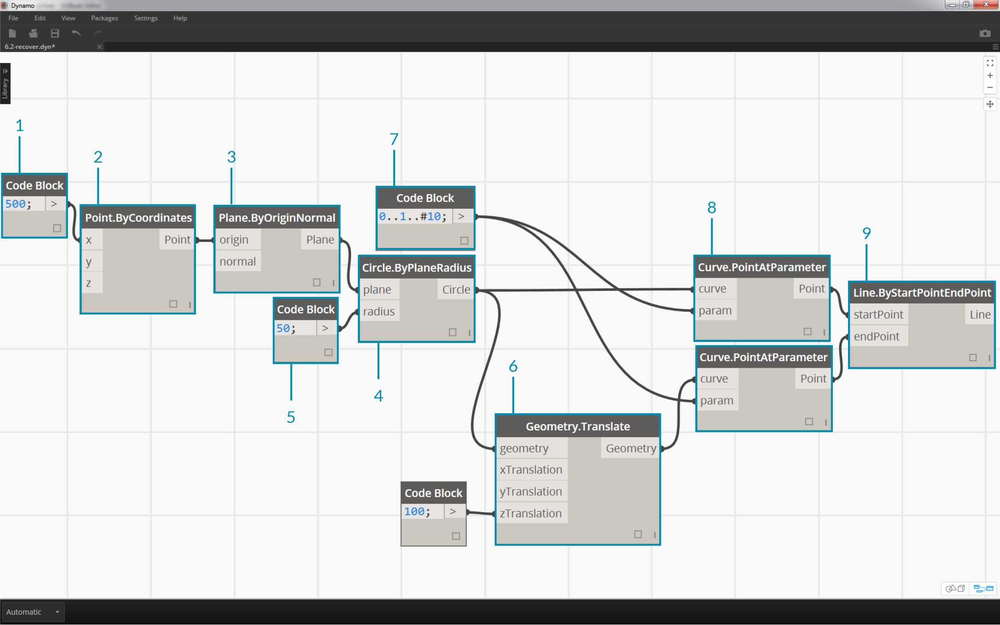
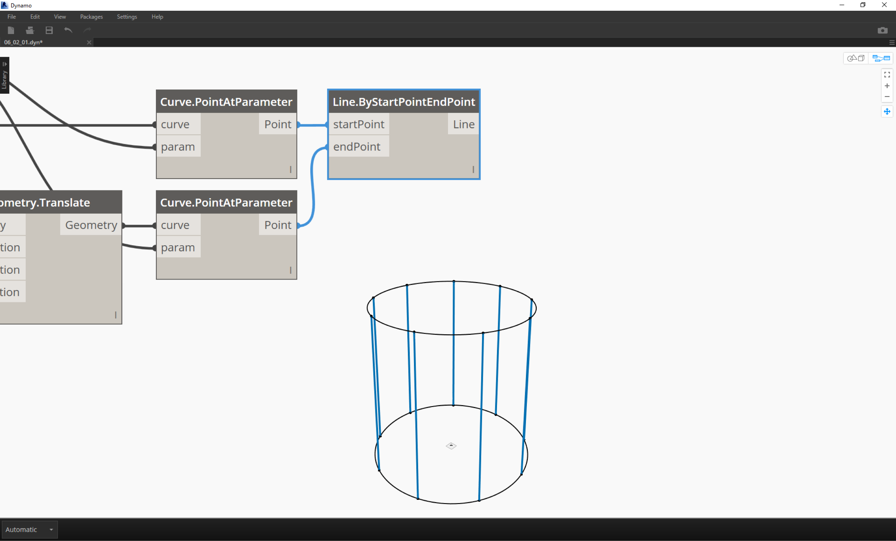
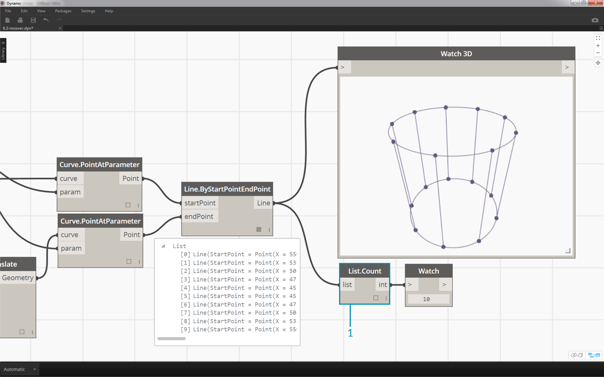
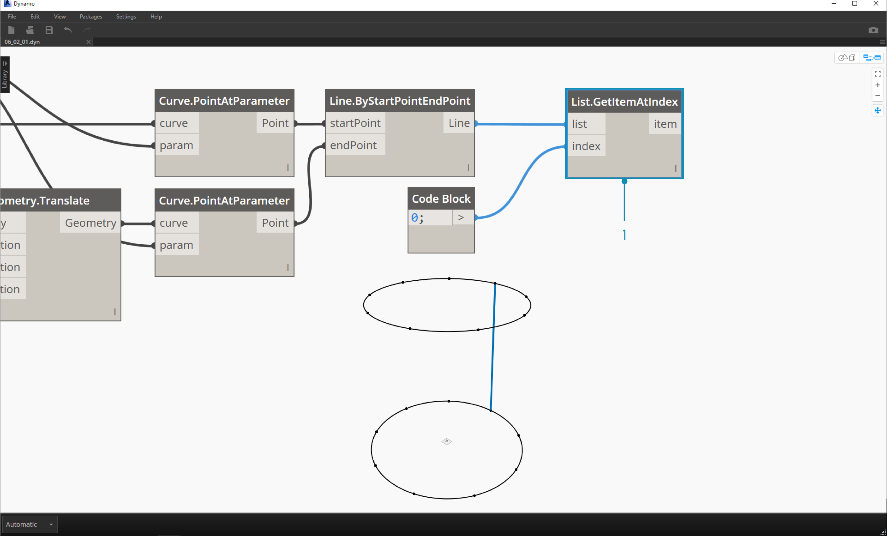
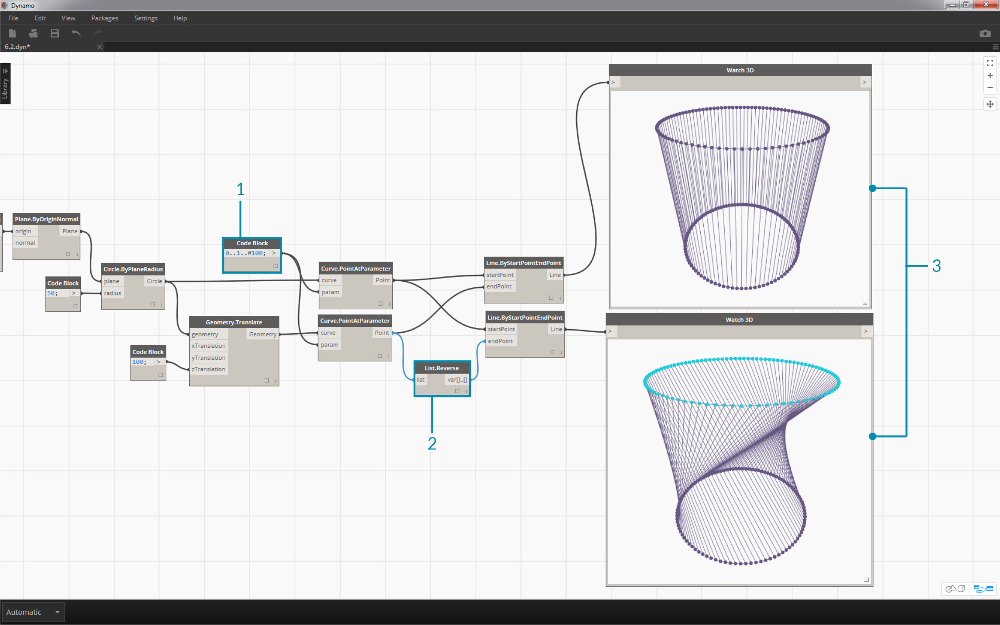
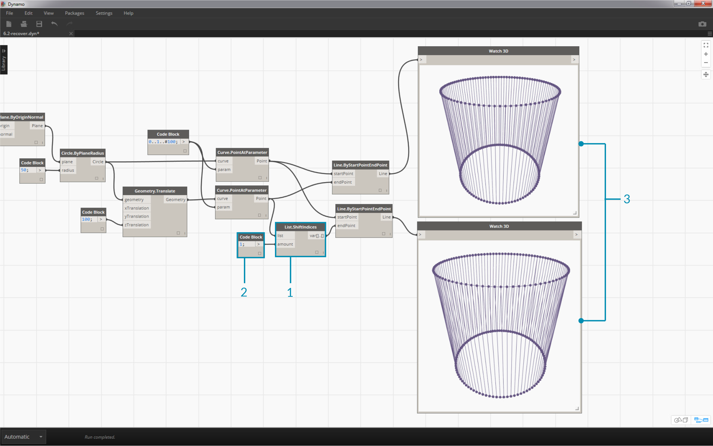
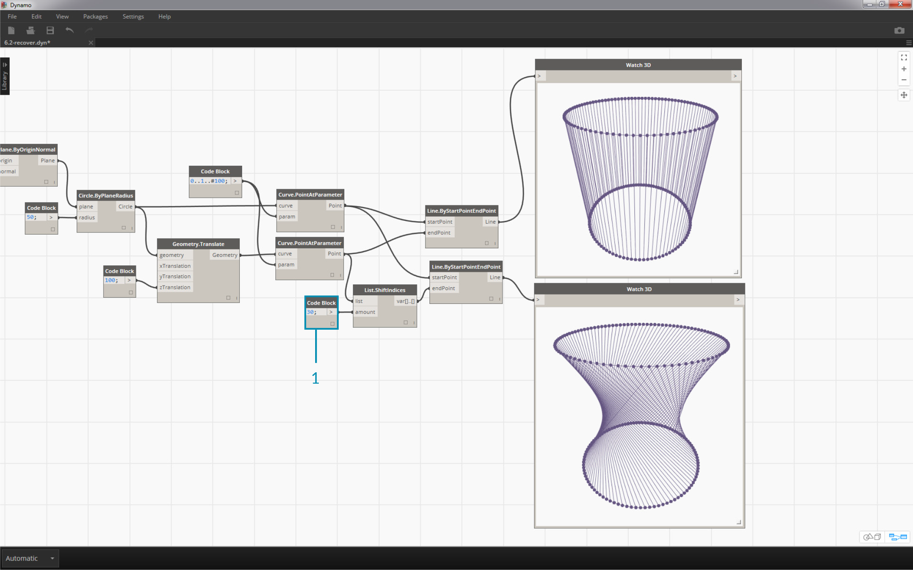
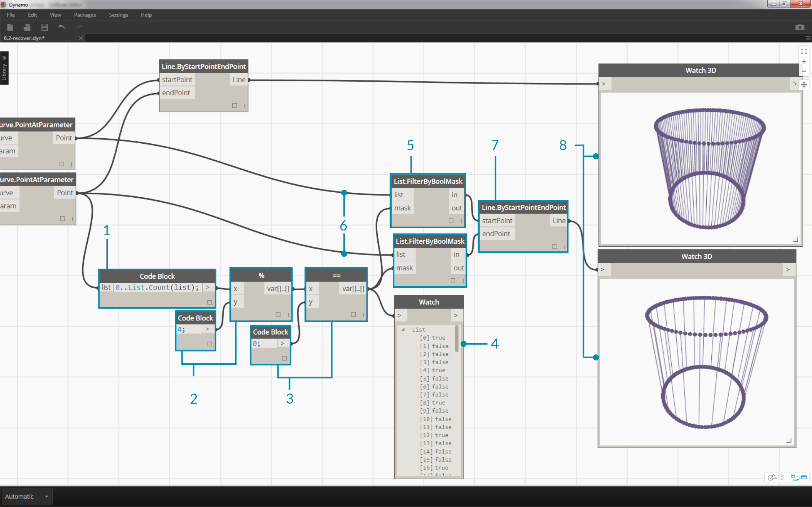

## Working with Lists

### Inputs and Outputs

> 1. The input data for PolyCurve.ByPoints and Circle.ByCenterPointRadius are the same, however the Polycurve battery gives us one polycurve while the Circle.ByCenterPointRadius battery gives us 5 circles with centers at each point.  Intuitively this makes sense: the polycurve is drawn as a curve connecting the 5 points, while the circles create a differenct circle at each point.  So what's happening with the data?
2. However over the "points" input for Polycurve.ByPoints, we see that the input is looking for "Point[]".  This represents a list of points, and to create a polycurve, the input needs to be a list for each polycurve.  This battery will therefore condense each list into one polycurve.
3.  On the other hand, the "centerPoint" input for Cirle.ByCenterPointRadius asks for "Point".  This battery looks for one point, as an item, to define the center point of the circle.  This is why we get five circles from the input data.
4.  Recognizing these difference with inputs in Dynamo helps to better understand how the batteries are operating when managing data.

##List Operations
The image below is the base graph we will be using to demonstrate basic list operations. We'll explore how to manage data within a list and demonstrate the visual results.


> 1. Begin with a code block with a value of ```500;
```
2. Plug into the x input of a Point.ByCoordinates node.
3. Plug the node from the previous step into the origin input of a Plane.ByOriginNormal node.
4. Using a Circle.ByPlaneRadius node, plug the node from the previous step into the plane input.
5. Using code block, designate a value of ```50;
``` for the radius.  This is the first circle we'll create.
6. With a Geometry.Translate node, move the circle up 100 units in the Z direction.
7. With a code block node, define a range of ten numbers between 0 and 1 with this line of code: ```0..1..#10;
```
8. Plug the code block from the previous step into the param input of two Curve.PointAtParameter nodes.  Plug Circle.ByPlaneRadius into the curve input of the top node, and Geometry.Translate into the curve input of the node beneath it.
9. Using a Line.ByStartPointEndPoint, connect the two Curve.PointAtParameter nodes.


>1. A Watch3D node shows the results of the Line.ByStartPointEndPoint.  We are drawing lines between two circles to represent basic list operations and will use this base Dynamo graph to walk through the list actions below.

###List.Count

> The List.Count node is straightforward: it counts the number of values in a list and returns that number.  This node gets more nuanced as we work with lists of lists, but we'll demonstrate that in the coming sections.


> 1. The List.Count node returns the number of lines in the Line.ByStartPointEndPoint node.  The value is 10 in this case, which agrees with the number of points created from the original code block node.

###List.GetItemAtIndex

> List.GetItemAtIndex is a fundamental way to query an item in the list.  In the image above, we are using an index of "2" to query the point labeled "C".


>1. Using the List.GetItemAtIndex node, we are selecting index "0", or the first item in the list of lines.
2. The Watch 3D node reveals that we've selected one line. Note: to get the image above, be sure to disable the preview of Line.ByStartPointEndPoint.

###List.Reverse

> List.Reverse reverses the order of all of the items in a list.


>1. To properly visualize the reversed list of lines, create more lines by changing the code block to ```0..1..#100;
```
2. Insert a List.Reverse node in between Curve.PointAtParameter and Line.ByStartPointEndPoint for one of the list of points.
3. The Watch3D nodes show two different results. The first one shows the result without a reversed list. The lines connect vertically to neighboring points. The reversed list, however, will connect all of the points to the opposing order in the other list.


###List.ShiftIndices

> List.ShiftIndices is a good tool for creating twists or helical patterns, or any other similar data manipulation.  This node shifts the items in a list a given number of indices.


>1. In the same process as the reverse list, insert a List.ShiftIndices into the Curve.PointAtParameter and Line.ByStartPointEndPoint.
2. Using a code block, designated a value of "1" to shift the list one index.
3. Notice that the change is subtle, but all of the lines in the lower Watch3D node have shifted one index when connecting to the other set of points.


>1. By changing to code block to a larger value, "30" for example, we notice a significant difference in the diagonal lines.  The shift is working like an camera's iris in this case, creating a twist in the original cylindrical form.

###List.FilterByBooleanMask

> List.FilterByBooleanMask will remove certain items based on a list of booleans, or values reading "true" or "false".


> In order to create a list of values reading "true" or "false", we need to a little more work...
1. Using a code block, define an expression with the syntax: ```0..List.Count(list);
```. Connect the Curve.PointAtParameter node to the list input.  We'll walk through this setup more in the code block chapter, but the line of code in this case is giving us a list representing each index of the Curve.PointAtParameter node.
3. Using a "%" (modulus) node, connect the output of the code block into the x input, and a value of 4 into the y input.  This will give us the remainder when dividing the list of indices by 4.  Modulus is a really helpful node for pattern creation.  All values will read as the possible remainders of 4: 0, 1, 2, 3.
4. From the modulus node, we know that a value of 0 means that the index is divisible by 4 (0,4,8,etc...). By using a "==" node, we can test for the divisibility by testing it against a value of "0".
5. The watch node reveals just this: we have a true/false pattern which reads: *true,false,false,false...*.
6. Using this true/false pattern, connect to the mask input of two List.FilterByBooleanMask nodes.
7. Connect the Curve.PointAtParameter node into each list input for the List.FilterByBooleanMask.
8. The output of Filter.ByBooleanMask reads "in" and "out". "In" represents values which had a mask value of "true" while "out" represents values which had a value of "false".  By plugging the "in" outputs into the startPoint and endPoint inputs of a Line.ByStartPointEndPoint node, we've created a filtered list of lines.
9. The Watch3D node reveals that we have fewer lines than points.  We've selected only 25% of the nodes by filtering only the true values!


