## List of Lists
Text
#Top-Down Hierarchy
###Flatten
###Flatten-N
###Transpose
###List.Count Example
###Code Block Creation
###Code Block Query
###Mapping

###Exercise
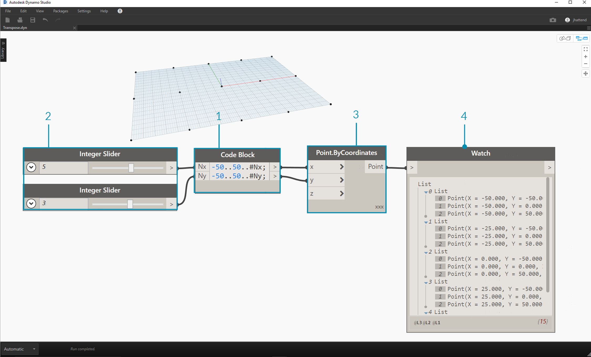
> 1. Insert two lines of code into the code block:
```
-50..50..#Nx;
-50..50..#Ny;
```
After typing in this code, the code block will create two inputs for Nx and Ny.
2. With two integer sliders, define the Nx and Ny values by connecting them to the code block.
3. Connect each line of the code block into the respective X and Y inputs of a Point.ByCoordinates node.  Right click the node, select "Lacing", and choose "Cross Product".  This creates a grid of points.  Because we defined the range from -50 to 50, we are spanning the default Dynamo grid.
4. A watch node reveals the points created.  Notice the data structure.  We've created a list of lists.  Each list represents a row of points of the grid.

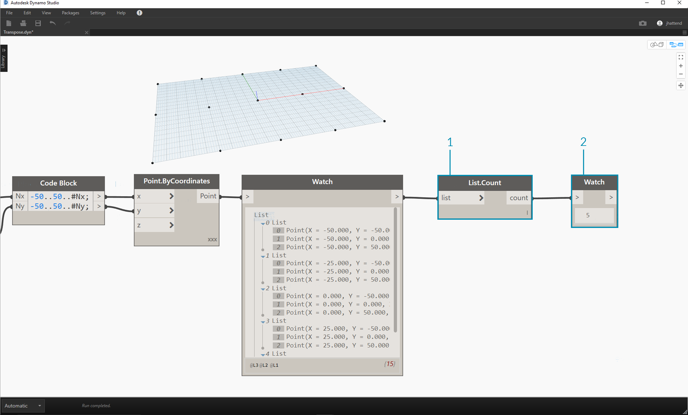
> 1. Attach a List.Count node to the output of the watch node from the previous step.
2. Connect a watch node to the List.Count output.

Notice that the List.Count node gives a value of 5.  This is equal to the "Nx" variable as defined in the code block.  Why is this?

* First, the Point.ByCoordinates node uses the "x" input as the primary input for creating lists.  When Nx is 5 and Ny is 3, we get a list of 5 lists, each with 3 items.
* Since Dynamo treats lists as objects in and of themselves, a List.Count node is applied to the main list in the hierarchy.  The result is a value of 5, or, the number of lists in the main list.

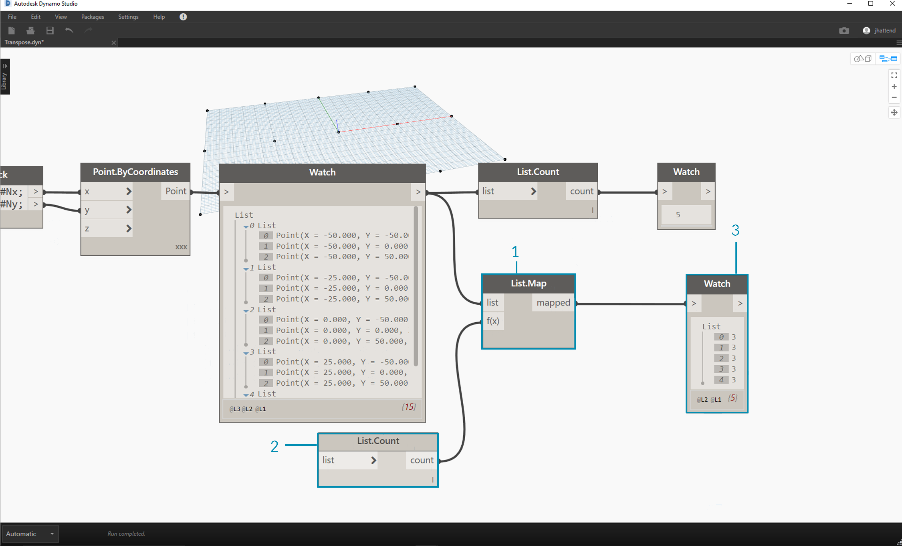
> 1. By using a List.Map node, we take a step down in the hierarchy and perform a "function" at this level.
2. Notice that the List.Count node has no input. It is being used as a function, so the List.Count node will be applied to every individual list one step down in the hierarchy.
3. The results of List.Count now gives a list of 5 items, each with a value of 3.  This represents the length of each sublist.

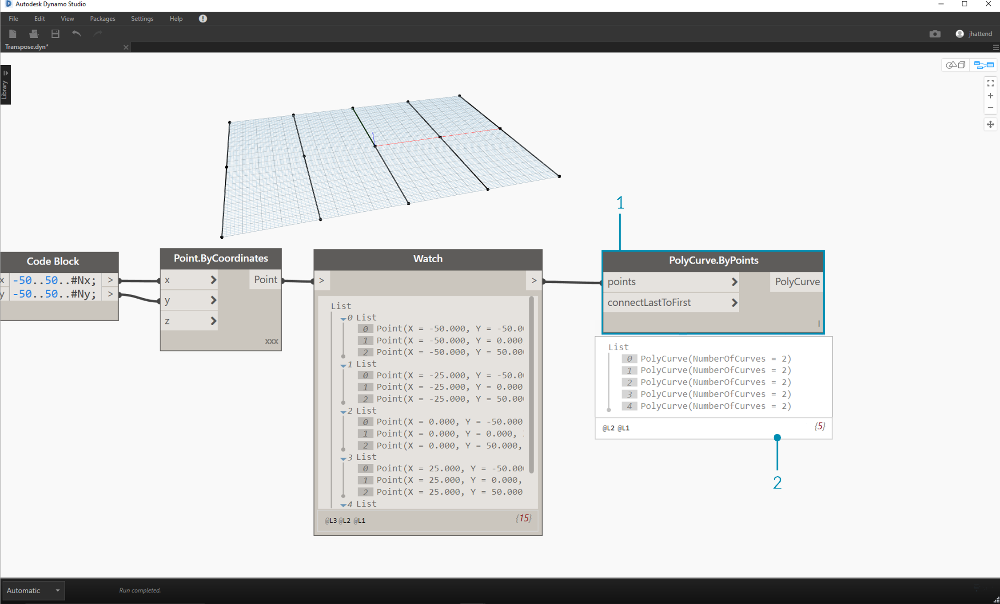
> Let's delete the List.Count nodes and move on to some geometry to see how the data structured.
1. Connect a PolyCurve.ByPoints to the output of the watch node from Point.ByCoordinates.
2. The output shows 5 polycurves, and we can see the curves in our Dynamo preview.  The Dynamo node is looking for a list of points (or a list of lists of points in this case) and creating a single polycurve from them.  Essentially, each list has converted to a curve in the data structure.

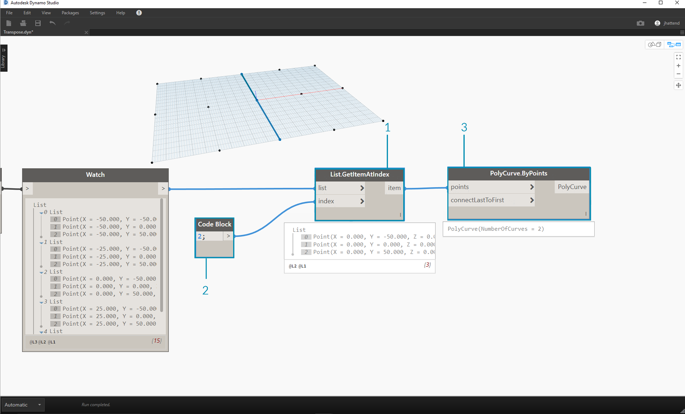
> 1. If we want to isolate one row of curves, we use the List.GetItemAtIndex node.
2. Using a code block value of 2, query the 3rd element in the main list.
3. The PolyCurve.ByPoints gives us one curve, since only one list is connected to the node.

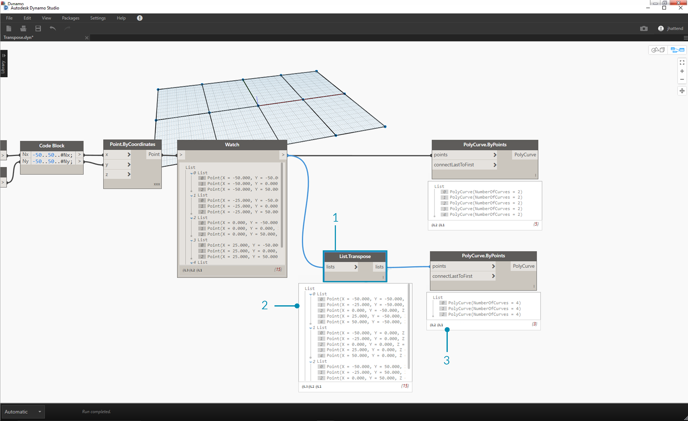
> 1. A List.Transpose node will switch all of the items with all of the lists in a list of lists.  This sounds complicated, but it's the same logic as transpose in Microsoft Excel: switching columns with rows in a data structure.
2. Notice the abstract result: the transpose changed the list structure from a 5 lists with 3 items each to 3 lists with 5 items each.
3. Notice the geometric result: using PolyCurve.ByPoints, we get 3 polycurves in the perependicular direction to the original curves.

###Exercise
This exercise uses some of the logic established in the previous one to edit a surface. Our goal here is intuitive, but the data structure navigation will be more involved.  We want to articulate a surface by moving a control point.

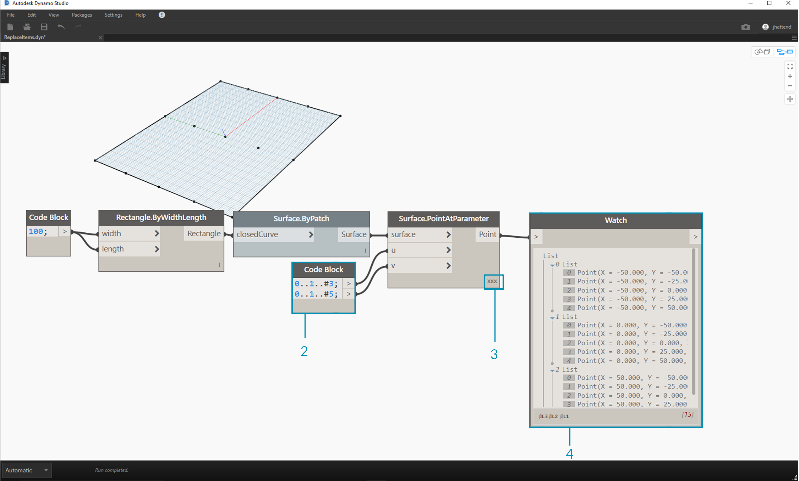
> 1. Begin with the string of nodes above. We are creating a basic surface which spans the default Dynamo grid.
2. Using code block, insert these two lines of code and connect to the u and v inputs of Surface.PointAtParameter, respectively:
```
-50..50..#3;
-50..50..#5;
```
3. Be sure to set the Lacing of Surface.PointAtParameter to "Cross Product".
4. The watch node show that we have a list of 3 lists, each with 5 items.

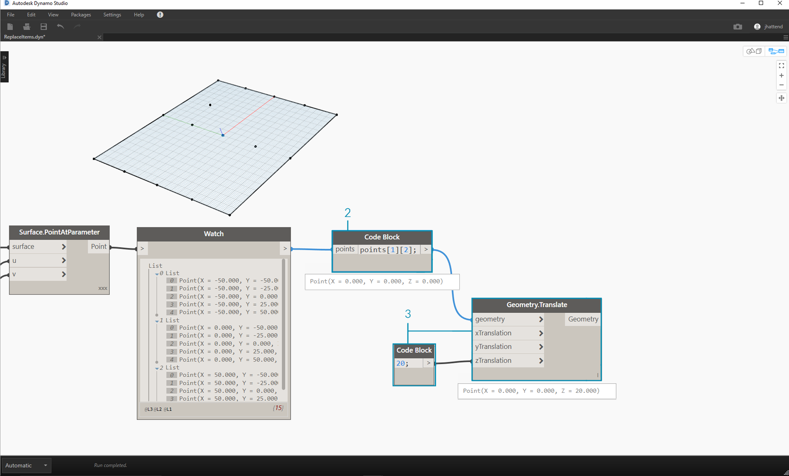
> In this step,  we want to query the central point in the grid we've created.  To do this we'll, select the middle point in the middle list.  Makes sense right?
1. To confirm that this is the correct point, we can also click through the watch node items to confirm that we're targeting the correct one.
2. Using code block, we'll write a basic line of code for querying a list of lists:
```points[1][2];```
3. Using Geometry.Translate, we'll move the selected point up in the Z direction by 20 units.

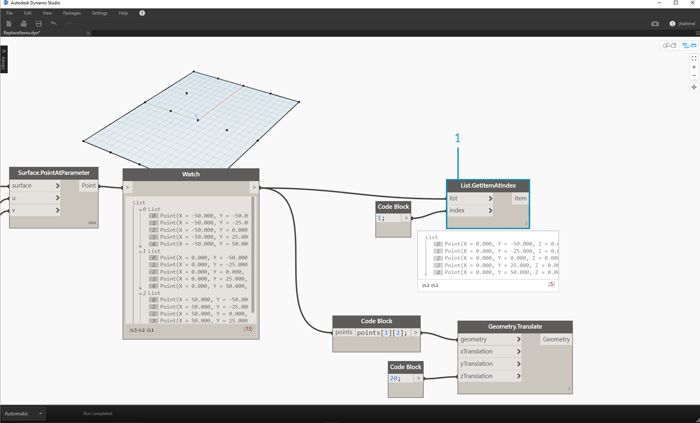
> 1. Let's also select the middle row of points with a List.GetItemAtIndex node.  Note: Similar to a previous step, we can also query the list with code block, using a line of ```points[1];```

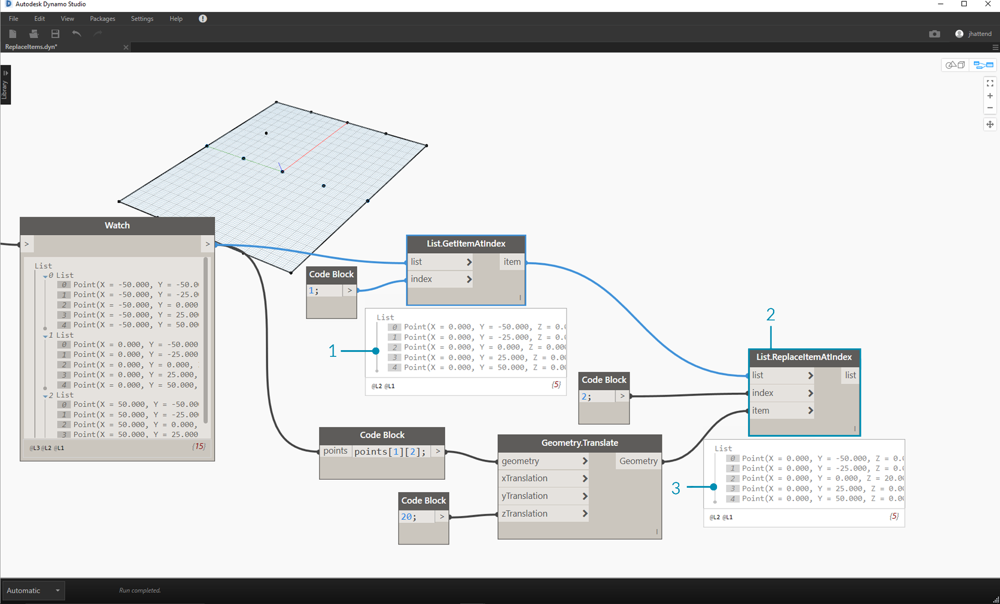
> So far we've successfully queried the center point and moved it upward.  Now we want need to insert this moved point back into the original data structure.
1. First, we want to replace the item of the list we isolated in a previous step.
2. Using List.ReplaceItemAtIndex, we'll replace the middle item by using and index of "2", with the replacement item connected to the moved point (Geometry.Translate).
3. The output shows that we've input the moved point into the middle item of the list.

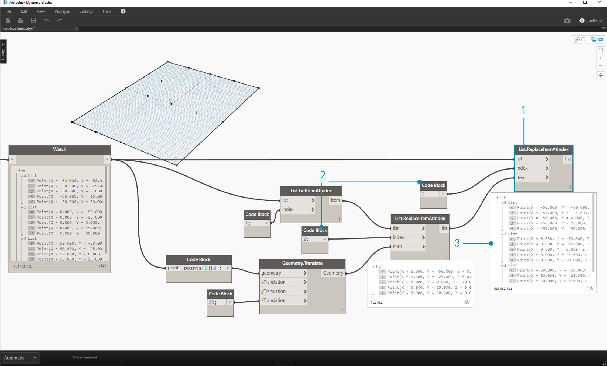
> Now that we've modified the list, we need to insert this list back into the original data structure: the list of lists.
1. Following the same logic, use List.ReplaceItemAtIndex to replace the middle list with the our modified list.
2. Notice that the code blocks defining the index for these two nodes are 1 and 2, which matches the original query from the code block (*points[1][2]*).
3. By selecting the list at index 1, we see the data structure highlighted in the Dynamo preview.  We successful merged the moved point into the original data structure.


> There are many ways to make a surface from this set of points.  In this case, we're going to create a surface by lofting curves together.
1. Create a NurbsCurve.ByPoints node and connect the new data structure to create three nurbs curves.


> 1. Connect a Surface.ByLoft to the output from NurbsCurve.ByPoints.  We now have a modified surface.  We can change the original Z value of Geometry.Translate and watch the geometry update.


