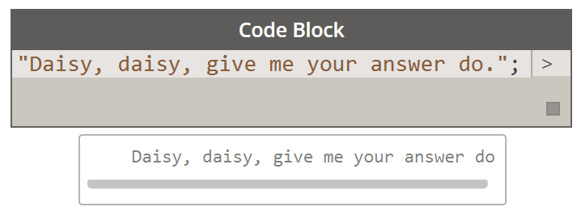
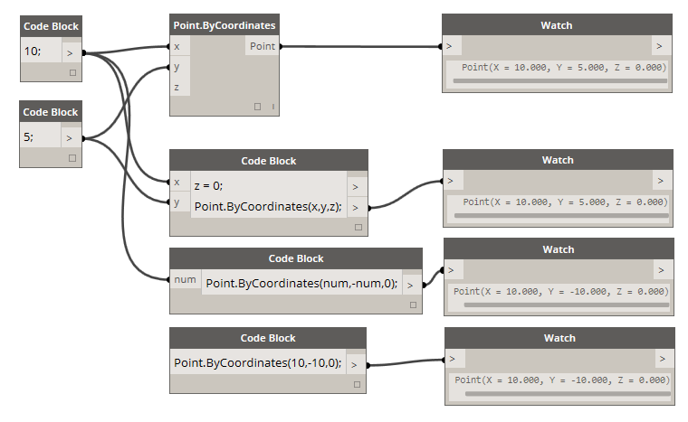
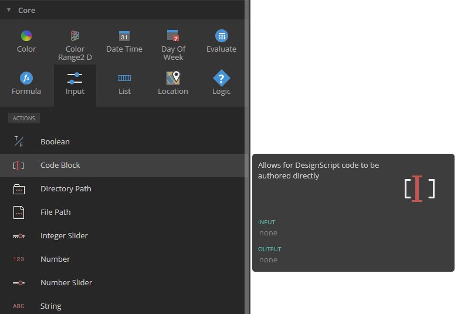
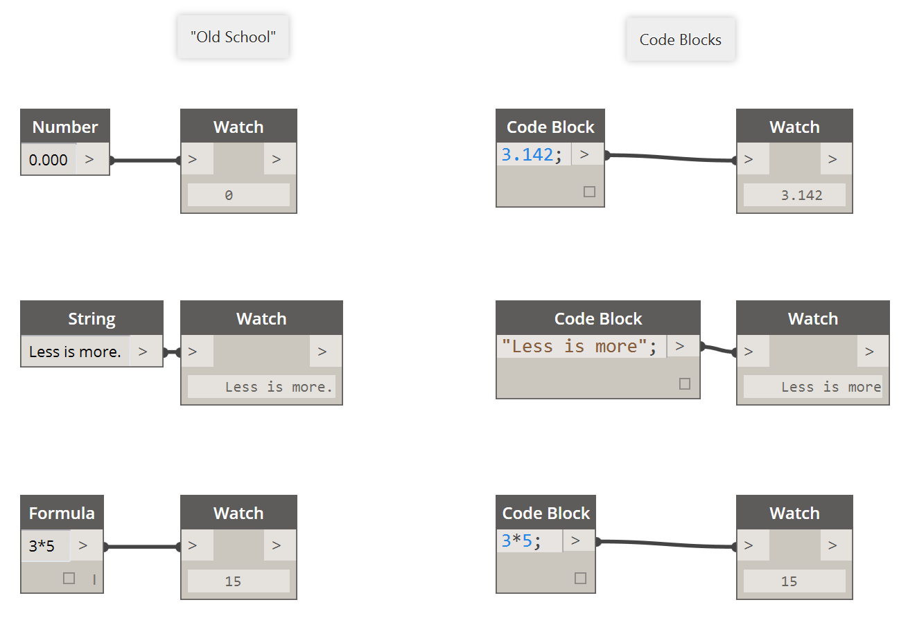

## What's a Code Block?
Code block is the special sauce of Dynamo.  It is a powerful tool which allows the user to work fluidly and parametrically throughout a project.  While the term 'code block' may be a little intimidating to non-programmers, it is both easy to use and robust.  A beginner can use the code block efficiently with minimal coding, and an advanced user can define scripted definitions to be recalled elsewhere in a Dynamo definition.  We highly recommend that you get familiar with code block as you develop your Dynamo definitions, and this chapter demonstrates how and why the code block is awesome.

###Code Block: A brief overview
In short, code blocks are a text-scripting interface within a visual-scripting environment.  They can be used as numbers, strings, formulas, and other data types.  The code block is designed for Dynamo, so one can define arbitrary variables in the code block, and those variables are automatically added to the inputs of the node:

With code blocks, a user has the flexibility to decide how to specify inputs. Here are several different ways to make a basic point with coordinates *(10, 5, 0)*:

As you learn more of the available functions in the library, you might even find that typing “Point.ByCoordinates” is faster than searching in the library and finding the proper node.  When you type in *"Point."* for example, Dynamo will display a list of possible functions to apply to a Point.  This makes the scripting more intuitive and will help with learning how to apply functions in Dynamo.

### Creating Code Block Nodes
The code block can be found in *Core>Input>Actions>Code Block*. But even faster, just double click on the canvas and the code block appears.  This node is used so often, it's given full double-click privileges.

### Numbers, strings, and formulas

Code blocks are also flexible towards data types.  The user can quickly define numbers, strings, and formulas and the code block will deliver the desired output.

In the image below, you can see the "old school" way of doing things is a little long-winded: the user searches for the intended node in the interface, adds the node to the canvas, and then inputs the data.  With code block, the user can double-click on the canvas to pull up the node, and type in the correct data type with basic syntax.

> The *number*, *string*, and *formula* nodes are three examples of Dynamo nodes which are arguably obsolete in comparison to the *code block*.

