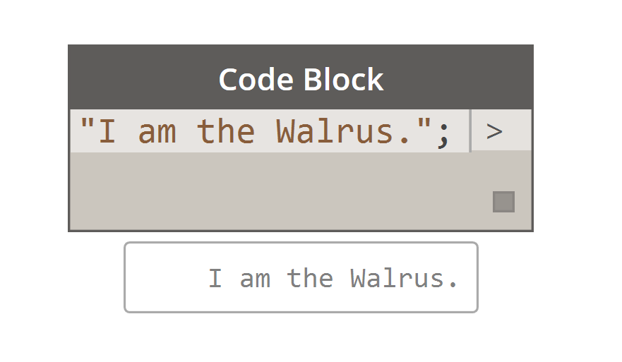

## What's a Code Block?
Code block is the secret sauce of Dynamo.  It is a powerful tool which allows the user to work fluidly and parametrically throughout a project.  While the term 'code block' may be a little intimidating to non-programmers, it is both easy to use and robust.  A beginner can use the code block efficiently with minimal coding, and an advanced user can define scripted definitions to be recalled elsewhere in a Dynamo definition.  We highly recommend that you get familiar with code block as your develop your Dynamo definitions, and this chapter demonstrates how and why the code block is awesome.

###Code Block: A brief overview
In short, code blocks are a text-scripting interface within a visual-scripting environment.  They can be used as numbers, strings, formulas, and other data types.  The code block is designed for Dynamo, so one can define arbitrary variables in the code block, and those variables are automatically added to the inputs of the battery:

### Creating Code Block Nodes
The code block can be found in Core>Input>Actions>Code Block. But even faster, just double click on the canvas and the code block appears.  This node is used so often, it's given full double-click privileges.

### Flexibility of Data Types
Text

