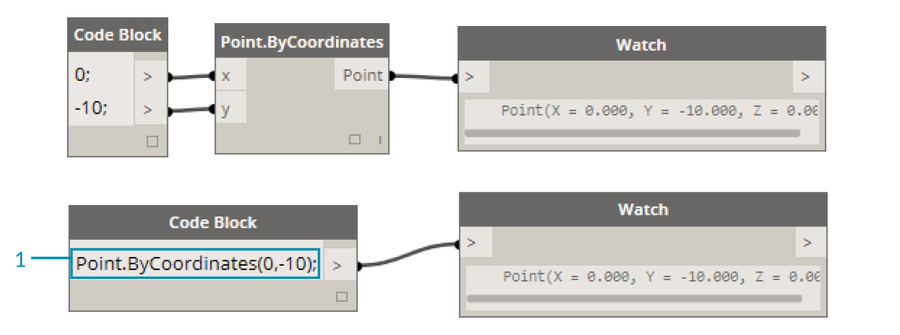
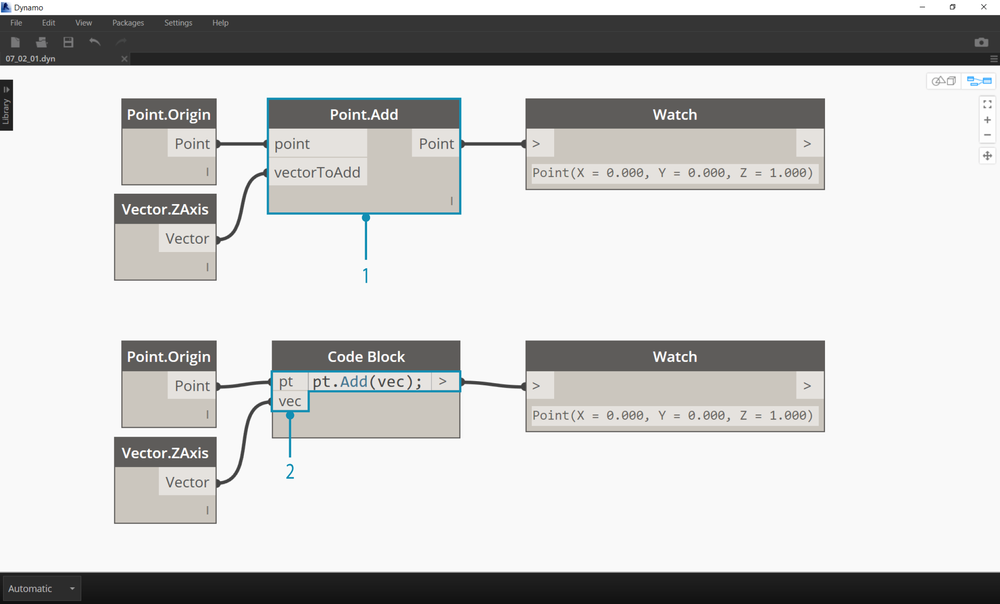
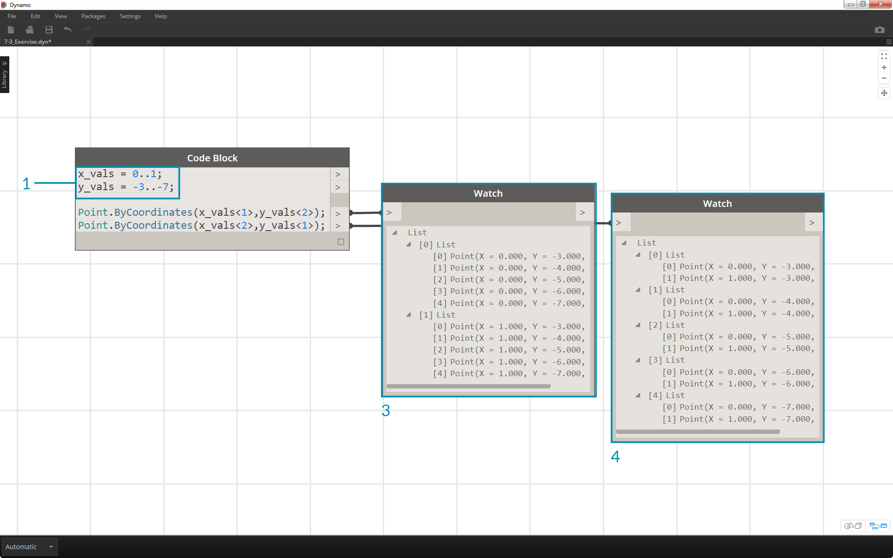
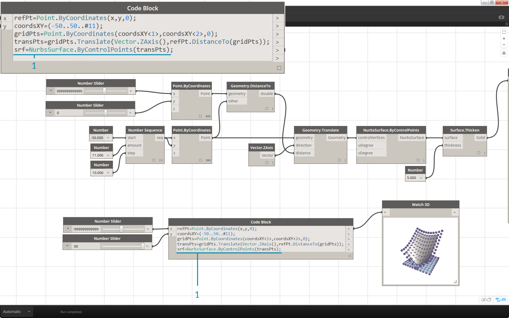
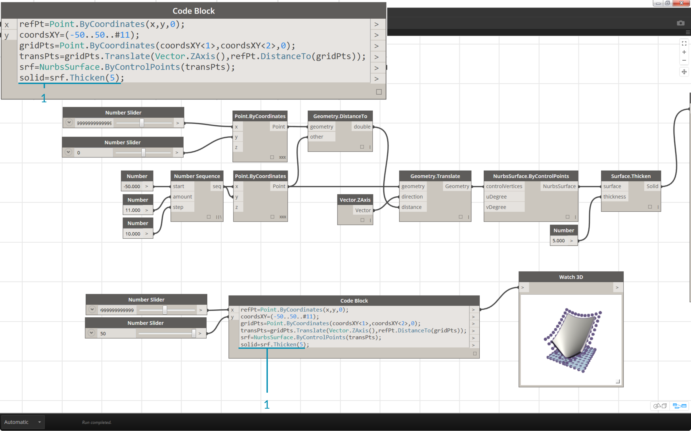
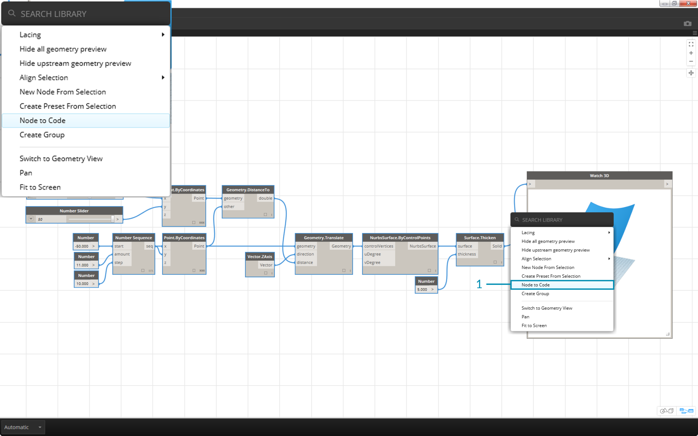
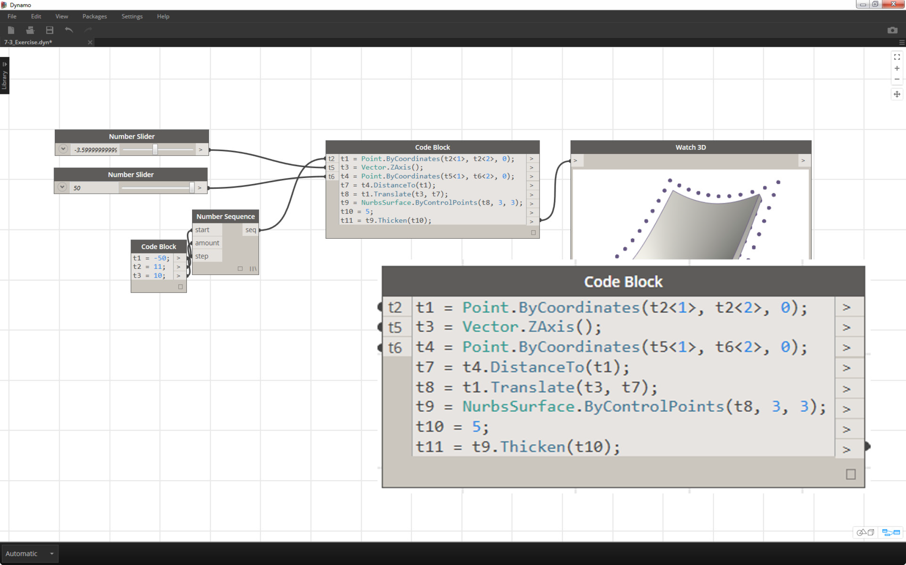

## Dynamo Language Syntax
You may have noticed a common theme in the names of nodes in Dynamo: each node uses a *"."* syntax without spaces.  This is because the text at the top of each node respresents the actual syntax for scripting, and the *"."* (or *dot notation*) separates an element from the possible methods we can call.  This creates an easy translation from visual scripting to text-based scripting. Let's look at *Point.ByCoordinates* and show how we can create a point using the code block:


> 1. We're calling *Point.ByCoordinates* in the code block and specifying the inputs in the same order as the out-of-the-box node *(X,Y)*.
2. The code block syntax ```Point.ByCoordinates(0,10);
```
gives the same result as a *Point.ByCoordinates* battery in Dynamo, except we're able to create a point using one battery.  This is more efficient than the connecting a separate node into *"X"* and *"Y"*.

###Calling Nodes
You can call any regular node in the library through a Code Block as long as the node isn’t a special *“UI” node*: those with a special user interface feature. For instance, you can call *Circle.ByCenterPointRadius*, but it wouldn’t make much sense to call a *Watch 3D* node.

Regular nodes (most of your library), generally come in three types:

*  **Create** -	Create (or construct) something
* **Action** -	Perform an action on something
* **Query** -	Get a property of something that already exists

You’ll find that the library is organized with these categories in mind. Methods, or nodes, of these three types are treated differently when invoked within a Code Block.


####Create
The "Create" category will construct geometry from scratch.  We input values in the code block from left-to-right.  These inputs are in the same order as the inputs on the node from top-to-bottom:

> Comparing the Line.ByStartPointEndPoint node and the corresponding syntax in the code block, we get the same results.

####Action

An action is something you do to an object of that type. Dynamo uses *dot notation*, common to many coding languages, to apply an action to a thing. Once you have the thing, type a dot then the name of the action. The action-type method’s input is placed in parentheses just like create-type methods, only you don’t have to specify the first input you see on the corresponding node.  Instead, we specify the element upon which we are performing the action:




> 1.For example, if I want to call the node Point.Add from a Code Block, I notice that this is an action-type node.
2. It’s inputs are (1) the point, and (2) the vector to add to it. In a Code Block, I’ve named the point (the thing) “pt”. To add a vector named “vec” to “pt,” I would write pt.Add(vec), or: thing, dot, action. The Add action only has one input, or all the inputs from the Point.Add node minus the first one. The first input for the Point.Add node is the point itself.

####Query

Query-type methods get a property of an object. Since the object itself is the input, you don’t have to specify any inputs. No parentheses required.


### How About Lacing?
Lacing with nodes is somewhat different from lacing with code block.  With nodes, the user right clicks on the battery and selects the lacing option to perform.  With code block, the user has much more control as to how the data is structured.  The code block shorthand method uses *replication guides* to set how several one-dimensional lists should be paired. Numbers in angled brackets "<>" define the hierarchy of the resulting nested list: <1>,<2>,<3>, etc.


> 1. In this example, we have lists of 2 x-values and 5 y-values. If we don’t use replication guides with these mismatched lists, we get two points as a result, the same as the length of the shortest list. Using replication guides, we can find all of the possible combinations of 2 and 5 coordinates (or, a *Cross Product*).
2. With this notation, we can also specify which list will be dominant: 2 lists of 5 things or 5 lists of 2 things. In the example, changing the order of the replication guides makes the result a list of rows of points or a list of columns of points in a grid.

### Exercise
Text

>1. Descriptive Text
2. Second step of descriptive text


>1. Descriptive Text
2. Second step of descriptive text


>1. Descriptive Text
2. Second step of descriptive text


>1. Descriptive Text
2. Second step of descriptive text


>1. Descriptive Text
2. Second step of descriptive text


>1. Descriptive Text
2. Second step of descriptive text


>1. Descriptive Text
2. Second step of descriptive text


>1. Descriptive Text
2. Second step of descriptive text


>1. Descriptive Text
2. Second step of descriptive text


>1. Descriptive Text
2. Second step of descriptive text


>1. Descriptive Text
2. Second step of descriptive text


>1. Descriptive Text
2. Second step of descriptive text

