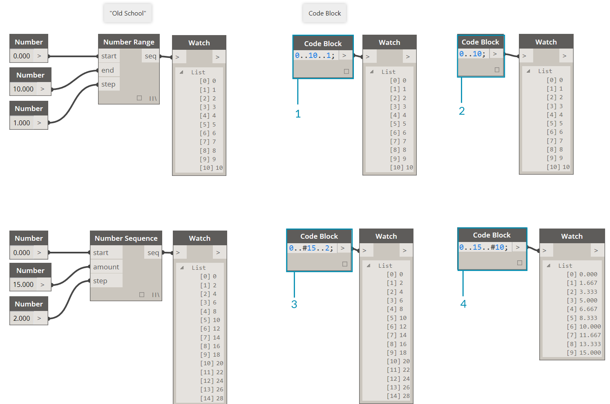
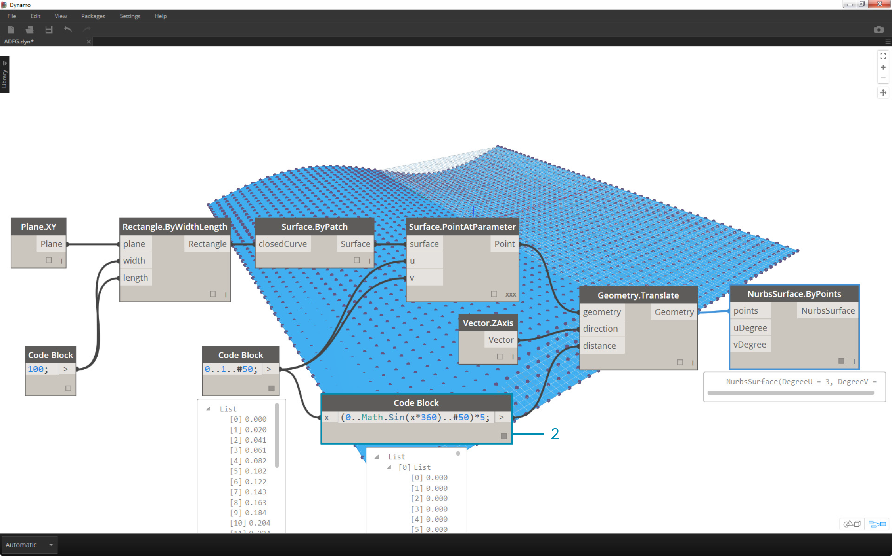
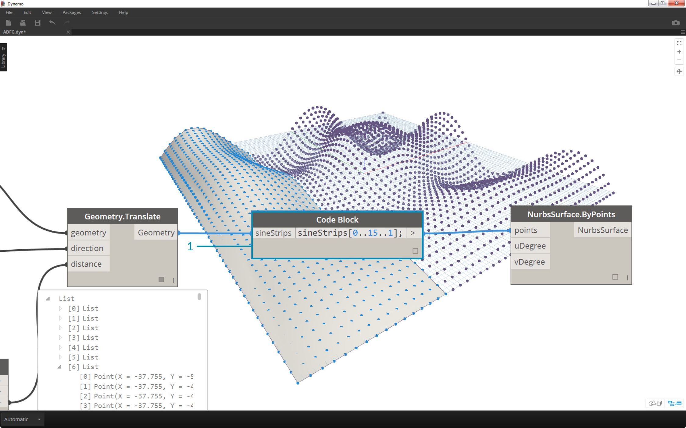
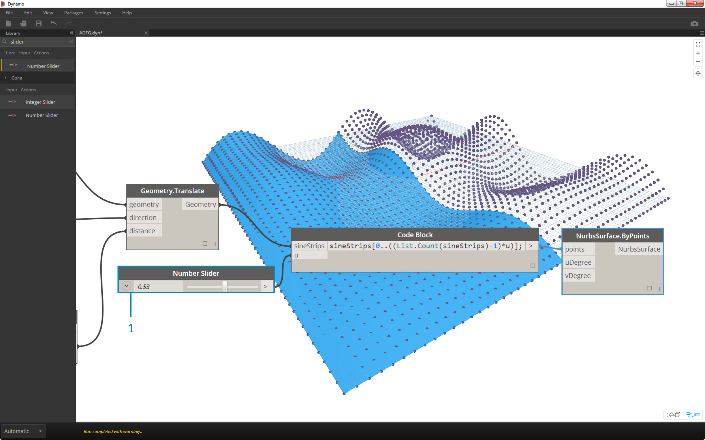

## Analogs, or "Obsolete" Nodes
Text

### Inputs
Text

### Operators
Text

### Numbers, strings, and formulas
In addition to inputs and operators, code blocks are flexible towards data types.  The user can quickly define numbers, strings, and formulas and the code block will deliver.  In the image below, you can see the "old school" way of doing things is a little long-winded.  The user has to search for the intended node in the interface, add the node to the canvas and then type in the data.  With code block, the user can double-click on the canvas to pull up the node, and type in the correct data type with basic syntax.

>The number, string, and formula nodes are three examples of Dynamo nodes which are arguably obsolete in comparison to the code block.

### Ranges

### Exercise

>1. Descriptive Text
2. Second step of descriptive text

>1. Descriptive Text
2. Second step of descriptive text

>1. Descriptive Text
2. Second step of descriptive text

>1. Descriptive Text
2. Second step of descriptive text

>1. Descriptive Text
2. Second step of descriptive text

>1. Descriptive Text
2. Second step of descriptive text

>1. Descriptive Text
2. Second step of descriptive text

>1. Descriptive Text
2. Second step of descriptive text

>1. Descriptive Text
2. Second step of descriptive text

>1. Descriptive Text
2. Second step of descriptive text

>1. Descriptive Text
2. Second step of descriptive text

>1. Descriptive Text
2. Second step of descriptive text

>1. Descriptive Text
2. Second step of descriptive text
