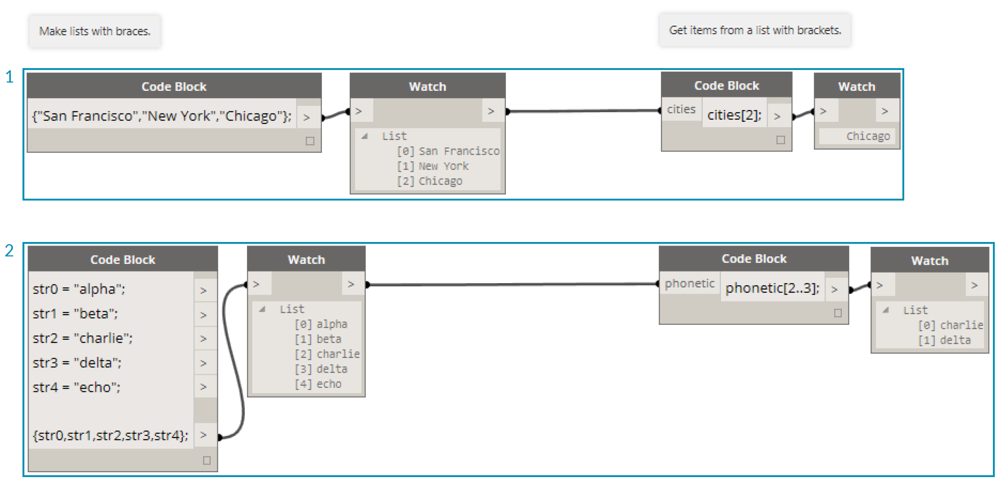
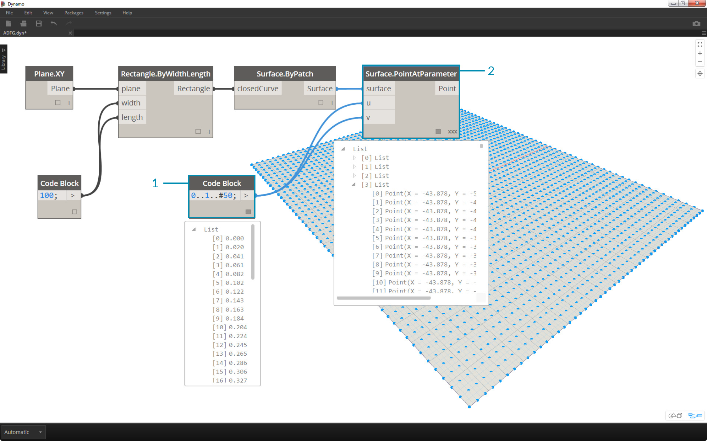
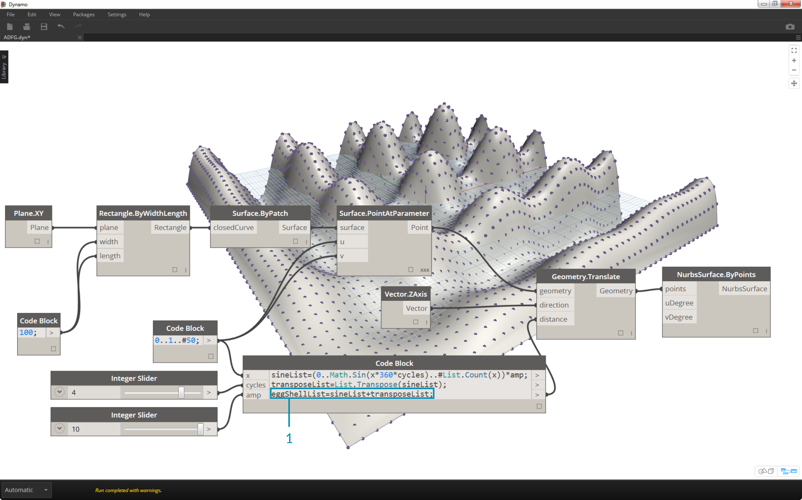
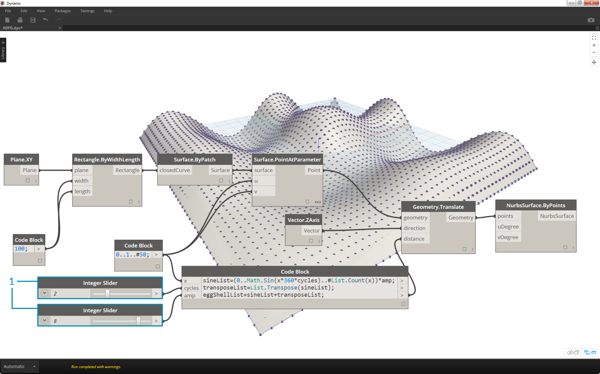

## Shorthand
There are a few basic shorthand methods in the code block which, simply put, make data management *a lot* easier.  We'll break down the basics below and discuss how this shorthand can be used both for creating and querying data.


### Ranges
The method for defining ranges and sequences can be reduced to basic shorthand.  Use the image below as a guide to the ".." syntax for defining a list of numerical data with code block. After getting the hang of this notation, creating numerical data is a really efficient process:

> 1. In this example, a number range is replaced by basic code block syntax defining the ```beginning..end..step-size;
```.  Represented numerically, we get: ```0..10..1;
```
2. Notice that the syntax ```0..10..1;
``` is equivalent to ```0..10;
```.  A step-size of 1 is the default value for the shorthand notation. So ```0..10;
``` will give a sequence from 0 to 10 with a step-size of 1.
3. The number sequence example is similar, except we use a *"#"* to state that we want 15 values in the list, rather than a list which goes up to 15.  In this case, we are defining: ```beginning..#ofSteps..step-size:
```.  The actual syntax for the sequence is ```0..#15..2
```
4. Using the *"#"* from the previous step, we now place it in the *"step-size"* portion of the syntax.  Now, we have a number range spanning from the *"beginning"* to the *"end"* and the *"step-size"* notation evenly distributes a number of values between the two: ```beginning..end..#ofSteps
```


### Advanced Ranges
Creating advanced ranges allows us to work with list of lists in a simple fashion.  In the examples below, we're isolating a variable from the primary range notation, and creating another range of that list.

>1. Creating nested ranges, compare the notation with a *"#"* vs. the notation without.  The same logic applies as in basic ranges, except it gets a little more complex.
2. We can define a sub-range at any place within the primary range, and notice that we can have two sub-ranges as well.
3. By controlling the *"end"* value in a range, we create more ranges of differing lengths.


> As a logic exercise, compare the two shorthands above and try to parse through how *subranges* and the *"#"* notation drive the resultant output.

###  Make lists and get items from a list
In addition to making lists with shorthand, we can also create lists on the fly.  These list can contain a wide range of element types and can also be queried (remember, lists are objects in themselves).  To summarize, with code block you make lists with braces (a.k.a. “curly brackets”) and you query items from a list with brackets (a.k.a. “square brackets”):


>1. Create lists quickly with strings and query them using the item index.
2. Create lists with variables and query using the range shorthand notation.

And manging with nested lists is a similar process. Be aware of the list order and recall using multiple sets of square brackets:


>1.  Define a list of lists and query a nested list with two bracket notations.


### Exercise

>1. Descriptive Text
2. Second step of descriptive text


>1. Descriptive Text
2. Second step of descriptive text


>1. Descriptive Text
2. Second step of descriptive text


>1. Descriptive Text
2. Second step of descriptive text


>1. Descriptive Text
2. Second step of descriptive text


>1. Descriptive Text
2. Second step of descriptive text


>1. Descriptive Text
2. Second step of descriptive text


>1. Descriptive Text
2. Second step of descriptive text


>1. Descriptive Text
2. Second step of descriptive text


>1. Descriptive Text
2. Second step of descriptive text


>1. Descriptive Text
2. Second step of descriptive text


>1. Descriptive Text
2. Second step of descriptive text


>1. Descriptive Text
2. Second step of descriptive text
