<style>
table{box-shadow: 2px 2px 2px #BBBBBB;max-width:75%;display:block;margin-left: auto;   margin-right: auto }
img{display:block;margin-left: auto;   margin-right: auto }
</style>

## Shorthand
There are a few basic shorthand methods in the code block which, simply put, make data management *a lot* easier.  We'll break down the basics below and discuss how this shorthand can be used both for creating and querying data.

<table>
    <tr>
    <td width="50%"><b>Data Type</b></td>
    <td width="25%"><b>Standard Dynamo</b> </td>
    <td width="25%"><b>Code Block Equilvalent</b></td>
  </tr>
  <tr>
    <td> Numbers</td>
    <td></img> </td>
    <td>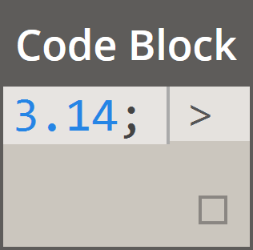</img></td>
  </tr>
  <tr>
    <td>Strings</td>
    <td></img> </td>
    <td>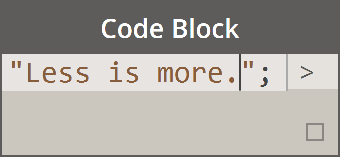</img></td>
  </tr>
  <tr>
    <td>Sequences</td>
    <td>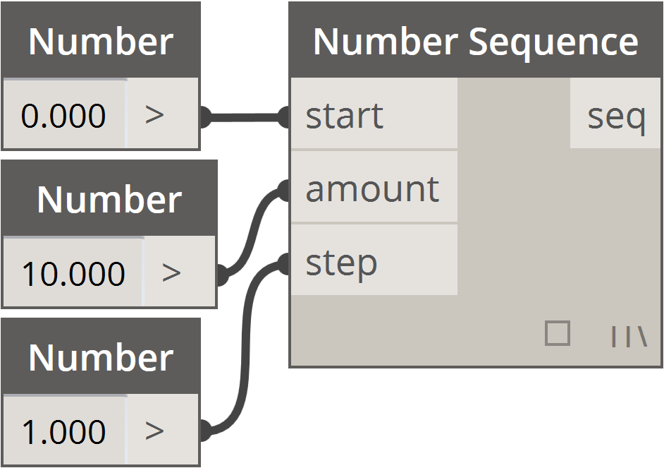</img> </td>
    <td></img></td>
  </tr>
  <tr>
    <td>Ranges</td>
    <td>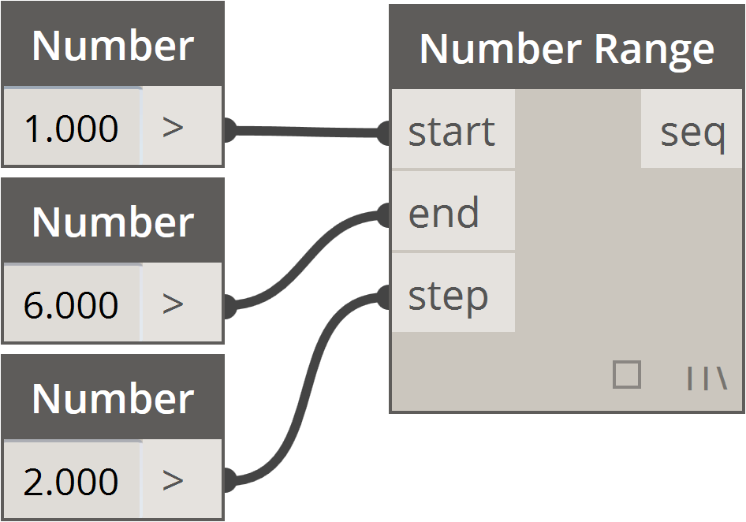</img> </td>
    <td>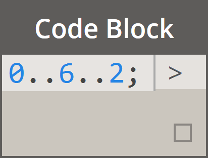</img></td>
  </tr>
  <tr>
    <td>Get Item at Index</td>
    <td>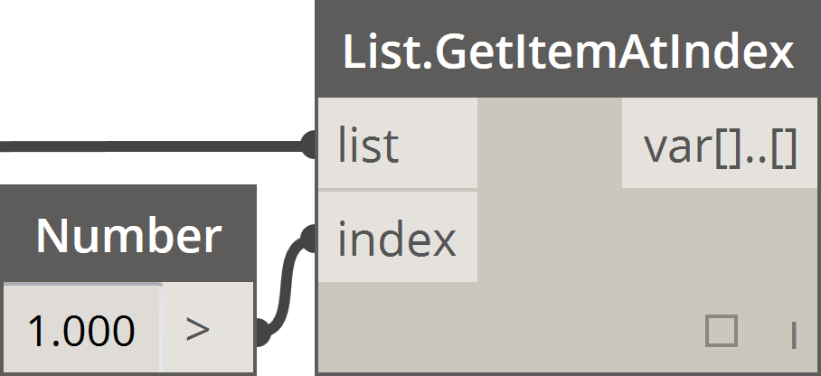</img> </td>
    <td></img></td>
  </tr>
  <tr>
    <td>Create List</td>
    <td>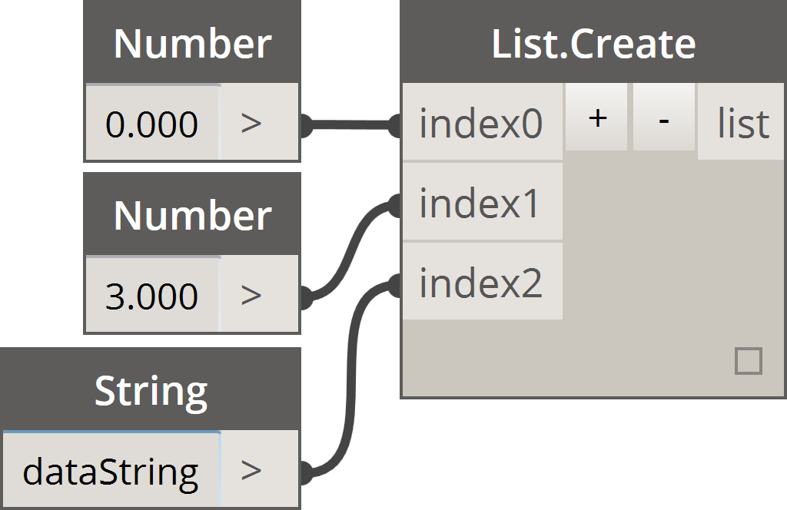</img> </td>
    <td></img></td>
  </tr>
  <tr>
    <td>Concatenate Strings</td>
    <td>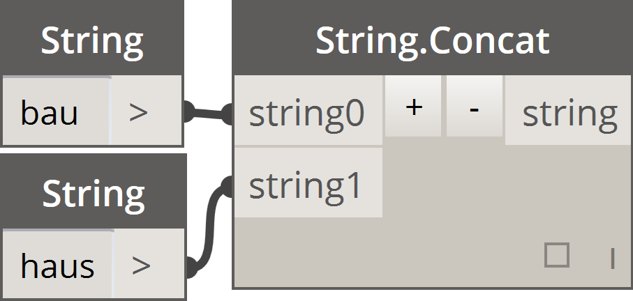</img> </td>
    <td></img></td>
  </tr>
  <tr>
    <td>Conditional Statements</td>
    <td>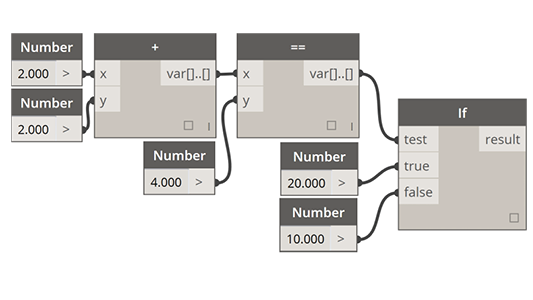</img> </td>
    <td></img></td>
  </tr>
</table>

###Additional Syntax
| Node(s) | Code Block Equivalent | Note |
| -- | -- | -- |
| Any operator (+, &&, >=, Not, etc.) |+, &&, >=, !, etc.| Note that “Not” becomes “!” but the node is called “Not” to distinguish from “Factorial”|
| Boolean True | true; | Note lower case |
| Boolean False | false; | Note lower case |

### Ranges
The method for defining ranges and sequences can be reduced to basic shorthand.  Use the image below as a guide to the ".." syntax for defining a list of numerical data with code block. After getting the hang of this notation, creating numerical data is a really efficient process:

> 1. In this example, a number range is replaced by basic code block syntax defining the ```beginning..end..step-size;
```.  Represented numerically, we get: ```0..10..1;
```
2. Notice that the syntax ```0..10..1;
``` is equivalent to ```0..10;
```.  A step-size of 1 is the default value for the shorthand notation. So ```0..10;
``` will give a sequence from 0 to 10 with a step-size of 1.
3. The *number sequence* example is similar, except we use a *"#"* to state that we want 15 values in the list, rather than a list which goes up to 15.  In this case, we are defining: ```beginning..#ofSteps..step-size:
```.  The actual syntax for the sequence is ```0..#15..2
```
4. Using the *"#"* from the previous step, we now place it in the *"step-size"* portion of the syntax.  Now, we have a *number range* spanning from the *"beginning"* to the *"end"* and the *"step-size"* notation evenly distributes a number of values between the two: ```beginning..end..#ofSteps
```

### Advanced Ranges
Creating advanced ranges allows us to work with list of lists in a simple fashion.  In the examples below, we're isolating a variable from the primary range notation, and creating another range of that list.
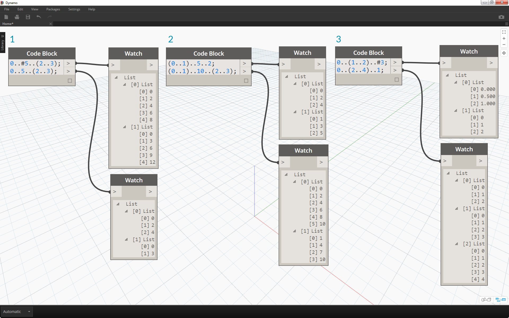
>1. Creating nested ranges, compare the notation with a *"#"* vs. the notation without.  The same logic applies as in basic ranges, except it gets a little more complex.
2. We can define a sub-range at any place within the primary range, and notice that we can have two sub-ranges as well.
3. By controlling the *"end"* value in a range, we create more ranges of differing lengths.


> As a logic exercise, compare the two shorthands above and try to parse through how *subranges* and the *"#"* notation drive the resultant output.

###  Make lists and get items from a list
In addition to making lists with shorthand, we can also create lists on the fly.  These list can contain a wide range of element types and can also be queried (remember, lists are objects in themselves).  To summarize, with code block you make lists with braces (a.k.a. “curly brackets”) and you query items from a list with brackets (a.k.a. “square brackets”):


>1. Create lists quickly with strings and query them using the item index.
2. Create lists with variables and query using the range shorthand notation.

And manging with nested lists is a similar process. Be aware of the list order and recall using multiple sets of square brackets:

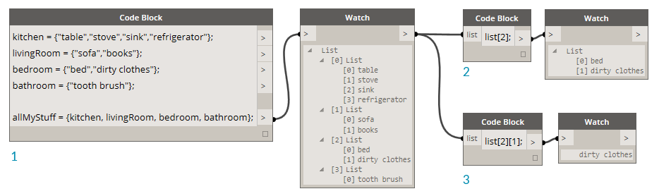
> 1. Define a list of lists.
2. Query a list with single bracket notation.
3. Query an item with double bracket notation.


### Exercise
>Download the example file that accompanies this exercise (Right click and "Save Link As..."). A full list of example files can be found in the Appendix. [Obsolete-Nodes_Sine-Surface.dyn](datasets/7-3/Obsolete-Nodes_Sine-Surface.dyn)

In this exercise, we will flex our new shorthand skills to create a funky-cool eggshell surface defined by ranges and formulas. During this exercise, notice how we use code block and existing Dynamo nodes in tandem: we use the code block for the heavy data lifting while the Dynamo nodes are visually laid out for legibility of the definition.


> Start by creating a surface by connecting the nodes above.  Instead of using a number node to define width and length, double click on the canvas and type ```100;
``` into a code block.


>1. Define a range between 0 and 1 with 50 divisions by typing ```0..1..#50
``` into a code block.
2. Connect the range into *Surface.PointAtParameter*, which takes *u* and *v* values between 0 and 1 across the surface.  Remember to change the *Lacing* to *Cross Product* by right clicking on the *Surface.PointAtParameter* node.


> In this step, we employ our first function to move the grid of points up in the Z.  This grid will drive a generated surface based on the underlying function.
1. Add the visual nodes to the canvas as shown in the image above.
2. Rather than using a formula node, we use a code block with the line: ```(0..Math.Sin(x*360)..#50)*5;
```.  To quickly break this down, we're defining a range with a formula inside of it.  This formula is the Sine function. The sine function receives degree inputs in Dynamo, so in order to get a full sine wave, we multiple our *x* values (this is the range input from 0 to 1) by *360*.  Next we want the same number of divisions as control grid points for each row, so we define fifty subdivisions with *#50*.  Finally, the multiplier of 5 simply increases the amplitude of translation so that we can see the effect in the Dynamo Preview.


> 1. While the previous code block worked fine, it wasn't completely parametric.  We want to dynamically drive its parameters, so we'll replace the line from the previous step with ```(0..Math.Sin(x*360*cycles)..#List.Count(x))*amp;
```.  This gives us the ability to define these values based on inputs.


>1. By changing the sliders (ranging from 0 to 10), we get some interesting results.

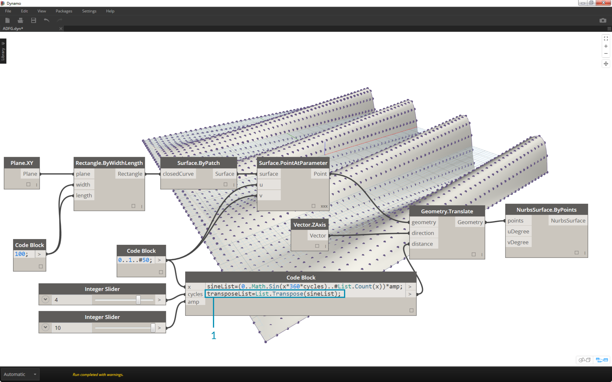
>1. By doing a transpose on the number range, we reverse the direction of the curtain wave: ```transposeList = List.Transpose(sineList);
```


>1. We get a distorted eggshell surface when we add the sineList and the tranposeList: ```eggShellList = sineList+transposeList;
```


>1. Changing the sliders again let's us calm the waters of this algorithm.


>1. Last, let's query isolated parts of the data with the code block.  To regenerate the surface with a specific range of points, add the code block above between the *Geometry.Translate* and *NurbsSurface.ByPoints* node.  This has the line of text: ```sineStrips[0..15..1];
```.  This will select the first 16 rows of points (out of 50).  Recreating the surface, we can see that we've generated an isolated portion of the grid of points.


>1. In the final step, to make this code block more parametric, we drive the query by using a slider ranging from 0 to 1. We do this with this line of code: ```sineStrips[0..((List.Count(sineStrips)-1)*u)];
```.  This may seem confusing, but the line of code gives us a quick way to scale the length of the list into a multiplier between 0 and 1.


>1. A value of *.53* on the slider creates a surface just past the midpoint of the grid.


>1. And as expected, a slider of *1* creates a surface from the full grid of points.


> Looking at the resultant visual graph, we can highlight the code blocks and see each of their functions.
1. The first code block replaces the *Number* node.
2. The second code block replaces the *Number Range* node.
3. The third code block replaces the *Formula* node (as well as *List.Transpose*, *List.Count* and *Number Range*).
4. The fourth code block queries a list of lists, replacing the *List.GetItemAtIndex* node.


