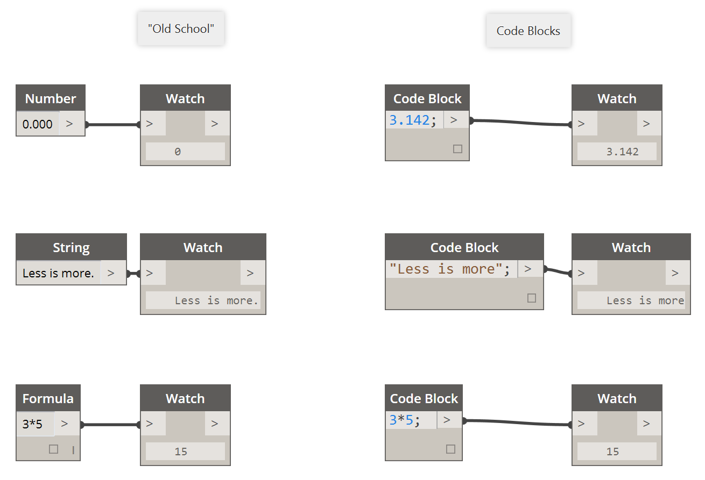
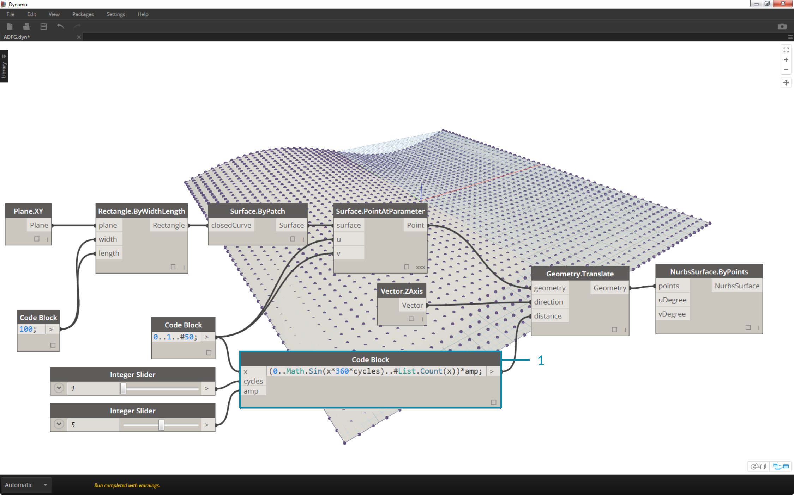
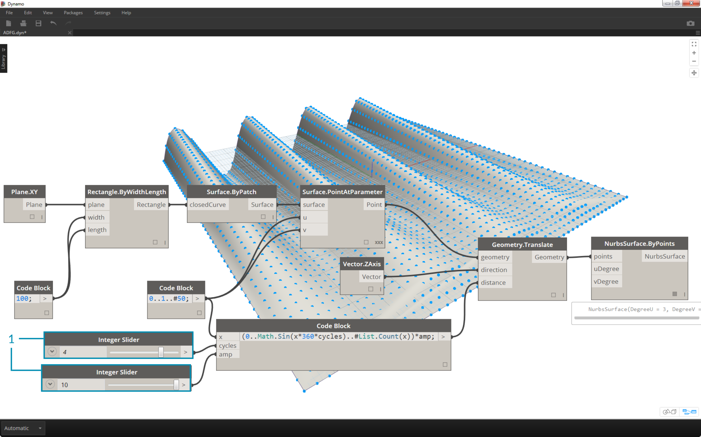
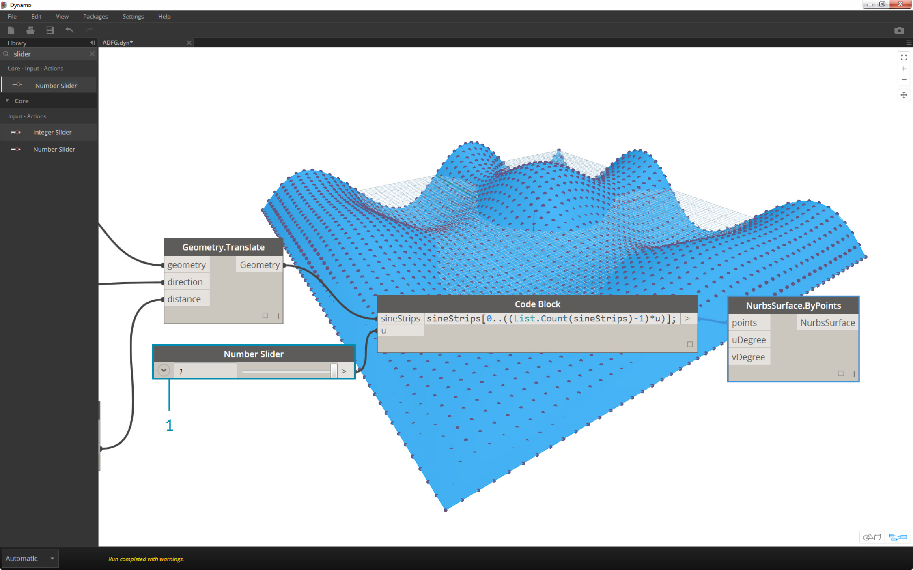
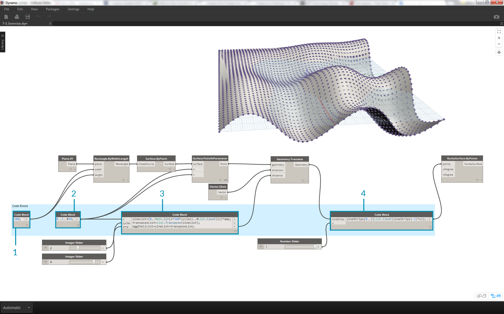

## Shorthand
Text

### Inputs
Text

### Operators
Text

### Numbers, strings, and formulas
In addition to inputs and operators, code blocks are flexible towards data types.  The user can quickly define numbers, strings, and formulas and the code block will deliver.  In the image below, you can see the "old school" way of doing things is a little long-winded: the user searches for the intended node in the interface, adds the node to the canvas, and then inputs the data.  With code block, the user can double-click on the canvas to pull up the node, and type in the correct data type with basic syntax.

>The number, string, and formula nodes are three examples of Dynamo nodes which are arguably obsolete in comparison to the code block.

### Ranges
Similarly, the method for defining ranges and sequences can be reduced to basic shorthand.  Use the image below as a guide to the ".." syntax for defining a list of numerical data with code block. After getting the hang of this notation, creating numerical data is a really efficient process:

### Advanced Ranges

### What About Lacing?
Lacing with nodes is somewhat different from lacing with code block.  With nodes, the user right clicks on the battery and selects the lacing option to perform.  With code block, you the user has much more control as to how the data is structured.  The code block shorthand method uses *replication guides* to set how several one-dimensional lists should be paired. Numbers in angled brackets "<>" define the hierarchy of the resulting nested list: <1>,<2>,<3>, etc.

> 1. In this example, we have lists of 2 x-values and 5 y-values. If we don’t use replication guides with these mismatched lists, we get two points as a result, the same as the length of the shortest list. Using replication guides, we can find all of the possible combinations of 2 and 5 coordinates (or, a *Cross Product*).
2. With this notation, we can also specify which list will be dominant: 2 lists of 5 things or 5 lists of 2 things. In the example, changing the order of the replication guides makes the result a list of rows of points or a list of columns of points in a grid.

### Exercise

>1. Descriptive Text
2. Second step of descriptive text

>1. Descriptive Text
2. Second step of descriptive text

>1. Descriptive Text
2. Second step of descriptive text

>1. Descriptive Text
2. Second step of descriptive text

>1. Descriptive Text
2. Second step of descriptive text

>1. Descriptive Text
2. Second step of descriptive text

>1. Descriptive Text
2. Second step of descriptive text

>1. Descriptive Text
2. Second step of descriptive text

>1. Descriptive Text
2. Second step of descriptive text

>1. Descriptive Text
2. Second step of descriptive text

>1. Descriptive Text
2. Second step of descriptive text

>1. Descriptive Text
2. Second step of descriptive text

>1. Descriptive Text
2. Second step of descriptive text
