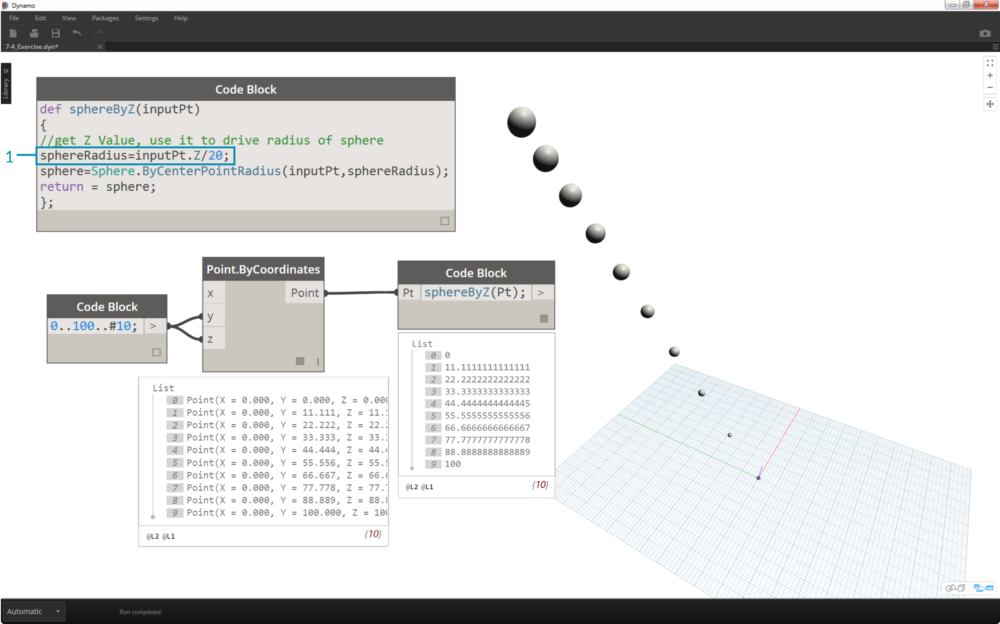

## Code Block Functions
Functions can be created in a code block and recalled elsewhere in a Dynamo definition.  This creates another layer of control in a parametric file, and can be viewed as a text-based version of a custom node.  In this case, the "parent" code block is readily accessible and can be located anywhere on the graph.

### Parent
The first line has the key word “def”, then the function name, then the names of inputs in parentheses. Braces define the body of the function. Return a value with “return =”. Code Blocks that define a function do not have input or output ports because they are called from other Code Blocks.

```
/*This is a multi-line comment,
which continues for
multiple lines*/

def FunctionName(input1,input2)
{
//This is a comment
sum = input1+input2;
return = sum;
};```

### Children
Call the function with another Code Block in the same file by giving the name and the same number of arguments. It works just like the out-of-the-box nodes in your library.

```FunctionName(in1,in2);```


### Exercise

>1. Descriptive Text
2. Second step of descriptive text


>1. Descriptive Text
2. Second step of descriptive text


>1. Descriptive Text
2. Second step of descriptive text


>1. Descriptive Text
2. Second step of descriptive text


>1. Descriptive Text
2. Second step of descriptive text


>1. Descriptive Text
2. Second step of descriptive text


>1. Descriptive Text
2. Second step of descriptive text


>1. Descriptive Text
2. Second step of descriptive text


>1. Descriptive Text
2. Second step of descriptive text


>1. Descriptive Text
2. Second step of descriptive text


>1. Descriptive Text
2. Second step of descriptive text


>1. Descriptive Text
2. Second step of descriptive text


>1. Descriptive Text
2. Second step of descriptive text

